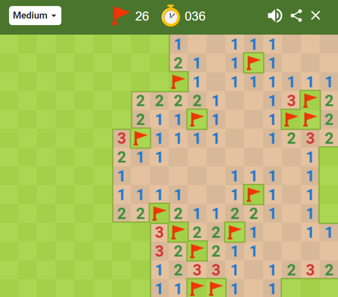

### Acknowledgement
Much of the material is this set of modules comes from two sources:

- [Chris Murphy - Lecturer at Bryn Mawr](https://cs.brynmawr.edu/~cdmurphy/) who I was very lucky to work with previously on a software engineering course at the University of Pennsylvania
- [Clean Code: A Handbook of Agile Software Craftsmanship](https://www.amazon.com/Clean-Code-Handbook-Software-Craftsmanship/dp/B08X8ZXT15/) by Robert C. Martin, a book that I highly recommend and dramatically improved my own outlook on designing and writing software.


# Analyzability

**Analyzability** is a core part of software **internal** quality, **Maintainability**. Specifically, with analyzability, we are interested considering "to what extent can the code be read and understood." This breaks down into two primary considerations:

* __Readability__: To what extent can we read and understand the code's **syntax**
* __Understandability__: To what extent can we read and under the code's **semantics**


With **syntax**, we are talking about being able to identify the structure of the code, the variables, functions, etc. That is, we can understand the code's rigid structure that allows the computer to execute it. **Semantics** are a bit more elusive and holistic; the **semantics** of the code refers to the intent of the code. That is, how does the code relate to the features of the software.


### Readability

Let's start with the following java code (this example is adapted from an example in Chapter 2 of __Clean Code__). This function comes from a Minesweeper game implementation in Java.



Try to tell me what this code does:

```java
public List<int[]> asdfasdf(){List<int[]> dfghdfgh=new ArrayList<>();for(int[] ouertioert:kjsdfgklkjsdfg){if(ouertioert[0]==4)dfghdfgh.add(ouertioert);}return dfghdfgh;}
```

What's that you say? What do you mean you can't read it? This is completely syntactically correct Java code! This compiles and would run as I intend it! Don't you know Java?

**Of course you do!** Yet despite that, I would be shocked if you could even understand the syntax of the above code, because the above code is not written in a **readable** way. The lack of line breaks, spacing, etc. make this code nearly impossible to read, even for an experience program.

## Spacing

Okay, fine, I'll rewrite it. Let me add some line breaks.

```java
public List<int[]> asdfasdf(){
        List<int[]> dfghdfgh=new ArrayList<>();
        for(int[] ouertioert:kjsdfgklkjsdfg){
        if(ouertioert[0]==4) 
        dfghdfgh.add(ouertioert);}
        return dfghdfgh;
    }
```

Okay, this might be **better**, but it's still obviously flawed. What we are seeing here is the importance of **spacing**. Think about reading a novel: we have chapters, and paragraphs. Sometimes within a chapter we have a *scene break*, where either some time passes of we switch perspectives. To communicate that, you'll often see extra space between the paragraphs, which communicates to the reader "this is the end of one scene and the start of another". That spacing is critical, and spacing in our code is no different. Compare the above to this:

```java
    public List<int[]> asdfasdf(){
        List<int[]> dfghdfgh = new ArrayList<>();
        for(int[] ouertioert : kjsdfgklkjsdfg) {
            if (ouertioert[0] == 4) {
                dfghdfgh.add(ouertioert);
            }
        }
        return dfghdfgh;
    }
```

**Syntactically** I haven't changed anything. Yet, immediately, this code is more readable now. It's still not very readable for other reasons we get into in a bit, but you can now more easily start to recognize syntax like:

* Oh, that's a variable name
* Oh, I can see where the for loop ends now
* Okay, I see, we're calling an `add` function in the if statement.

## Identifier names

However, this still isn't readable. That's because the variable names are atrocious (I literally made them by rolling my hand on random places on the keyboard). At a minimum, **variable names should also be made up of human-readable and human-pronounceable words**. Consider the further modification below:

```java
    public List<int[]> bathtub() {
        List<int[]> carrot = new ArrayList<>();
        for (int[] carot : chair) {
            if (carot[0] == 4) {
                carrot.add(carot);
            }
        }
        return carrot;
    }
```

### Using readable names

Now, simply by changing variable names to words, you probably find the code even easier to read to understand the **syntax** of. However, I bet there are two variable names that tripped you up a bit: `carat` and `carrot`. In general, we want our variable names to be distinct enough that we can easily tell them apart at a glance. This means we want to avoid variable names that look the same or sound the same. For example, imagine I had the following two variable names:

* theListItemWeAreCheckingFor
* theListSubItemWeAreCheckingFor

Imagine a program with both of those variable names. They are both human-readable and pronounceable because they use camel-case. However, they are both long, and the difference is only three letters in the center of the word.

It's important to udnertsand that humans don't actually read words by looking at evrey sinlge letter and combninig them to form a word. Rather, we galnce at the word and our brain aotumatcially runs that thorugh a filter of knwon words and fills it in for us. For example, I intentionally misspelled several words in this paragraph by rearranging the letters, yet I bet most of you had no trouble reading what I intended. The key, however, is that each of the words I misspelled existed in a context, and within that context, only one word with that group of letters makes sense. We have to use this to our advantage:

In short, we want use variable names that are distinct enough that it's impossible to accidentally confuse one variable name for another.

Let's update our words again:

```java
    public List<int[]> getThem() {
        List<int[]> outList = new ArrayList<>();
        for (int[] item : theList) {
            if (item[0] == 4) {
                outList.add(item);
            }
        }
        return outList;
    }
```

At this point, you can probably start to understand better the **syntax** of this above code. For instance, you may not realize that `theList` must be an instance variable, since it isn't defined within the scope of our function. You can pick out which variable is used for the return value. 

## Understandability

**Readability** is a necessary but insufficient condition for **Understandability**.

You may now be able to explain what the above function does syntactically:

"The function loops through a list of integer-arrays. If the first value of an integer-array is 4, that array is added to a list of integer-arrays that we output later."

But being able to understand this syntax doesn't tell you "what is this function's role in our entire software system." 


**Readability** *is a necessary but insufficient condition for* **Understandability**. That is, our code **cannot** be understandable if it isn't readable. However, just because our code is readable does not mean it is understandable.

Even if we know that this function is used in a game of Minesweeper, we still have no idea of **why this function exists.**

### Names that communicate intent.

I will rename the variables again, as well as the function. Read the following and see if you can understand better why the function exists:

```java
    public List<int[]> getFlaggedCells() {
        List<int[]> flaggedCells = new ArrayList<>();
        for (int[] cell : gameGrid) {
            if (cell[0] == 4) {
                flaggedCells.add(cell);
            }
        }
        return flaggedCells;
    }
```

Since we have started this exercise, I have not changed the code in any syntactical way. By simply by adding spacing and better names, now it's starting to become clear what this function does. It returns a list of the cells that have been marked with a flag in Minesweeper!

What is the int[]? It's a representation of a Minesweeper cell.

### Magic Numbers are bad

However, we still have a problem. Consider this line:

```java
if (cell[0] == 4) 
```

What is the purpose of index 0 and the number 4 here? These are examples of "magic numbers": hard-coded values that have an intent that isn't clearly understandable without additional knowledge of the code. For example, maybe the cell int-array is organized as follows:

`[cell_status, row, column, is_mine, adjacency_number`

In this case, something like:

`[3, 5, 8, 0, 3]`

Might mean:

* 3 - the cell has been clicked and is revealed
* 5 - the cell is in row 5
* 8 - the cell is in column 8
* 0 - the cell is not a mine (1 if it is a mine)
* 3 - the cell is adjacent to 3 mines.

The problem is that even if this is how cells are organized, the only way you could know that is if whoever designed the system told you. Which means the syntax `cell[0]` is not **understandable** without additional information.

What if our program, however, had the following constants:

```java
    public static final int CELL_STATUS = 0,
        CELL_ROW = 1,
        CELL_COLUMN = 2,
        CELL_IS_MINE = 3,
        CELL_ADJACENCY = 4;
```

Now, instead of using `cell[0]` to get the cell status, we use `cell[CELL_STATUS]`. Additionally, we might have:

```java
    public static final int STATUS_HIDDEN = 0,
        STATUS_REVEALED_NUMBER = 1,
        STATUS_REVEALED_BLANK = 2,
        STATUS_REVEALED_MINE = 3,
        STATUS_FLAGGED = 4;
```

Now, we can replace these "Magic Numbers" with the names of constants **that communicate intent**.

```java
    public List<int[]> getFlaggedCells() {
        List<int[]> flaggedCells = new ArrayList<>();
        for (int[] cell : gameGrid) {
            if (cell[CELL_STATUS] == STATUS_FLAGGED) {
                flaggedCells.add(cell);
            }
        }
        return flaggedCells;
    }
```

Now this code is **understandable** even if you don't know the structure of the cell array, simply by using constants with **names that communicate intent** instead of magic numbers.

## Encapsulation

If I had showed you this code at the beginning of the this modules, you likely could have understood it right out of the gate. You'd still have questions:

* What is the structure of the int array?
* How does it model a cell?
* What other information is in the cell array?
* How would I get that other information?
* How is the `gameGrid` list of cells created and stored?

And all of these are good questions. In fact, necessarily, this function is forcing us to understand now just "what does this function do", but also "how does the cell integer-array work?". What if instead, we could **encapsulate** the ideas of the `cell` and the `gameGrid` into classes?

Well, if we do that, our code may look like:

```java
    //fields
    private GameGrid gameGrid = new MineSweeperGameGrid();
    
    ...
    
    public List<Cell> getFlaggedCells() {
        List<Cell> flaggedCells = new ArrayList<>();
        for (Cell cell : gameGrid.getCells()) {
            if (cell.isFlagged()) {
                flaggedCells.add(cell);
            }
        }
        return flaggedCells;
    }
```

Notice now that this function does the same thing, but **hides** the details of how Cell and gameGrid work. What to check if a given `Cell` instance is flagged? Just called the `boolean` function `isFlagged()` and it will tell you! How does that function work? We don't need to know!

In this way, our **design**, storing the game grid and the cell information access inside of **classes** makes our code more readable.

This also has the added benefit where if we have to *changed how the Cell object is structured*, we won't have to changed this method at all! So long as the **interface** of the Cell function we use (`isFlagged`) doesn't change, this class will be unaffected if we change the inner workings of how a cell works.

We will come back to that idea repeatedly during design.


## Conclusions

* **Analyzability** is a vital aspect of software evolution. As our software grows and changes, we need to understand code we have already written so we can maintain it, update it, and re-use it.
* **Readability** is the part of analyzability that relates to being able to correctly interpret the **syntax** of software.
* **Understandability** is the part of analyzability that relates to understand the semantics, or the **high-level meaning** of the code, and why the code exists.
* Using good code style and human-readable identifier names improves *readability*
* Using *effective* identifier names, avoiding "magic values" that require additional context to explain, and good class design can improve understandability.