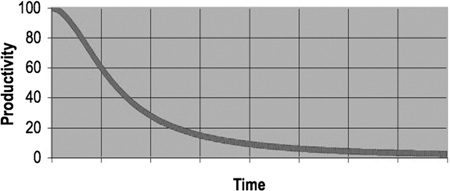

## Acknowledgement

Most of the material in this unit is derived from: 

* [Clean Code: A Handbook of Agile Software Craftsmanship](https://www.amazon.com/Clean-Code-Handbook-Software-Craftsmanship/dp/B08X8ZXT15/) by Robert C. Martin, a book that I highly recommend and dramatically improved my own outlook on designing and writing software.

This page is currently under construction.

# Clean Code

What is clean code? It can be a hard term to define. For example, code that is "clean" in Java, with it's intended style and usage, may not be considered "clean" in Python or C++ because of style and syntax differences between the languages.

In our last module, we talked about the Analyzability of our software. Software that is **understandable** is inherently easier to read and comprehend than software that is written poorly, even if in both cases the software works.

The idea of clean code extends this idea. We need understandable code, but it goes deeper. We need code that we can build from, change, maintain, update, and improve over time.

## Software Entropy

The idea of software entropy is that as a project ages, it becomes harder and harder to maintain. This means doing things like:

* Bug fixing
* Adding new features
* Updating for new infrastructure

Becomes harder and harder the older the software is.

For example, have you ever found a bug, did what you thought was a simple fix, only to see that 3 other features (potentially features that seem completely unrelated) in your program broke because of that bug fix? If so, you've fallen prey to software entropy. 

It has been observed empirically that as software ages, the time it takes to implement changes increases dramatically. However, the rate at which this speed increases isn't a sentence, but a decision. **We can slow down entropy!**

## Technical Debt

Last year, I installed a ceiling fan in the living room of my house. It took a lot of time and effort, and when I was done, I stopped working, sat down, and watched some Netflix. The next day, I wanted to install a fan in the Master bedroom. Except...I couldn't find my screwdriver nor my electric wand (for detecting if a wire has current in it and therefore not save to touch). They weren't in my toolbox!

The problem was that *I never cleaned up*! I didn't pull my tools away in my toolbox. I just left them on the couch in the living room near where I was working. Sometime during the night, my cat jumped up on the coach, pushing the screwdriver onto the floor under the couch, and the electric wand into the couch cushions. I spent nearly an hour just looking for my tools before I could start the next day. **All of that time could have been saved if I just spent 1 minute cleaning-up when I finished the previous task**.

This mindset of "cleaning up" applies to code! 

You aren't done when your code works! You are done when you've cleaned up!

By not putting my tools away, I accrued a "debt". That is, I didn't spend time putting my tools away now, so I paid for it later (with substantial interest) when I had to look for my tools. Our source code is just as vulnerable to debt. When you leave a method in an overly complex, unreadable state, or you use static global variables to store information relevant only to one function, you are accruing a debt that will cost you time later to fix (or to work around if you can't fix it).

## You always read more than you write

The basic reason that clean code is important is that when you are writing code, very little time is actually spent *writing code*. Most of the time you are reading. Consider, for example, writing a program that reads an Excel file.

* How much time is spent looking up examples
* How often do you need to look at other classes
* What order are the Constructor arguments in?
* How do I use that data structure?
* Where does this variable come from again?

On and on and on. Most estimates say that while writing code, we spend **ten times** as much time reading code as we do *writing code*. This means that it is vitally important that we make our code as readable as possible, and easy to use as possible!

The thing that will slow down your projects is entropy and complexity. As your projects age, they naturally get larger and more complicated. If we spend time cleaning up our code and making it easy to read, this entropy slowdown will...well...slow down. Our project will be easier to develop longer, provided that each step along the way we take time to clean-up, refactoring, improve our variable and function names, etc.

## Going fast means slowing down

In automobile racing, how you go around corners can be arguably the most important skill on the track. However, counterintuitively, you don't want to greedily go as fast as you can at all times. If you approach a corner too fast, you have to slow down **longer** while going through the corner, which means you start accelerating later. As a result, you will end up going slower on the next straightaway because you tried to go too fast through the corner. On the other hand, if you approach the corner a little slower, than you can start accelerating out of the corner sooner, meaning you will go faster on the next straightaway.

In short, slowing down a little more now can save you significant time later! And the same applies to code!

Because your code must evolve and change overtime, taking time to do a slow down, do a little clean-up, ensure your code is readable and understandable, removing duplicate code, etc. will mean that the next time you add to your code, you will save time!

Ultimately, clean-code will help you go faster in the long run. "Fast and dirty" code may make the first couple of classes faster to write, but before too long, you will start to reap what you sow, and your productivity will grind to a halt.

## Conclusion

In the rest of this unit, we will look at examples of "dirty code" and "clean code", as well as talk about techniques for turning the former into the latter. We will also look at techniques around using exceptions, as well as functional programming and streams, to help make our code simpler and shorter without sacrificing understandability.