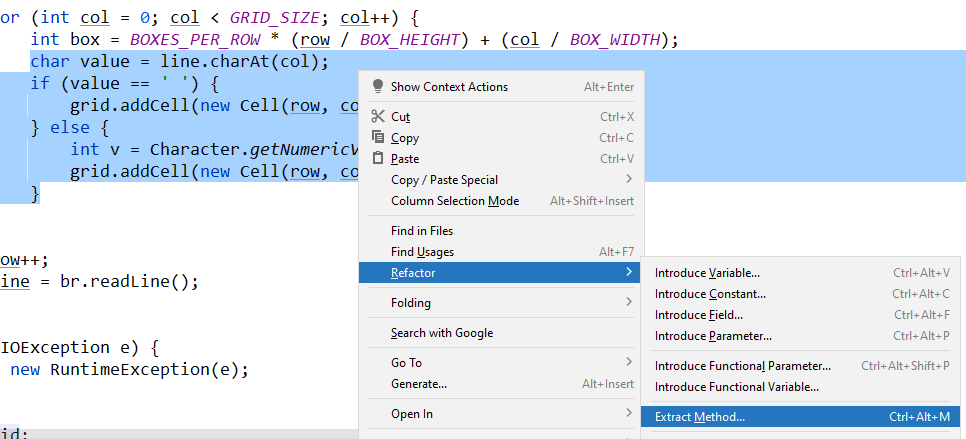

# Extracting Methods

In this module, we will look at the refactoring practice of extracting methods. We may extract methods for the following reasons:

* Address methods that are too large, breaking them into smaller methods
* Improve the readability of our code by encapsulating low-level logic into a method with an intent-communicating name.
* Removing duplicate code and duplicate logic by extracting the repeated behavior into a single method

## Breaking up big methods

**Function are good at doing one thing and one thing only!**

But what is one thing?

Consider the following method from my SudokuSolver. This method is in a class called `SudokuTextFileReader`:

```java
    public SudokuGrid read() {
        SudokuGrid grid = new SudokuGrid();
        
        try {
            BufferedReader br = new BufferedReader(new FileReader(new File(filename)));
            String line = br.readLine();
            int row = 0;
            
            while(line != null) {
                if (line.length() < GRID_SIZE) {
                    br.close();
                    throw new IllegalStateException("Error: Formatted file has invalid length at line " + row + " - " + line + " - length: " + line.length());
                }
                for (int col = 0; col < GRID_SIZE; col++) {
                    int box = BOXES_PER_ROW * (row / BOX_HEIGHT) + (col / BOX_WIDTH);
                    char value = line.charAt(col);

                    if (value == ' ') {
                        grid.addCell(new Cell(row, col, box));
                    } else {
                        int v = Character.getNumericValue(value);
                        grid.addCell(new Cell(row, col, box, v));
                    }
                }
                
                row++;
                line = br.readLine();
            }
            br.close();
        }
    } catch (IOException e) {
      throw new RuntimeException(e);
    }

    return grid;
  }
```

Not that long ago, I would say: 

> This done one thing! It reads in a text file to make a Sudoku Grid

I would add an example text file that may look like:

```text
   3 5  
 12  6  
4       
2 6315  
5  146  
614  2  
```

To build an instance of the class SudokuSolver.

But does it really only do one thing? Consider you can see the following operations:
* We create a Buffered reader and loop through every line of the file
* For each character, we determine if it is a solved or unsolved Sudoku cell
* We determine which row, column, and box that cell should be in
* We have multiple places where we check error values

To show that this function needs to be reworked, let me ask you a couple questions:
* What does the outer while loop do?
* What does the inner for loop do?
* Why do we do row++ when we do it?
* What is the difference between these two lines?
  * `grid.addCell(new Cell(row, col, box));`
  * `grid.addCell(new Cell(row, col, box, v));`
* What is the point of this line of code?   
`int v = Character.getNumericValue(value);`

If these are easy questions to answer (taking less than a couple seconds), then the function is too complicated.

So let's refactor!

### Well Written Prose

In Chapter 1 of __Clean Code__, [Grady Booch](https://en.wikipedia.org/wiki/Grady_Booch) describes clean code as:

> "Clean code is simply and direct. Clean code **read like well-written prose**. Clean code never obscures the designer's intent..."

Does our code do that?

Here is a specification I have for part of this function:

"Given a character `value`, determine if a cell is unsolved (blank) or solved (a number). If it is not solved, make an unsolved `Cell` object and add it to the grid. Otherwise, add a solved `Cell` with the solution `value` to the grid."

Now, while this specification is long (and notice already our function is clearly not doing one thing even in this **part** of the function), you could start to think about how you would implement it. That is, this description is fairly unambigious, and we can even think about how we would test it.

Now read the following code.

```java
char value = line.charAt(col);
if (value == ' ') {
    grid.addCell(new Cell(row, col, box));
} else {
    int v = Character.getNumericValue(value);
    grid.addCell(new Cell(row, col, box, v));
}
```

Does this code **obviously** implement the specification? No! Which cell constructor is solved vs. unsolved? You don't know without digging into another class!

**This code is not well-written-prose**

### Refactoring from the inside-out

Let's extract it as a method and see if we can fix this:



For now, we'll call this `addCellToGrid()` 

```java
    private void makeCellAndAddToGrid(SudokuGrid grid, String line, int row, int col, int box) {
        char value = line.charAt(col);
        if (value == ' ') {
            grid.addCell(new Cell(row, col, box));
        } else {
            int v = Character.getNumericValue(value);
            grid.addCell(new Cell(row, col, box, v));
        }
    }
```

You may notice that we have **five arguments** to this method! We absolutely should avoid this. Don't worry, for now, however. We'll cut down on it later. 

Also, be aware that after **each refactoring step**, I run my tests for my read() function to ensure it is still working. I want to do this every step of the way so that if I make a mistake and break my code, I can simply undo my last refactoring and try again. Just like TDD, we want to test **as we make changes**, not just at the end.

Here, I want to start by looking at my `if` statement. Namely, what is the **semantic intent** behind `value == ' '`? If it's not obvious, then we need to fix it. This is supposed to mean "if the `value` character is blank".

So let's extract that statement as a method so we can clarify this intent!

```java
    private boolean isBlankCharacter(char value) {
        return value == ' ';
    }
```

Notice how trivial this method is, and easy to understand. What is the purpose of this method "Check if `value` is a blank character". **This is one thing!**

Now, our `makeCellAndAddToGrid` is:

```java
    private void makeCellAndAddToGrid(SudokuGrid grid, String line, int row, int col, int box) {
        char value = line.charAt(col);
        if (isBlankCharacter(value)) {
            grid.addCell(new Cell(row, col, box));
        } else {
            int v = Character.getNumericValue(value);
            grid.addCell(new Cell(row, col, box, v));
        }
    }
```

Not much better, but it is more readable.

From here, I notice an issue with duplication. We call `grid.addCell` in two places, in the `if` and the `else`. Since we call it anyways, let's pull it out of the `if` statement:

```java
  private void makeCellAndAddToGrid(SudokuGrid grid, String line, int row, int col, int box) {
      char value = line.charAt(col);
      Cell newCell = null;
      if (isBlankCharacter(value)) {
          newCell = new Cell(row, col, box);
      } else {
          int v = Character.getNumericValue(value);
          newCell = new Cell(row, col, box, v);
      }
      grid.addCell(newCell);
  }
```

But wait, didn't I just make the function longer? I did! But, this now lets me extract the `if-else` statement into a function `generateNewCell`!

```java
    private void makeCellAndAddToGrid(SudokuGrid grid, String line, int row, int col, int box) {
        char value = line.charAt(col);
        Cell newCell = generateNewCell(row, col, box, value);
        grid.addCell(newCell);
    }
    
    private Cell generateNewCell(int row, int col, int box, char value) {
        Cell newCell = null;
        if (isBlankCharacter(value)) {
            newCell = new Cell(row, col, box);
        } else {
            int v = Character.getNumericValue(value);
            newCell = new Cell(row, col, box, v);
        }
        return newCell;
	}
```

From here, I can simply remove the no-longer necessary `newCell` variable from `generateNewCell`

```java
    private Cell generateNewCell(int row, int col, int box, char value) {
        if (isBlankCharacter(value)) {
            return new Cell(row, col, box);
        } else {
            int v = Character.getNumericValue(value);
            return new Cell(row, col, box, v);
        }
    }
```

And now, I can clarify what the `if` and the `else` do differently:

```java
    private Cell generateNewCell(int row, int col, int box, char value) {
		if (isBlankCharacter(value)) {
			return createUnsolvedCell(row, col, box);
		} else {
			return createSolvedCell(row, col, box, value);
		}
	}

	private Cell createUnsolvedCell(int row, int col, int box) {
		return new Cell(row, col, box);
	}

    private Cell createSolvedCell(int row, int col, int box, char cellCharacter) {
        int cellSolution = Character.getNumericValue(cellCharacter);
        return new Cell(row, col, box, cellSolution);
    }
```

Now, let's go back to `makeCellAndAddToGrid`:

```java
    private void makeCellAndAddToGrid(SudokuGrid grid, String line, int row, int col, int box) {
        char value = line.charAt(col);
        Cell newCell = generateNewCell(row, col, box, value);
        grid.addCell(newCell);
    }
```

Hey, this method is starting to make more sense now! That first line is still a bit low-level. Let's fix it:

```java
    private void makeCellAndAddToGrid(SudokuGrid grid, String line, int row, int col, int box) {
        char value = getCharacterFromLineAtIndex(line, col);
        Cell newCell = generateNewCell(row, col, box, value);
        grid.addCell(newCell);
    }
    
    private char getCharacterFromLineAtIndex(String line, int index) {
        return line.charAt(index);
    }
```

Okay, now, only focus on the method `makeCellAndAddToGrid`, and for now ignore most of the arguments. How does it read?

"Get the character from a line. Use that character to generate a new cell. Add that cell to the grid."

### Our progress so far

Hey, we're making progress!

Look at our code now:

```java
    private void makeCellAndAddToGrid(SudokuGrid grid, String line, int row, int col, int box) {
        char value = getCharacterFromLineAtIndex(line, col);
        Cell newCell = generateNewCell(row, col, box, value);
        grid.addCell(newCell);
    }
    
    private char getCharacterFromLineAtIndex(String line, int index) {
        return line.charAt(index);
    }
    
    private Cell generateNewCell(int row, int col, int box, char value) {
        if (isBlankCharacter(value)) {
            return createUnsolvedCell(row, col, box);
        } else {
            return createSolvedCell(row, col, box, value);
        }
    }
    
    private boolean isBlankCharacter(char value) {
        return value == ' ';
    }
    
    private Cell createUnsolvedCell(int row, int col, int box) {
        return new Cell(row, col, box);
    }
    
    private Cell createSolvedCell(int row, int col, int box, char cellCharacter) {
        int cellNumericValue = Character.getNumericValue(cellCharacter);
        return new Cell(row, col, box, cellNumericValue);
    }
```

While the arguments are still a bit crazy, this code is much more readable and **understandable** now, right? It's longer, sure, but each individual function makes more sense.

### Let's get argument names under control

Notice that once we start the function `makeCellAndAddToGrid`, none of the following values change:

* `row`  
* `col`  
* `box`  
* `grid`
* `line`  

Technically, we call `grid.add()` later on, but that doesn't change the value of the reference `grid`, only the state of the object `grid` references.

As such, as soon as we start this routine, all of these are, effectively, fields that describe the *state* of our reader. **These can be instance variables!**

As such, I add the new fields as instance variables, and then remove all the declarations in the 

```java
public class Sudoku6x6TextReader extends SudokuReader {
    public static final int GRID_SIZE = 6;
    public static final int BOXES_PER_ROW = 2;
    public static final int BOX_HEIGHT = 2;
    public static final int BOX_WIDTH = 3;
    
    private SudokuGrid grid;
    private String filename;
    private int row, col, box;
    private String line;
    
    @Override
    public SudokuGrid read() {
      grid = new SudokuGrid();
  
      try {
        BufferedReader br = new BufferedReader(new FileReader(new File(filename)));
        line = br.readLine();
        row = 0;
  
        while(line != null) {
          if (line.length() != 6) {
            br.close();
            throw new IllegalStateException("Error: Formatted file has invalid length at line " + row + " - " + line + " - length: " + line.length());
          }
          for (col = 0; col < GRID_SIZE; col++) {
            box = BOXES_PER_ROW * (row / BOX_HEIGHT) + (col / BOX_WIDTH);
            makeCellAndAddToGrid(grid, line, row, col, box);
          }
  
          row++;
          line = br.readLine();
        }
  
      } catch (IOException e) {
        throw new RuntimeException(e);
      }
  
      return grid;
    }
    
    ...
}
```

So since these values are in fields, we no longer need them in our method signatures. The function `makeCellAndAddToGrid` can now just access the instance variables, and we no longer need to pass all the extra values around.

```java
    private void makeCellAndAddToGrid() {
		char value = getCharacterFromLineAtIndex(col);
		Cell newCell = generateNewCellUsingCharacter(value);
		grid.addCell(newCell);
	}

	private char getCharacterFromLineAtIndex(int index) {
		return line.charAt(index);
	}

	private Cell generateNewCellUsingCharacter(char value) {
		if (isBlankCharacter(value)) {
			return createUnsolvedCell();
		} else {
			return createSolvedCell(value);
		}
	}

	private boolean isBlankCharacter(char value) {
		return value == ' ';
	}

	private Cell createUnsolvedCell() {
		return new Cell(row, col, box);
	}

	private Cell createSolvedCell(char cellCharacter) {
		int cellNumericValue = Character.getNumericValue(cellCharacter);
		return new Cell(row, col, box, cellNumericValue);
	}
```

You'll notice we still have some arguments. For example:

`private Cell generateNewCellUsingCharacter(char value)`

I renamed this function from `generateNewCell`, but it makes sense to me that this class takes in a character (the value of a particular cell) to determine if that character indicates a solved or unsolved cell.

`private boolean isBlankCharacter(char value) {`

For similar reasons, I kept the argument here in `isBlankCharacter`, since I could in theory re-use this function for any character, not just value.

`private char getCharacterFromLineAtIndex(int index)`

This is a case where I think including an argument makes the function easier to understand, whereas removing it would make the function's purpose less clear.

### Extract 'til you drop

We still haven't clearly answered "What is one thing?" when discussing writing functions that do only one thing. I'm a fan of Bob Martin's answer which, paraphrased, is that once you can no longer extract meaningful functions that describe a single action from your code, that is when you are done.

This is why most functions I write end up being 6 lines or less. Because most *single things* take that long.

### Speeding up

From here, I'll skip ahead to my finished product. However, it's important to realize that *I am still running my tests on this class after each major refactoring step to ensure I'm not breaking the functionality of my code.

```java
public class Sudoku6x6TextReader extends SudokuReader {
  public static final int GRID_SIZE = 6;
  public static final int BOXES_PER_ROW = 2;
  public static final int BOX_HEIGHT = 2;
  public static final int BOX_WIDTH = 3;

  private String filename;
  private SudokuGrid grid;
  private int currentRowIndex, currentColumnIndex, currentBoxIndex;
  private String currentLine;
  private BufferedReader bufferedReader;

  public Sudoku6x6TextReader(String filename) {
    Settings settings = Settings.getInstance();
    settings.setGridSize(GRID_SIZE);
    this.filename = filename;
  }

  @Override
  public SudokuGrid read() {
    try {
      initializeReader();
      return getSudokuGridFromFileContents();
    } catch (IOException e) {
      throw new RuntimeException(e);
    }
  }

  private void initializeReader() throws IOException {
    grid = new SudokuGrid();
    bufferedReader = getBufferedReader();
    getFirstLine();
  }

  private SudokuGrid getSudokuGridFromFileContents() throws IOException {
    while(thereIsAnotherLine()) {
      validateCurrentLine();
      getAllCellsFromLine();
      goToNextRow(bufferedReader);
    }

    return grid;
  }

  private BufferedReader getBufferedReader() throws FileNotFoundException {
    FileReader fileReader = new FileReader(filename);
    return new BufferedReader(fileReader);
  }

  private void getFirstLine() throws IOException {
    currentLine = bufferedReader.readLine();
    currentRowIndex = 0;
  }

  private boolean thereIsAnotherLine() {
    return currentLine != null;
  }

  private void validateCurrentLine() throws IOException {
    if (isInvalidLineLength()) {
      bufferedReader.close();
      throw new IllegalStateException(getInvalidLineLengthExceptionMessage());
    }
  }

  private void getAllCellsFromLine() {
    for (currentColumnIndex = 0; currentColumnIndex < GRID_SIZE; currentColumnIndex++) {
      currentBoxIndex = getCurrentBoxNumber();
      makeCellAndAddToGrid();
    }
  }

  private void goToNextRow(BufferedReader br) throws IOException {
    currentRowIndex++;
    currentLine = br.readLine();
  }

  private boolean isInvalidLineLength() {
    return currentLine.length() != GRID_SIZE;
  }

  private String getInvalidLineLengthExceptionMessage() {
    return "Error: Formatted file has invalid length at line " + currentRowIndex + 
            " - " + currentLine + " - length: " + currentLine.length();
  }

  private int getCurrentBoxNumber() {
    return BOXES_PER_ROW * (currentRowIndex / BOX_HEIGHT) + (currentColumnIndex / BOX_WIDTH);
  }

  private void makeCellAndAddToGrid() {
    char value = getCharacterFromLineAtIndex(currentColumnIndex);
    Cell newCell = generateNewCellUsingCharacter(value);
    grid.addCell(newCell);
  }

  private char getCharacterFromLineAtIndex(int index) {
    return currentLine.charAt(index);
  }

  private Cell generateNewCellUsingCharacter(char value) {
    if (isBlankCharacter(value)) {
      return createUnsolvedCell();
    } else {
      return createSolvedCell(value);
    }
  }

  private boolean isBlankCharacter(char value) {
    return value == ' ';
  }

  private Cell createUnsolvedCell() {
    return new Cell(currentRowIndex, currentColumnIndex, currentBoxIndex);
  }

  private Cell createSolvedCell(char cellCharacter) {
    int cellNumericValue = Character.getNumericValue(cellCharacter);
    return new Cell(currentRowIndex, currentColumnIndex, currentBoxIndex, cellNumericValue);
  }
}
```

I know that looks like a lot of code. However, pick any function at random, read its name and it's code. Chances are, you have a clear idea of **what the function does** and **why it exists.** And if you don't, let me know! That way I can try to clean it further so the code is **as understandable as it can be**.

### We don't write this way the first time.

To be absolutely clear, I **actually wrote** the first code you saw. [You can see it here:](https://github.com/Will-McBurney/SudokuSolver/blob/main/src/main/java/edu/virginia/cs/sde/sudokusolver/Sudoku6x6TextReader.java)

The clean version we just wrote together was my first attempt at cleaning up code in this project (of which, there are many, many serious design and code construction problems). And while this article was long, the actual process of extracting code, cleaning up, extract variable names and constants, etc. took surprisingly little time. All told it was probably about 15 minutes of coding. This is because IntelliJ has great refactoring tools to ensure the process is easy, accurate, and fast.

### Why SudokuSolver is so ugly

This SudokuSolver project was a project I was working on to illustrate some design patterns. I started it about 4 years ago, with goals of making a UI, illustrating three tier architecture, etc. However, I ended up abandoning it and haven't meaningfully worked on the code for it since about three years ago. The reason? I realized well after I started, and was working on more complex solver techniques, that I made a number of bad design choices. Rather than try to stop and fix these design choices, I decided to brute force my way through them. In doing so, the code became less and less maintainable, and writing solvers became harder and hard. Eventually, I fell into a pattern of "Just make this feature work and I'll move on".

Until I realized I hit a dead-end. I kept telling myself "I'll come back and clean this up later, and I didn't". I uploaded it to git late last year as I was preparing for this course, as I wanted to show that, yes, Professor's write bad code to.

But **the reason my code is bad is that I never cleaned it**. As soon as I passed the tests I was writing, I stopped working on a feature. Eventually, I abandoned TDD altogether and relied on System Testing. Then I just started "get it done fast, I don't have time to do it right". And the end result is I never finished the product. I never implemented the features I wanted to.

So take it from someone who learned the lesson the hard way: "the only way to go fast is to go well".
