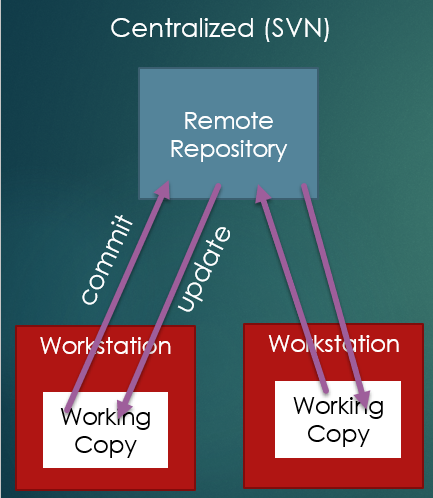
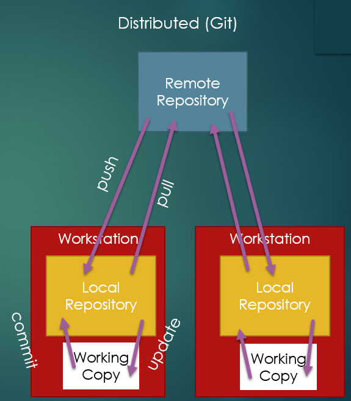

# Version Control

When developing software, we need to be able to share
code among the team, as well as release multiple versions of the software.
After release, software continues to evolve, with new versions featuring
bug fixes, new features, and compatible with new hardware or software.

## Version Control Usage

### Safety - never lose old code

### Debugging - find when defect introduced

### Collaboration

### Deployment

### Conflict Detection

### Regression Testing


## Centralized Repository

Older version control systems (VCS) used a centralized repository.



In a centralized VCS system, the remote repository is where all
shared versions of the software are stored. Developers work in their
workstations, and when they want to record their work in the
repository and share, they **commit**. When they want to get the work
from the repository, they **update**.

## ```cvs```

Concurrent Versions System (cvs), released in 1990 was an early
centralized-repository system. It supports branching as well
as committing and updating. However, CVS maintained a version
history on each file separately, meaning different files could
have different commit numbers for what is the same commit of multiple files. 
Additionally, because each file was maintained separately, 
if you had a conflict
on one file, CVS would reject that commit. On the other hande, if
in the same commit another file had no conflict, that commit would go
through, effectively meaning half your commit failed, while half passed.
This could lead to significant difficulties in maintaining the
validity of the remote repository.


## ```svn```

Apache Subversion, or `svn`, is probably the most well known 
centralized-repository VCS system. `svn` was very popular in
the early and mid 2000s. However, by the late 2000s and into
the 2010s, it had begun falling off considerably as git became more
widely used.

SVN made a couple of changes to CVS. First, the entire repository
had a single commit number for all commits. Additionally, it used 
the paradigm of "atomic commits", meaning when you commit multiple
files, either *all* the files are accepted, or *none* of them. As
Mike from Breaking Bad would say, "No half-measures."

This actually was beneficial for conflict resolution, which
contributed to SVN's wide adoption. In fact, SVN was what
I learned in undergraduate.

## Distributed Repository

In a distributed repository model, in addition to a centralized
remote repository, every workstation also has a local copy.



So, the generic operations of a distributed system are:

* __Commit__ - store your current changes in your local repository
* __Update__ - get any changes to your local repository
* __Push__ - send the state of your local repository to the remote repository
* __Pull__ - get any new changes on the remote repository

### ```git```

Git (which was selected as a name because it was phonetic and short
and wasn't already an established UNIX command) is a distributed
repository VCS. Git grew rapidly in popularity, and is now more
popular than all other VCS systems combined.

Git separates "committing", saving changes to a local repository,
from "pushing", sending changes in the local repository to the
remote repository. This encourages "committing early and often",
that is, committing in the same way that you would "save" a file,
one little bit at a time. This also means you will often avoid
pushing non-working code, as you can still commit your progress
without polluting a remote repository that others have to work with.

Just like svn, git supports atomic commits and branching.

Additionally, git supports deciding *which* files you want to commit
by use of a "staging area". When you want to commit a file, you first
use "add" to tell git "the next time I commit, add the changes to
this file to the local repository". While this may seem like a burden,
it allows you to consciously decide to commit changes from only some 
files at a time if you want to.

``git add .`` tells git to add all file changes, as the period
serves as a wild-card for "all files".

#### Why git instead of svn?

The biggest reason we are using git instead of svn is that
the distributed nature makes for a better workflow. You can
work independently on a new feature and commit frequently as
a way of saving your work and tracking your progress, without
having to push and potentially deal with conflicts as frequently
as you push. Another reason we are using git is simply how
popular git has become, as well as the availability of tools
like GitHub classroom. While `svn`, Mecurial, and other VCS
systems still exist and are still used, git's popularity
rises well above its competitors, and thus is the best
starting place for learning VCS.

#### GitHub

GitHub and git `git` are *not* the same thing. GitHub didn't
invent git, though it likely had a significant hand in the
rapid popularity rise in Git.

GitHub hosts remote repositories so that you do not have to
create your own. Github allows an unlimited repositories, and
up to 500MB of package storage for free. Github also supports
services like Continuous Integration, which can be used to
automate things like Regression Testing, and Continuous Delivery,
to automatically release new versions of software committed to
the "main" branch.

GitHub also supports a feature called "pull requests." A "pull 
request" can be something of a misnomer when people first see it.
If you make a "pull request", typically you are saying "Hey, this is
a series of commits I have made, would you please pull them into this
branch?" That is, the person issuing the request is asking the
maintainer to pull the requester's code.

Pull Requests are often used as a safe-guard to prevent people
committing directly to the production branch (that is, the version of
the software that has been released). This is because you don't
want patches which haven't been thoroughly vetted to be added to
software that may be in use. However, many open-source repositories
do accept pull-requests, and an accepted pull request is absolutely 
something you can put on your resume.

GitHub also acts as a social network for programmers. It allows you
to track your history of committing code across all projects, show others
what projects you're working on, etc. GitHub profiles can be
a key portfolio item in job searches, with the added benefit of
allowing you to show not just what projects you've done work for, but
what specific work you've done.

GitHub also has an educational tool called "GitHub Classroom" which
we use in this class for the homework. It allows educators to create
organizations for students to use to work on and submit projects.