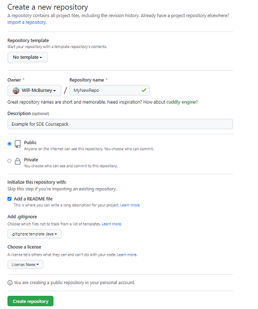

# Git Basics

In this unit, we will dive into specific usage of git. This is meant
to be a "getting started" tutorial. This will not cover all advanced
usage of git. However, there are a number of more robust tutorials
to be found online.

## .gitignore

When we create a new project, one of the first files we want to
commit, even before we start writing code, is a .gitignore file.
A .gitignore file tells git which files *not* to commit relative
to its current location.

Consider the following example .gitignore

```gitignore
# Gradle related folders
build/
.gradle/

# Local settings files
gradle-app.setting
.settings/
.classpath
.idea/**/workspace.xml


# Ignore java compiled files
*.jar
*.class

# Don't ignore gradle wrapper jar
!gradle-wrapper.jar
```

This is an incomplete excerpt from this [.gitignore file](https://github.com/sde-coursepack/NBAExcelTeams/blob/main/.gitignore)
We will discuss this project and gradle in a later unit. You are welcome
to use the linked example as a .gitignore file, but I would encourage
you to delete lines 1-3, as ignoring Excel files is unique to that project.

Here we are telling git to never commit the folders `build` or `.gradle`. This
is because we only want source code on our remote repository. We do
not want to include compiled files, as compiled files are much larger, and
unnecessary to upload and download, as we will build the compiled files
locally on our workstations.

We also want to ignore local settings files like `.classpath` (which is used
by Eclipse) and `.idea/workspace.xml` (IntelliJ), as these files tell our 
IDEs things like where to find the JDK and JRE on our computer, or how
our IDE is configured for our personal programming. It's very
important to .gitignore these files, as where my Java installation is
on my computer will almost certainly not match your computer. If we commit
these files, then when anyone pulls, it's going to overwrite their
own local settings files and could create anomalous results. Further, these
files are not necessary for being able to build the source code, and
we want to limit our git repositories to storing only what is necessary
for building the source code locally.

**Be aware that .gitignore files are not retroactive**. .gitignore only
prevent future commits from adding a file to the repository. It will not
remove files that are already in the repository.

### Creating a new empty repository

Below are a few simple ways to create a git repository. Please note
that for in-class homework, Github Classroom with make a repository
for you. As such, you will not do these steps for the homework.

1. On Github, you can go to My Repositories, click the green "New" button,
and fill out the next page with the settings you want. If you are doing
this approach, I generally recommend creating a starting ReadMe, as it
makes the next few steps easier. You can then skip to cloning a new repo



2. When creating a new project in IntelliJ, you can check the box that says
create git repository, and it will make a local git repository. You can
then skip to "Pushing a local repo."
3. Using a terminal inside of an empty folder in your system, 
you can use `git init` to create a git repository. Then, as you 
4. add files and changes to that folder,
the local repository will track them. 

### Adding a git repo to an existing project

If you already have a project, and you want to start a repo, there's
a couple ways to do it.

1. In IntelliJ, I can click the tab that says "Version Control" in the
bottom left, then click "create git repository". When the file browser pops
up asking where you want the repository, you can simply select the same
folder you are working in. (be aware that this creates a main branch named
"master", but you can rename it by right-clicking on name and going
to rename after your first commit).
2. Do the same `git init` as Step 3 under creating a git repository, but in the folder
containing the content you want to add to a repo. Then (after you setup
your .gitignore file), simply use
git add and git commit to add all the files in the folder to the repo.

### Cloning a new repo

**This is the first step you will do in the homework assignments.**

Cloning means downloading an existing remote repository to your local machine.
For simplicity, we're going to focus on clone a repository from GitHub, [like
this one](https://github.com/sde-coursepack/NBAExcelTeams). Each remote
repository on GitHub has a `.git` link that is used to clone a repository.
You can find it under the Green "Code" button towards the top right
of the repository's home page.


If you are comfortable using SSH, you are welcome to use that, but
otherwise I generally encourage starting out with the HTTPS link.
SSH can be more secure and convenient, but requires learning how to
set up an SSH key.

1. Within IntelliJ, we can open a remote repository as a project with
File -> New -> Project from Version Control. From there, click on
Github in the column to the left, and you'll be prompted to log-in
to GitHub (unless you are already logged in IntelliJ) if you log-in
to GitHub within IntelliJ, it can find the repositories you have
access to, and you can simply select the Repository you want to use.
IntelliJ will then automatically download the repository to your computer.
2. First, you will need a the `.git` link for the repository, then we can 
use that .git link as the Repository URL in "Repository URL" in IntelliJ.
From there, it works the same as option 1.
3. In a folder on your computer (I tend to use something like 
"My Documents/git/" as a location for general git projects, or
"My Documents/teaching/3140 for my examples for this class), open a terminal
and type `git init [url]` where [url] is the git link for the repository
you want to clone.

### Pushing a local repo as a new repository

Generally, the easiest way to do this is going to be in IntelliJ.
First, you can only push a repository to GitHub if it has at least
one commit. Additionally, you should ensure you commit a .gitignore
file before you commit any other files.

1. In an IntelliJ project where you have already created a local 
git repository with Version Control (see "Adding a git repo to an existing
project" option 1) with at least one commit, go to Git -> GitHub -> Share
Project on GitHub. At that point, you'll be prompted to Log-in if you
are not already logged in. Then you can specify the name of your repository,
deciding whether or not it is private, then hit "Share"
2. First, create an empty repository on GitHub and get the git link. Then, in IntelliJ, with
an existing repository with at least one commit, make sure your main
branch is named "main" (if it's named "master", rename it), and then
click the green up-right pointing arrow in the top right for Push, or
go to Git->Push in the taskbar. Then, in the window that pops up click
the blue "define remote" task, and paste the .git link in the URL. Note
that you will have to log-in to GitHub.

## Branching

**We are covering branching before add/commit/push because 
understanding and working with branching is vitally important.**
You should always be in a branch when writing new code!

One of the most important concepts in any version control is the
concept of branching. By default, when we create a git repository, 
we will have one branch called `main` or `master`, depending on
what we use to create the repository (Github will create
repositories with 'main', while using `git init` on your computer
locally will typically create the branch 'master'). For the
rest of this unit and future modules, when we say "main" or "main branch",
this is typically the branch you mean.

Now, if you are working alone on a person project you do not plan
to release publicly, it may make sense to only work in main. However,
there are several reasons we want to avoid primarily working in the main
branch:

* If we are releasing this software publicly, we want to avoid
adding new work directly to main, as any partially completed
or untested work could break our released software.
* If we are working with multiple people, and everyone is
committing to main for everything, we'll end up wasting a lot
of time dealing with conflicts (see Conflict Resolution below).

As such, we want to instead work in a separate branch, and then
merge our work into main when it's ready to be released. Generally,
we create a branch for each feature we are developing, and merge
that branch into other work once the feature is finalized.

### Using IntelliJ's Git GUI for Branching

This is **highly recommended** when you are first getting used to
working with git, as the GUI means you won't have to worry
about remembering specific commands.

In IntelliJ, you can manage branches by going to Git-> Branches,
and using the GUI, either add a branch ("+ New Branch"), which 
boths creates a **checks out** (switches your working directory to)
the new branch. The starting state of this new branch will be whatever
the working branch and working copy of the files you have. You can
also do all of this with the "Git" tab in the bottom right by 
right-clicking on the branches to switch between them or add a new branch.

You can also handle branch merging. Just got to Git-> Merge and
select the branch you want to merge into the branch you are currently
working in. If you want to merge your current branch into another branch,
checkout the other branch first, and then you can use merge. As a general
rule, if you are working in a feature branch, you should merge the development
branch (which may be "main" or some other branch depending on your group's
workflow) into the feature branch *first*, handle any conflicts, commit, and
then checkout your development branch and merge your feature.

### ```branch```

In terminal, you can see all existing branches with

`git branch`

After you hit enter, you'll see something like:

```shell
* development
  main
```

The asterisk next to development tells me I'm currently *in*
the development branch, but that there is also a main
branch.

#### creating a new branch

You can add a new branch with:

`git branch my_new_branch`

Example using my terminal in a project called HibernateDemo:

```
PS C:\Users\pm8fc\sde-Homeworks\HibernateDemo> git branch
    * development
      main
PS C:\Users\pm8fc\sde-Homeworks\HibernateDemo> git branch my_new_branch
PS C:\Users\pm8fc\sde-Homeworks\HibernateDemo> git branch
    * development
      main
      my_new_branch
 ```

Be aware that creating a new branch this way **does not check the 
new branch out**. Your working copy will still be whatever branch you
started with. You will need to use `git checkout my_new_branch` to switch
to the new branch.

### ```checkout```

"Checkout" means "I want to switch to this branch". When you switch
branches, your working copy will be updated to the most recent
commit in your local repository in that branch. **You should always
commit to your current branch before switching branches.**

`git checkout branch_to_switch_to`

```shell
PS C:\Users\pm8fc\sde-Homeworks\HibernateDemo> git branch
  * development
    main
    my_new_branch
PS C:\Users\pm8fc\sde-Homeworks\HibernateDemo> git checkout my_new_branch
    Switched to branch 'my_new_branch'
PS C:\Users\pm8fc\sde-Homeworks\HibernateDemo> git branch
    development
    main
  * my_new_branch
```

### ```merge```

Once you are ready to merge your work, you need to use the merge command.
Merge does what you think it would do, it merges the repositories of
two seperate branches. However, a merge is a one directional operation:

If I say merge from branch_a to branch_b, what I mean is copy any
repository changes from branch_a to branch_b, but *not the other way around.*
That is, merging from branch_a to branch_b only affects the repository in
branch_b. So if I wanted branch_a and branch_b to be sync, I would first merge
from branch_a to branch_b, resolve any conflicts, and then from branch_b 
to branch_a.

Let's imagine we wanted to merge our new branch into `development`. As a
general rule, when we are merging from a single feature branch into a
development branch (or main branch), we want to **first merge from development
to our feature branch**, resolve any conflicts *within our feature branch*, and
**only then** do we merge from our feature branch to development.

**Merging from development to my_new_branch**

```shell
PS C:\Users\pm8fc\sde-Homeworks\HibernateDemo> git branch
    development
    main
  * my_new_branch
PS C:\Users\pm8fc\sde-Homeworks\HibernateDemo> git checkout my_new_branch
  On branch my_new_branch
  * my_new_branch
PS C:\Users\pm8fc\sde-Homeworks\HibernateDemo> git merge development
  Auto-merging src/main/java/edu/virginia/cs/Main.java
  Merge made by the 'recursive' strategy.
  src/main/java/edu/virginia/cs/Main.java | 2 +-
  1 file changed, 1 insertion(+), 1 deletion(-)
PS C:\Users\pm8fc\sde-Homeworks\HibernateDemo> git branch
    development
    main
  * my_new_branch
```

If I had any conflicts, I would handle them, and then commit.

**Merging from feature branch to development**

PS C:\Users\pm8fc\sde-Homeworks\HibernateDemo> git checkout development
    Switched to branch 'development'
PS C:\Users\pm8fc\sde-Homeworks\HibernateDemo> git merge my_new_branch
    Updating c54b5fd..5f305f1
    Fast-forward
    src/main/java/edu/virginia/cs/Main.java | 2 +-
1 file changed, 1 insertion(+), 1 deletion(-)

## Repository operations

Now that we have branching down, let's look at basic repository operations.

### Using IntelliJ

Once again, I strongly encourage using IntelliJ or any other Git GUI
if you are first starting out.

### ```add```

### ```commit```

### ```push```

### ```pull```

## Using git with IntelliJ

## Commit hashes

## ```reset``` and ```revert```

## Conflict Resolution


### If you get stuck


### GitHub Permissions Issues on IntelliJ and Terminal

