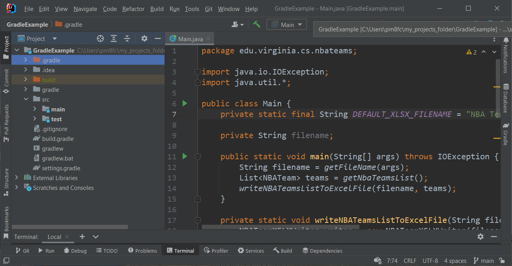
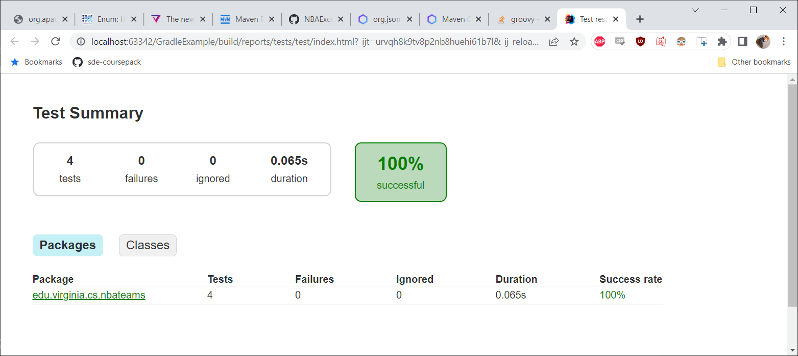

## [Source code example](https://github.com/sde-coursepack/NBAExcelTeams)

Note that you are not expected to understand all of the source code
in this project, we will be focusing on the build files and the structure
only, not the source code itself.

# Gradle

In this class, we will be using the Gradle build tool.

**All code released in this course** is released with a gradle build, and all
homework in this course will be required to be buildable via gradle.

---

## The ease of gradle

For today's example, [I have an open source project](https://github.com/sde-coursepack/NBAExcelTeams), which is the start
of a project for parsing out stats from the National Basketball Association (NBA).
Currently, this project produces an Excel spreadsheet of all NBA Teams.

Let's say you wanted to contribute to this project, adding things like team stats,
player stats, record, etc. How could you do that? Well, first you need to download
the project. So you go to a folder where you want to put the code, open a terminal,
and type:

`git clone https://github.com/sde-coursepack/NBAExcelTeams.git`

Note that you may not have git installed yet, and so you may not be able to
follow along. That's fine, as you don't need to today. Just understand that
the above command will download the repository on that Github page.

But now, if you try to run `cs.virginia.edu.nbateams.Main` right away, it won't
work. Because I only distributed the *source-code*, not the byte-code .class files.
And if you try to compile, you won't be able to. That's because this project has several dependencies. :

* JUnit Jupiter for testing
* Mockito for mocking during unit testing
* Apache POI for reading from Excel Files
* Org.json for reading JSON

Do you need to find all of those libraries and download them yourself? Well,
if we weren't using gradle, you might. However, lucky for you, **we are using gradle**,
and that makes this process very simple.

Simply, after cloning, stay in your terminal, and type:

``` shell
cd NBATeams
.\gradlew build
```

And then, sit back, relax, and let gradle do all the work! Gradle will:

* Download all the dependencies
* Compile all the code for you
* Run the existing test suite to make sure there are no known failures
* Build the output jar file for you to use.

It will also automatically optimize this build process. All the dependencies
already downloaded? Well, no need to download them again. No code changes
since your last build? Well, no need to recompile or re-test.

Once gradle finishes building, you will find a .jar file in the `build/libs`
folder inside of your project named `NBA-Excel-1.0.jar`.

You can now `cd` to that folder run that .jar file with:

`java -jar NBA-Excel-1.0.jar`

And a file named "NBA Teams.xlsx" will show up in that folder! If you open it
in Excel or Google Drive, you'll see the results:


So with just a `git clone`, a `cd`, and `.\gradlew build`, we can immediately
have the code downloaded, built, and working, ready for us to edit it! You've
been on boarded and are ready to start contributing code!

---

## Gradle project structure

A Gradle project has a strict structure.

---

### Root directory

The root directory is the project's root folder. For example, when I open
this project in IntelliJ:



On the left side, on what we call the **Project Pane**, you can see the file
structure of the project.

### src folder

The `src` folder contains of all our source code, both for running (`src\main\java`)
and for testing (`src\test\java`). Of all our source code will
be inside this folder somewhere.

### gradle/wrapper

You'll also see a folder called `gradle` which contains a folder called `wrapper`.
We will talk about the Gradle wrapper below.

### build folder

The folder `build` contains all of the generated files when building the
project, including the .class files, .jar files, test results, etc.

We never share the build folder publicly, and instead generate its contents
whenever we run `.\gradlew build`.


### gradle files

The files `build.gradle`, `settings.gradle`, `gradlew`, and `gradlew.bat` are files
needed for gradle to function correctly. The most interesting of these is
`build.gradle` which acts as a type of "script" for how your project is built.
`settings.gradle` is also worth looking at briefly. We will look at both of these
in detail in the next two sections.

### other files and folders

As a general rule, folders and files starting with a dot, like `.gitignore` are
special files that serve specific purposes.

* `.gitignore` is an important file related to Git that we will discuss in that unit
* `.idea` is for settings related to the IntelliJ IDEA, which is the IDE I am using
for this project.
* `.gradle` folder contains settings for gradle related to our `gradlew` command

---

## build.gradle

This file acts as the beating heart of the gradle build. Let's take a look at it's contents
piece by piece. You can see the [build file for this project on Github.](https://github.com/sde-coursepack/NBAExcelTeams/blob/main/build.gradle)

The build.gradle file is written in a **domain-specific language** using Groovy.
However, you don't need to learn Groovy to work with gradle, as it's
designed to be very readable and modifiable.

### plugins

The core plugins are used to describe the major aspects of the project
to gradle. Here, we simply have:

```groovy
plugins {
    id 'java'
}
```

This just tells gradle that our project uses Java. There are other plugins like
`kotlin` if we wanted to use that language, or `eclipse` if we want to use
the Eclipse IDE. There is technically a plug-in for IntelliJ, `idea`, but we
don't actually need it. That said, if we wanted to add it, we could just
change this to:

```groovy
plugins {
    id 'java'
    id 'idea'
}
```

The reason we don't need to add this is that IntelliJ already integrates
with Gradle on its own very nicely, which is one of the reasons I recommend
it over Eclipse in this class.

### Dependencies and Repository

Arguably, the sections that are the most important to understand are the
`repositories` and `dependencies` sections.

```groovy
repositories {
    mavenCentral()
}
```

This tells Gradle that you want to download all references from the
Maven Central repository. This is, by *far*, the most used and largest
repository of Java libraries, so you will basically always have this and
never change it.

```groovy
dependencies {
    implementation group: 'org.json', name: 'json', version: '20220320'
    implementation group: 'org.apache.poi', name: 'poi-ooxml', version: '5.2.2'
    runtimeOnly group: 'org.apache.logging.log4j', name: 'log4j-core', version: '2.18.0'

    testImplementation 'org.junit.jupiter:junit-jupiter-api:5.9.0'
    testImplementation group: 'org.mockito', name: 'mockito-core', version: '2.1.0'
    testRuntimeOnly 'org.junit.jupiter:junit-jupiter-engine:5.9.0'
}
```

This lists all the external libraries we are using. You'll see:
* json - used for parsing json text
* poi-ooxml - used for generating an Excel spreadsheet
* log4j-core - used by poi at runtime
* junit-jupiter-api - used in source code for writing tests
* mockito - used in testing to more precisely test specific features
* junit-jupiter-engine - used at runtime for executing tests

Now, you do not need to fully understand what each of these libraries do for
this lecture. The key here is to understand the point of this section, which
is to tell gradle:

1. Which libraries do we need
2. Which *versions* of those libraries do we need

So, for example let's look at the poi-ooxml dependency:

```groovy
implementation group: 'org.apache.poi', name: 'poi-ooxml', version: '5.2.2'
```

This tells gradle that "in order to compile our source code,
we need the `poi-ooxml` library. You can find it on the Maven 
Central repository under `org.apache.poi`. Please get version `5.2.2`.

Don't worry too much about the word at the start of the line. It will either be:
* implementation - the source code relies on this to compile
* runtimeOnly - I only need this resource at runtime
* testImplementation - Only the testing code relies on this to compile (src/test folder)
* testRuntimeOnly - I only need this when running the tests

If you are ever in doubt, just use **implementation**. Anything tagged as
implementation will be accessible in both main and test, both at compile-time 
and run-time. However, anything tagged as testImplementation will not
be accessible in main. Generally, you'll typically only see things like JUnit and
Mockito in the testing dependencies.

**To add a new dependency**, you can simply go to the 
[Maven Central Repository](https://search.maven.org/) or alternatively to
[MVNRepository](https://mvnrepository.com/) -- whichever you prefer from
an interface standpoint, as they both link to the same libraries -- search
for the library you want. From there, click on the version you want (typically
the most recent). Both websites will then show you the *Maven* and *Gradle* text
you need to add that dependency:


Note that you may need to scroll down to see the Gradle command on the Maven Central
Repository, or select the Gradle tag on MVNRepository. You do not want to copy
the Maven XML text.

### test

This tells gradle how to execute our tests.

```groovy
test {
    useJUnitPlatform()
}
```
In this class, you'll never use another testing platform, so you can just leave
this as is.

You can run the tests seperately from the rest of the build 
process with `.\gradlew test`. When testing, a formatted HTML page
will be generated at:

`build\reports\tests\test\index.html`

You can open that file with any browser (Safari, Chrome, Firefox, etc.)
to see a test report.



### jar

This task tells gradle how to build our output jar file.

```groovy
jar {
    archivesBaseName = "NBA-Excel"
    duplicatesStrategy = DuplicatesStrategy.EXCLUDE
    manifest {
        attributes "Main-class": "edu.virginia.cs.nbateams.Main"
    }

    from {
        configurations.runtimeClasspath.collect { it.isDirectory() ? it : zipTree(it) }
    }
}

group 'edu.virginia.cs.nbateams'
version '1.0'
```

`archiveBaseName` is simply the name of the output jar file. The name will
by default have the `version` number appended. This means our .jar will be named
`NBA-Excel-1.0.jar`.

`group` is useful if we want to deploy our .jar file on Maven or something like
that. I tend to just set this to my `Main` class, or whichever class contains the
`main` function.

`duplicatesStrategy` is something that could be relevant in more complicated development
settings, but for the sake of this class, just leave it as `DuplicateStrategy.EXCLUDE`.
You'll always want this whenever you are making a "fat-jar" like we are.

`manifest` is where we define the properties of our jar Manifest. Whenever
you are releasing a **runnable** jar, then you **absolutely must include** the
`attributes "Main-class"` item. This should be set to the package name and class name
of your main class. In my code, the `main` method is in `Main.java` in the package
`edu.virginia.cs.nbateams`.

### fat-jar

The idea of a "Fat Jar" is a jar that contains **not only my own code**, but also
all of the dependencies of my code. This is important because if I didn't include
the dependencies in my jar file, I would need to seperately run the `java -jar` command
with additional arguments to specify where to find those dependencies. While doable,
this is complicated and beyond what we need in this class. The purpose of:

```groovy
from {
    configurations.runtimeClasspath.collect { it.isDirectory() ? it : zipTree(it) }
}
```

...is simply to tell Gradle "Hey, include all the dependencies in the Jar file". You 
will want to check the licenses of any libraries you use to ensure that you have
a right to redistribute them. For the libraries I have selected for homework
assignments, I have ensured that the License allows redistribution.

---

## ```gradle build```

First, notice the above is *not* `.\gradlew build`, we'll talk about why in
a second.

The command ```gradle build``` tells Gradle to execute the build script, 
`build.gradle`. Generally this means make sure the project has the necessary
dependencies, compile the code, run the tests, and build the jar file.

---

## Gradle wrapper

Now, all of the above assumes you someone has installed gradle on their computer.

What if they haven't? Do they have to download it, figure out how to set it up
on their PATH variable, etc.? This is where the gradle **wrapper** comes into play.
In each gradle distribution, there should be a wrapper included. This will automatically
Install gradle for you just by running `.\gradlew build`

**MAC USERS**: If you are getting a permission denied error when running `.\gradlew build`
or any other `.\gradlew` commands,
this means that the `gradlew` doesn't have execute permissions. This can
be changed by simply running in the same folder:

`chmod +x gradlew`

And *then* run `\.gradlew build`

### ```.\gradlew build```

`.\gradlew build` does basically the same thing `gradle build` does, but you
*don't have to have gradle installed on your computer*. The first time you
run a `.\gradlew` command, the program will automatically install
the correct version of `gradle` for that project (not to your computer
as a whole). This is beneficial, because now if you have multipl projects
on your computer that use different versions of gradle, you don't have to worry
about it! In fact, you never have to manually install gradle at all.

The one limitation of this is that if you want to **create** your own project
as gradle, you will either need to install gradle yourself or use an IDE
that will install gradle for you (like IntelliJ). However, this means that
the only dependency your project has that you must install on your own
is the JDK (which IntelliJ can also do for you). Everything else, including
external libraries, is going to be described in the gradle file.

Note that there are some limits to this. For example, if you want to work
with Android Studio projects, you still have to install Android Studio on your
own. However, we won't be working with Android Studio in the course.

---

## Conclusion

The point of gradle is to ease both the build-process and the
setup-process. All you need to do to build a gradle project you
find on github is:

1) Download it (`git clone`)
2) Open the project (either in your terminal or your IDE)
3) Build it (run `.\gradlew build` )

And you're ready to go!
