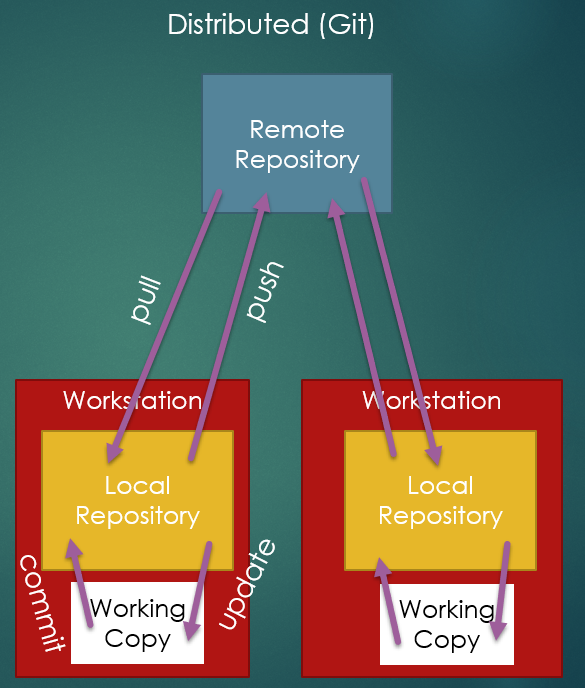

* TOC
{:toc}

# Version Control

When developing software, we need to be able to share
code among the team, as well as release multiple versions of the software.
Externally, as software continues to evolve, with new versions featuring
bug fixes, new features, and compatible with new hardware or software.

Internally, we track as the features are developed overtime. Every time
anyone makes any changes to a file, they are creating a new
version, even if they never share it with anyone.

A *Version Control System* (VCS) is a system for tracking
changes to files in a project overtime. VCS systems
aren't just used with code! This website is stored
using `git`, the Version Control System we will use
in this class. [You can actually see the commit history
for this website here!](https://github.com/sde-coursepack/sde-coursepack.github.io/commits/main)

## Version Control Usage

Often, newer developers will think "We use version
control to aid collaboration", which is absolutely
true! But it's far from the only reason for using VCS!
I use VCS (almost always git) for even independent
development projects, either for fun or for class, even
when I'm not working with anyone else. There are myriad
benefits for this!

### Safety

Have you ever been working on a project, deleted some
old code, tried to replace it with something "better",
only to get stuck, and then think to yourself:


I've done this! And when I was in undergrad, and not
using version control systems (or using them poorly),
I would be out of luck! I'd have to try to remember
what I wrote, which I almost never did, and I wasted
hours of time.

With modern version control systems, especially if
you are hosting a project on GitHub and/or using a
great IDE like IntelliJ, you can quickly and easily
time-travel to your earlier commits, get what you
need, and bring the code back to the present with you!

Additionally, if you are pushing to a remote
repository, you don't have to worry if your hard drive
fails, of your for some other reason you are unable
to access the computer you wrote code on. It's
all online and accessible!

### Debugging

In large software systems, it is often very easy
to run into problems with **stability** (covered back
in the software quality unit in Intro). That is, changes
in one location in the code can have negative and
unpredictable side effects for other parts of the code.

However, if you practice proper test-driven development,
as we will cover later in this course, and sufficiently
test your code, you can often find these "would be" bugs
before you share your code with others. Once you
identify that a test is failing, and a bug must have 
been introduced, you can step back through your commit
history and find the commit where the bug first appeared.

This will substantially narrow your search when trying
to find and correct the bug!

### Collaboration

One of the most obvious benefits is how VCS supports
collaboration between multiple people. A robust VCS
system will allow multiple development branches, so
individuals or tight-knit groups can work on individual
features and incorporate them independent of other
changes throughout the software project. Robust systems
will alert you when two changes conflict with one
another, ensuring a human is consciously deciding
how to resolve the defect to avoid unexpected errors.
A robust system can allow tracking of who worked
on what, so if issues emerge, you know how the
first person to talk to is.

In particular, the VCS `git` ended up being the basis
for an entire programming hub and social network, 
GitHub.

### Conflict Detection

When working together, programmers will not always
pull in the same direction. While experienced software
development teams will have a good idea what
everyone is working on, there will still at times
be situations where two people make changes to the project
at roughly the same time that are not compatible.

This is similar to race conditions you've talked
about when using Threads in Java, and
we want to make sure race conditions are avoided when
possible! Modern VCS systems will handle all
threading aspects of handling commits, but they
**will not resolve conflicts for you!** And this is
a good thing!

When a conflict is created by two programmers
committing incompatible changes, the VCS system will
alert the second committer that their commit creates
a conflict. Then, the second committer will want
to work with the first committer to decide how
to best resolve the conflict. 

A good VCS system handles compatible changes without
manual effort, but **forces** the committers to take
manual effort whenever there is a conflict, and helps
inform the committers what the nature of the conflict
is to best enable committers to make an appropriate decision
on how to resolve the conflict.

### Deployment

When we say *deployment*, what we mean is releasing
changes to a software product such that the customer
can access them. Whenever you are prompted to download
a software update, that is because the company *deployed*
new changes to the software.

This website is actually deployed by git! Whenever
I push a change to the `main` branch, git rebuilds 
the hosted website to reflect the new articles I've 
written or anachronistic Arrested Development memes 
I've posted, with no manual effort on my end! In fact
many web services work this way! This process is often
called Continuous Integration/Continuous Deployment (CI/CD).

In many software projects (both open-source and 
propriety, or closed-source), the `main` branch
represents the software project in its current
deployed state. When a push is made to main, a 
Continuous Integration service will run a suite of
tests written by the development team to ensure all
known and tested for behavior is working correctly. If
it passes, it will then deploy the changes to the website.
From then on, customers going to the website will see
the new features, bug fixes, etc.

### Regression Testing

As part of deployment, I talked about running existing
tests. Running an existing battery of pre-existing
tests to ensure previously working features are still
working is called regression testing. When we start
writing tests, there is no reason to ever throw them
away! Once tests are passing, they become our
regression tests: our safeguard against breaking things
that work.

However, a VCS system can be setup to do things
like reject pushes and merges to important 
branches like `main`, or if a push causes a test
to fail, not deploying that faulty push. Github
features a tool called GitHub Actions, which is a
CI (Continuous Integration) Tool that will automate
this process. This adds visibility, as each commit
that is run against the tests will have either a red-x
for "Tests failed" or green check for "Tests passed",
adding visibility to the development progress.

---

## Centralized Repository

Older version control systems (VCS) used a centralized repository.


In a centralized VCS system, the remote repository is where all
shared versions of the software are stored. Developers work in their
workstations, and when they want to record their work in the
repository and share, they **commit**. When they want to get the work
from the repository, they **update**.

### ```cvs```

Concurrent Versions System (cvs), released in 1990 was an early
centralized-repository system. It supports branching as well
as committing and updating. However, CVS maintained a version
history on each file separately, meaning different files could
have different commit numbers for what is the same commit of multiple files. 
Additionally, because each file was maintained separately, 
if you had a conflict
on one file, CVS would reject that commit. On the other hande, if
in the same commit another file had no conflict, that commit would go
through, effectively meaning half your commit failed, while half passed.
This could lead to significant difficulties in maintaining the
validity of the remote repository.


### ```svn```

Apache Subversion, or `svn`, is probably the most well known 
centralized-repository VCS system. `svn` was very popular in
the early and mid 2000s. However, by the late 2000s and into
the 2010s, it had begun falling off considerably as git became more
widely used.

SVN made a couple of changes to CVS. First, the entire repository
had a single commit number for all commits. Additionally, it used 
the paradigm of "atomic commits", meaning when you commit multiple
files, either *all* the files are accepted, or *none* of them. As
Mike from Breaking Bad would say, "No half-measures."

This actually was beneficial for conflict resolution, which
contributed to SVN's wide adoption. In fact, SVN was what
I learned in undergraduate.

---

## Distributed Repository

In a distributed repository model, in addition to a centralized
remote repository, every workstation also has a local copy.



So, the generic operations of a distributed system are:

* __Commit__ - store your current changes in your local repository
* __Update__ - get any changes to your local repository
* __Push__ - send the state of your local repository to the remote repository
* __Pull__ - get any new changes on the remote repository

### ```git```

Git (which was selected as a name because it was phonetic and short
and wasn't already an established UNIX command) is a distributed
repository VCS. Git grew rapidly in popularity, and is now more
popular than all other VCS systems combined.

Git separates "committing", saving changes to a local repository,
from "pushing", sending changes in the local repository to the
remote repository. This encourages "committing early and often",
that is, committing in the same way that you would "save" a file,
one little bit at a time. This also means you will often avoid
pushing non-working code, as you can still commit your progress
without polluting a remote repository that others have to work with.

Just like svn, git supports atomic commits and branching.

Additionally, git supports deciding *which* files you want to commit
by use of a "staging area". When you want to commit a file, you first
use "add" to tell git "the next time I commit, add the changes to
this file to the local repository". While this may seem like a burden,
it allows you to consciously decide to commit changes from only some 
files at a time if you want to.

``git add .`` tells git to add all file changes, as the period
serves as a wild-card for "all files".

#### Why git instead of svn?

The biggest reason we are using git instead of svn is that
the distributed nature makes for a better workflow. You can
work independently on a new feature and commit frequently as
a way of saving your work and tracking your progress, without
having to push and potentially deal with conflicts as frequently
as you push. Another reason we are using git is simply how
popular git has become, as well as the availability of tools
like GitHub classroom. While `svn`, Mecurial, and other VCS
systems still exist and are still used, git's popularity
rises well above its competitors, and thus is the best
starting place for learning VCS.

#### GitHub

GitHub and git `git` are *not* the same thing. GitHub didn't
invent git, though it likely had a significant hand in the
rapid popularity rise in Git.

GitHub hosts remote repositories so that you do not have to
create your own. Github allows an unlimited repositories, and
up to 500MB of package storage for free. Github also supports
services like Continuous Integration, which can be used to
automate things like Regression Testing, and Continuous Delivery,
to automatically release new versions of software committed to
the "main" branch.

GitHub also supports a feature called "pull requests." A "pull 
request" can be something of a misnomer when people first see it.
If you make a "pull request", typically you are saying "Hey, this is
a series of commits I have made, would you please pull them into this
branch?" That is, the person issuing the request is asking the
maintainer to pull the requester's code.

Pull Requests are often used as a safe-guard to prevent people
committing directly to the production branch (that is, the version of
the software that has been released). This is because you don't
want patches which haven't been thoroughly vetted to be added to
software that may be in use. However, many open-source repositories
do accept pull-requests, and an accepted pull request is absolutely 
something you can put on your resume.

GitHub also acts as a social network for programmers. It allows you
to track your history of committing code across all projects, show others
what projects you're working on, etc. GitHub profiles can be
a key portfolio item in job searches, with the added benefit of
allowing you to show not just what projects you've done work for, but
what specific work you've done.

GitHub also has an educational tool called "GitHub Classroom" which
we use in this class for the homework. It allows educators to create
organizations for students to use to work on and submit projects.
