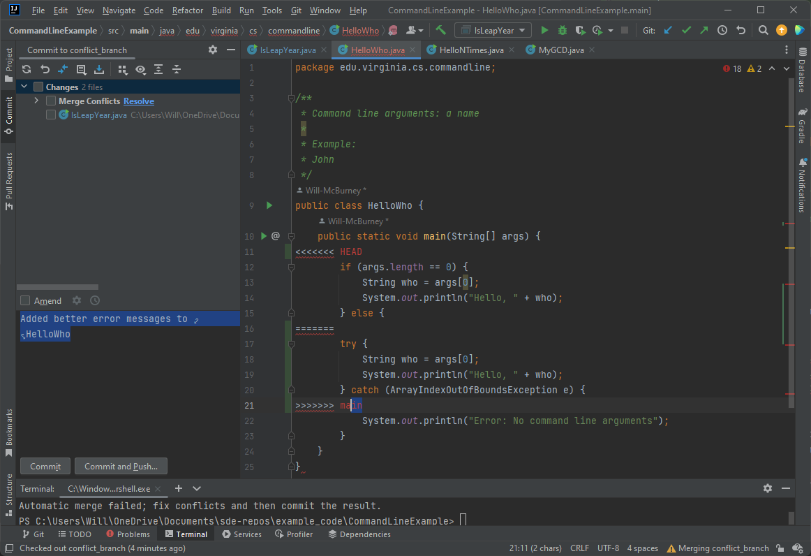

* TOC
{:toc}

# Repository operations

Now that we have branching down, let's look at basic repository operations.

### Using IntelliJ

Once again, I strongly encourage using IntelliJ or any other Git GUI
if you are first starting out.

### ```add```

The name `add` may imply that the command is for adding new
files to the repository, but you actually use add for all changes.

`git add my_filename`

Adds any changes to the file to the repository. If the file hasn't
been added before, it adds the whole file. In either case, we call
these changes "staged", as in ready to be stored in the repository.
To add all files that aren't filtered out by .gitignore, you can run `git add .` (the last
item being a period) in the project's root directory. **Make sure
you have a correct .gitignore in place before you do this!)

### ```commit```

Committing means saving your staged changes to your local
repository. Commits require a meaningful commit message. The
format is:

`git commit -m "your message goes here"`

You cannot commit individual files, because commit automatically
stores all **staged** changes (that is, changes we have run
git add on). So your message should describe all staged
changes.

Your commit message should clearly communicate what the commit
contains. You don't need to write a novel, but it should be something
like "refactored myBigFunction to make myClass more readable", 
"fixed negative number crash in getClassByIDNumber", or
"continued working on CSVReader class". You may need to understand
what each commit did later on if you are trying to backtrace a bug,
or retrieve code that has been lost.

### ```push```

This pushes all commits in your current branch
since the last push to the remote repository.

`git push`

This can and will push multiple commits at the same time. Git will
automatically determine which commits to push to keep things simple.
**However, remember to always pull before you push**.

### ```pull```

`git pull`

This gets the most recent changes from the remote repository for your
current branch. Be aware that pulling only pulls for your current
branch, not for every branch. Whenever you checkout a new branch,
you should always pull.

**If you get an error when you try to pull** that reads something like:
"Your local changes to the following files will be overwritten by merge",
this means that you have changes that have not been committed.

However, because this means your local repository is behind the remote
repository, you won't be able to commit your changes. The solution is to use the 
stash. The stash is basically a stack for saving changes that, for whatever reason,
you don't wish to commit, but don't want to lose. Simply use:

```
    git stash
    git pull
    git stash pop
```

...and you should be good to go.

## Commit hashes

If you look at the commit history [for the Gradle Tutorial](https://github.com/sde-coursepack/NBAExcelTeams/commits/main)
that we will cover in the next unit, you will see each commit comes with a hexadecimal number
on the right hand side. For example, the most recent commit is c568af0. These are actually the first
7 hexademical characters of a hash that uniquely identifies the commit. Rather than using incrementing
numbers, GitHub uses a hashing system to manage commits.

If you need to use the commit number, you can simply use those 7 digits. If needed, you can also find
the full hash by [clicking on the commit hash](https://github.com/sde-coursepack/NBAExcelTeams/commit/c568af0cfe3709c466ad2767fc31736540df6676)

Where you will see it on the right next to commit:

`c568af0cfe3709c466ad2767fc31736540df6676`


## Conflict Resolution

A conflict can occur when you commit to a branch in the remote repository that
someone else has pushed to since your last pull. An example of a situation that could create
a conflict.

1) Bob pulls from branch_a
2) Steve pulls from branch_a
3) Bob commits MyClass.java to branch_a and pushes
4) Steve commits MyClass.java to branch_a
5) Steve pulls from branch_a

Now, just because two different people committed to the same
file does not mean that a conflict necessarily occurs. Git tracks
line numbers of files as changes are added and committed. If Steve
and bob edit different lines of the file, then there is no conflict,
git will automatically merge the changes without error or warning.

Let's say they are working with the with HelloWho.java

```java
public class HelloWho {
    public static void main(String[] args) {
        String who = args[0];
        System.out.println("Hello, " + who);
    }
}
```

Bob decides to add error handling via a try-catch block:

```java
public class HelloWho {
    public static void main(String[] args) {
        try {
            String who = args[0];
            System.out.println("Hello, " + who);
        } catch (ArrayIndexOutOfBoundsException e) {
            System.out.println("Error: No command line arguments");
        }
    }
}
```

While Steve uses an if-statement

```java
public class HelloWho {
    public static void main(String[] args) {
        if (args.length == 0) {
            String who = args[0];
            System.out.println("Hello, " + who);
        } else {
            System.out.println("Error: No command line arguments");
        }
    }
}
```

Now, when Steve pulls, he gets a conflict!

```java
Auto-merging src/main/java/edu/virginia/cs/commandline/HelloWho.java
CONFLICT (content): Merge conflict in src/main/java/edu/virginia/cs/commandline/HelloWho.java
Automatic merge failed; fix conflicts and then commit the result.
```

I see a lot of students panic when they see this. But when you see this,
**Don't panic!** Conflict resolution is Git isn't as bad as it sounds.

When Steve opens the file in IntelliJ, he sees:



The contents of the class are:

```java
public class HelloWho {
    public static void main(String[] args) {
<<<<<<< HEAD
        if (args.length == 0) {
            String who = args[0];
            System.out.println("Hello, " + who);
        } else {
=======
        try {
            String who = args[0];
            System.out.println("Hello, " + who);
        } catch (ArrayIndexOutOfBoundsException e) {
>>>>>>> 7bce35c8b1e70f4b3daf478d772546d554f07e96
            System.out.println("Error: No command line arguments");
        }
    }
}
```

Now, it's worth taking a second and talking about how Git labels conflicts. Remember
here that this is from the perspective of Steve, who pulled *after* Bob
pushed his changes:

* Between `<<<<<<< HEAD` and `========` is Steve's code
* Between `=======` and `>>>>>>> 7bce35c8b1e70f4b3daf478d772546d554f07e96` is the incompatible changes on the remote repository
* The `=======` is a divider between these changes.

Therefore, in this case, we can resolve this conflict by simply **picking which implementation we want**. Steve
talks to Bob, and they decide the try-catch block approach is better. So Steve:
* Deletes everything between `<<<<<<< HEAD` and `========`

```java
public class HelloWho {
    public static void main(String[] args) {
<<<<<<< HEAD
=======
            try {
                String who = args[0];
                System.out.println("Hello, " + who);
            } catch (ArrayIndexOutOfBoundsException e) {
>>>>>>> 7bce35c8b1e70f4b3daf478d772546d554f07e96
                System.out.println("Error: No command line arguments");
            }
        }
    }
```

* and the deletes the conflict indicator tags

```java
public class HelloWho {
    public static void main(String[] args) {
            try {
                String who = args[0];
                System.out.println("Hello, " + who);
            } catch (ArrayIndexOutOfBoundsException e) {
                System.out.println("Error: No command line arguments");
            }
        }
    }
```

* Now Steve can simply commit this resolve file

`git commit -m "resolved HelloWho conflict, used try-catch solution"`

And now we're done! Resolving conflicts is easy when there aren't many. But **the only
way to keep the problem manageable is to pull frequently, and push new changes frequently.**
The more code you write between pulls and pushes, the larger and harder to resolve your conflicts
will be.

### No conflict, no problems? No!

Note that even when a direct conflict doesn't occur, like the above, that
doesn't mean changes are inherently compatible.

Say MyClass.java looks like this when Bob and Steve pull

```java
public class MyClass {
    private int MyNumber;
    private String myText;
    
    public MyClass() {
        MyNumber = 0;
        myText = "Text";
    }
}
```

Now, Bob notices bad style, specifically that the variable MyNumber is
written in a class-like style, with a capitalized first letter. So Bob
catches this, and fixes it by refactoring the name of the variable:

```java
public class MyClass {
    private int myNumber;
    private String myText;
    
    public MyClass() {
        myNumber = 0;
        myText = "Text";
    }
}
```

Meanwhile, Steve is adding getter methods to MyClass, so he commits:

```java
public class MyClass {
    private int MyNumber;
    private String myText;
    
    public MyClass() {
        MyNumber = 0;
        myText = "Text";
    }
    
    public int getMyNumber() {
        return MyNumber;
    }
}
```

Now, Steve pulls Bob's changes. Git will automatically merge the files. Since Bob edited the second and
sixth line of the class, and Steve added four lines after the constructor, there is no overlap. So the merged
filed will look like:

```java
public class MyClass {
    private int myNumber;
    private String myText;

    public MyClass() {
        myNumber = 0;
        myText = "Text";
    }
    
    public int getMyNumber() {
        return MyNumber;
    }
}
```

But now, Steve will have a syntax error! This is because the getter method references the variable
`MyNumber`, which no longer exists. Instead, the variable name was changed to `myNumber`. Luckily
for Steve, Bob wrote a useful commit message:

`renamed MyNumber to myNumber`

Just that simple message immediately communicates to Steve why the syntax error is there, and how
to fix it. So, Steve changes his getter method to:

```java
    public int getMyNumber() {
        return myNumber;
    }
```

And now everything is fine.

## If you get stuck

If all else fails, and you find that your repository has become unmanageable to work with in
its current state (FUBAR - ... beyond all repair. You can fill in the F), sometimes the best
option may be to do a reset.

`git reset --hard`

This will reset your repo to the state of the previous commit, discording all changes. If you
don't want to lose those changes, you can either use 'git stash' **before the reset** or simply
copy (not cut and paste) your working copy files to another, non-git folder on your computer.

A "nuclear option", if all else fails, is to delete your *local* repository by deleting
your project folder, and then re-cloning your repository. Generally, you shouldn't need
to do this, but I can say when I was first learning version control, I did do this. If there
are any changes you want to keep track of, you can simply copy those files to another folder
before you delete your project folder, and then copy them back in after cloning.

## GitHub Permissions Issues on IntelliJ and Terminal

If you are having any permissions issues in GitHub, see the **"Login/Permissions issues with GitHub"**
in the **Git Basics** module.