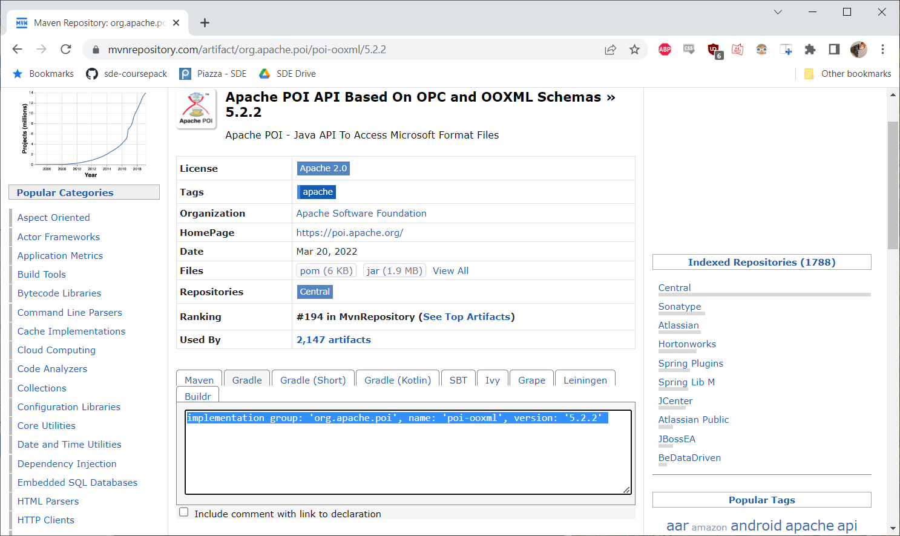

* TOC
{:toc}

## [Source Code Example](https://github.com/sde-coursepack/NBAExcelTeams)

Note that this example also uses the package `org.json` in the class
`NBATeamReader`, but you can ignore that for now. Just trust that
the `NBATeamReader` class works as used in main.

# poi

Apache Poi is a library for reading and writing Microsoft
Office File Formats (like Word, Excel, etc.) in Java. For
the sake of this tutorial, we are going to focus on
writing to and reading Excel files.

In this example, we will be writing information about NBA
teams to an Excel spreadsheet.

## org.apache.poi

There are a number of Apache Poi libraries. The specific packages
we want for reading Excel files are:

* `org.apache.poi.ss` - Library for reading and writing an abstract SpreadSheet
* `org.apache.poi.xssf` - Library for reading and writing an `.xlsx`, or Excel 2007 and later, spreadsheet.

XSSF stands for "XML Spreadsheet Format" because the file 
format is XML based. There is also a library for reading from
older, .xls spreadsheets, which is HSSF. However, we are going
to focus strictly on the newer and better `.xlsx` file format.

## Adding poi with Gradle

Both of these packages are in the Apache POI-OOXML library, [which
can be found here.](https://mvnrepository.com/artifact/org.apache.poi/poi-ooxml)
However, you do not have to download or install anything on
your own to make this work.

Instead, we will go to the link, click the most recent version (as
of this writing, 5.2.2), and then from the tabbed area below the
version information, click the Gradle tab:



From there, we copy the text that says:

`implementation group: 'org.apache.poi', name: 'poi-ooxml', version: '5.2.2'`

...and then simply paste that into our build.gradle file
inside of the `dependencies` closure. Thus, our dependencies will look
like: 

```groovy
dependencies {
    implementation group: 'org.apache.poi', name: 'poi-ooxml', version: '5.2.2'

    testImplementation 'org.junit.jupiter:junit-jupiter-api:5.9.0'
    testRuntimeOnly 'org.junit.jupiter:junit-jupiter-engine:5.9.0'
}
```

Note that the org.junit.jupiter libraries are loaded by default
in IntelliJ because of how popular the testing framework is. Leave
those libraries in there!

### log4j

Now, our dependencies may have dependencies of their own. In the
case of `poi-ooxml`, it uses the Apache logging tool `log4j`. However, the
poi-ooxml does not contain this dependency. So we need to include it
separately. It is worth noting our code *can* work without `log4j`,
but it will give an error message if log4j is not available at runtime.

To include it, we simply search for log4j, [which can be found here.](https://mvnrepository.com/artifact/org.apache.logging.log4j/log4j-api)
Once again, we select the latest version (2.18.0 at the time of this writing),
and copy the Gradle import statement from [that version's web-page.](https://mvnrepository.com/artifact/org.apache.logging.log4j/log4j-api/2.18.0)

`implementation group: 'org.apache.logging.log4j', name: 'log4j-core', version: '2.18.0'`

And drop it in our dependencies as well:

### implementation vs. runtime

None of our code will actually use `log4j` in this demo. We only
need to include `log4j` because it is used by `poi-ooxml` at runtime.
As such, we can change our build dependencies to:

```groovy
dependencies {
    implementation group: 'org.apache.poi', name: 'poi-ooxml', version: '5.2.2'
    runtimeOnly group: 'org.apache.logging.log4j', name: 'log4j-core', version: '2.18.0'

    testImplementation 'org.junit.jupiter:junit-jupiter-api:5.9.0'
    testRuntimeOnly 'org.junit.jupiter:junit-jupiter-engine:5.9.0'
}
```

The specific difference is that `log4j` is now listed as `runtimeOnly`
rather than `implementation`. The advantage here is that when
we are compiling, but not running, our code, we won't have to
load in the `log4j` library, making the compiling process slightly
more efficient. The change is negligible in this case, but if
you have a project pulling from dozens of libraries, this can
start to add up.

The short way to understand this:
* If you ever import a package from a library in your code, it must be in `implementation`
* If you depend on a package, but do not import it in your code, it can be in either `implementation` or `runtimeOnly`
* `runtimeOnly` is generally preferred in this case, but not required.

If you're ever unsure, it's fine to just leave your dependencies as `implementation`

### implementation vs testImplementation

You'll notice that the JUnit libraries are listed as:
* `testImplementation`
* `testRuntimeOnly`

This is because we are separating the process of **testing our
code** from the process of **running our code**. 

**When we run this program**, we want to have the program write
information about NBA teams to an Excel file.

**When we test this program**, we are running our battery of tests
against the code to ensure there are no known defects.

In fact, we can run our tests without building using:

./gradlew test

We will talk more about testing in the [Testing](https://sde-coursepack.github.io/modules/testing/V-and-V/) module.

### Connecting with IntelliJ

Sometimes, even after building, IntelliJ's Java editor may not
immediately recognize the libraries you've imported. If this happens,
you can either close and re-open the project, or, on the right side
of the screen, open the Gradle Tab and click the "Refresh" symbol
for "Reload all Gradle Projects."


### Relevant Classes

We're going to look at the classes we need to use poi first. We will
break this into the abstract interfaces, and the concrete classes
that implement the interfaces for an `.xlsx` Spreadsheet

#### Abstract interfaces

Package: `org.apache.poi.ss.usermodel.*`

* `Workbook` - represents a generic Spreadsheet style workbook
* `Sheet` - represents an individual generic Spreadsheet in a Workbook
* `Row` - represents a row in a generic spreadsheet
* `Cell` - represents a single cell in a generic spreadsheet

You'll note there is no class for Column. We typically access columns
via a getColumn(int index) function on Sheet or Row

#### Concrete interfaces

Package: `org.apache.poi.xssf.usermodel.*`

* `XSSFWorkbook` - represents an `.xlsx` Workbook
* `XSSFSheet` - represents an individual Spreadsheet in an `.xlsx` spreadsheet
* `XSSFRow` - represents a row in an `.xlsx` spreadsheet
* `XSSFCell` - represents a cell in an `.xlsx` spreadsheet

Package: `org.apache.poi.hssf.usermodel.*`

* `HSSFWorkbook` - represents am `.xls` Workbook
* `HSSFSheet` - represents an individual Spreadsheet in an `.xls` spreadsheet
* `HSSFRow` - represents a row in an `.xls` spreadsheet
* `HSSFCell` - represents a cell in an `.xls` spreadsheet

#### Which to use

As a general design principle, we want our code to be as abstract as possible.
This is because if, for example, Excel made a new file format, we could expect in
time `org.apache.poi` to have packages for that new file format. For example
if, say, Excel made a new JSON-based file format, it might be something 
like `org.apache.poi.jssf.usermodel.*`. If, as much as possible, we use the
abstract classes, then our code is much more reusable. We only have to 
re-write one line (the Constructor call), but can still use our Worksheet from there.

Consider the following function in the [class `NBATeamsExcelWriter`](https://github.com/sde-coursepack/NBAExcelTeams/blob/main/src/main/java/edu/virginia/cs/nbateams/NBATeamXSLXWriter.java):

```java
    private void addTeamsToWorkbook(List<NBATeam> nbaTeamList) throws IOException {
        worksheet = workbook.createSheet("NBA Teams");
        Row titleRow = getNextRow();
        putHeaderStringArrayInFirstRow(titleRow);
        addTeamsToWorksheet(nbaTeamList);
        resizeColumns();
    }
```

This function takes in a List of NBA Teams and a Workbook. Is this Workbook
for `.xls`, `.xlsx`, or something cool we haven't even heard of yet? It doesn't
matter! In the same way we don't care what *kind* of List the first parameter is (ArrayList
Vector, LinkedList), we don't care what *kind* of Workbook the second parameter is (HSSFWorkbook, 
XSSFWorkBook, or something new). The only time we need to reference the concrete-class is at creation. Thus,
we can just create the WorkBook, and then store it in the `workbook` field.

```java
    private void openWorkbook() {
        SSWorkbookFactory workbookFactory = new SSWorkbookFactory();
        workbook = workbookFactory.getWorkbook(excelFilename);
    }
```

All the logic about *which* type of spreadsheet we are using is handled
by the `SSWorkbookFactory` class:

```java
public class SSWorkbookFactory {
    public Workbook getWorkbook(String filename) {
        if (filename.endsWith(".xlsx")) {
            return new XSSFWorkbook();
        } else if (filename.endsWith(".xls")) {
            return new HSSFWorkbook();
        } else {
            throw new IllegalArgumentException(getIllegalFilenameError(filename));
        }
    }

    private String getIllegalFilenameError(String filename) {
        return "Error: illegal excel filename: " + filename + "\n" +
                "\tFilename must end with .xlsx or .xls";
    }
}
```

After that, we can treat it like a generic workbook to ensure our code
is reusable and flexible.

## Writing to an Excel Workbook

To create a new `.xlsx` Excel Workbook, we have to do the following steps:
1. Create a new XSSFWorkbook Object 
2. Populate the workbook with data 
3. Save the Workbook object with the intended filename and close it

And if you look, this is exactly what our `writeNBATeamsToFile` function does:

```java
    public void writeNBATeamsToFile(List<NBATeam> nbaTeamList) throws IOException {
        openWorkbook();
        addTeamsToWorkbook(nbaTeamList);
        saveAndCloseWorkbook();
    }
```

Now, of course, it isn't this simple. I wrote all 3 of these functions. But
writing our code this way can improve readability, as it becomes clear
**exactly** what each function does.

Let's say we wanted to generate the following spreadsheet. We've already covered
1, so now let's dive into the [class `NBATeamsExcelWriter`](https://github.com/sde-coursepack/NBAExcelTeams/blob/main/src/main/java/edu/virginia/cs/nbateams/NBATeamXSLXWriter.java)
function `populateSaveAndCloseWorkbook` in our code. We will go line by
line, diving into the helper-functions as needed.

### Worksheet

```java
    Sheet worksheet = workbook.createSheet("NBA Teams");
```

This creates a new worksheet. In an Excel workbook, you can have multiple
sheets if you want. But before we can write to a sheet, we must create our sheet first. Every sheet has a
name, so our name is "NBA Teams". This worksheet is initially blank.

### Row

When looking at the next line, we are calling the private helper function 
getNextRow(). This uses the private class field `rowCount`, which we are
using to keep track of the next row that we can write to.

```java
    private Row getNextRow(Sheet worksheet) {
        Row newRow = worksheet.createRow(rowCount);
        rowCount++;
        return newRow;
    }
```

The above method gets a new Row object using the function 
`worksheet.createRow(rowCount)`. It then increments rowCount so that
the next time we call this function, we get the next row below the
one we just created. This new Row, like our Worksheet and Workbook, is
initially empty. So now we need to know how to create Cells:

### Cell

Looking at the function `putHeaderStringArrayInFirstRow`, we see:

```java
    private void putHeaderStringArrayInFirstRow(Row titleRow, String[] COLUMN_HEADERS) {
        for (int columnIndex = 0; columnIndex < COLUMN_HEADERS.length; columnIndex++) {
            Cell newCell = titleRow.createCell(columnIndex);
            newCell.setCellValue(COLUMN_HEADERS[columnIndex]);
        }
    }
```

Here, for each String we want to put into the Row `titleRow`, we:
1. Create a new Cell with the column number we want, where 0 is the first column 
2. Use setCellValue to set the contents of the Cell.

Note that setCellValue will also set the cells type. For example:

* If you input a String, the cell type will be Text
* If you input an int or double, the cell type will be Numeric
* If you input a java.util.Date class, the cell type will be Date, etc.
* Separately, you can enter formula Strings with setCellFormula(String formula) if you are familiar with Excel formula syntax

For example, in `putNBATeamArrayInRow`, we store the `id` of the team in
a Numeric Cell:

```java
    private void putNBATeamArrayInRow(Row row, String[] contents) {
        Cell idCell = row.createCell(0);
        idCell.setCellValue(Integer.parseInt(contents[0]));
        for (int columnIndex = 1; columnIndex < contents.length; columnIndex++) {
            Cell newCell = row.createCell(columnIndex);
            newCell.setCellValue(contents[columnIndex]);
        }
    }
```

### Styling

I do want to briefly point out one element of styling in the function `resizeColumns`

```java
    private void resizeColumns(Sheet worksheet) {
        for (int columnIndex = 0; columnIndex < COLUMN_HEADERS.length; columnIndex++) {
            worksheet.autoSizeColumn(columnIndex);
        }
    }
```

This is just a simple for-loop that goes through each column and auto-sizes
the width so no text is cut off. This is about as far into the styling rabbit-hole
as I want to go for now, but it's worth doing so that your spreadsheet is readable.
There are lots of tutorials and documentation on the `CellStyle` class in poi
if you want to look into it, but you won't have to in this course.

### Saving the file

Finally, let's look at how our file is saved:

```java
    private void saveAndCloseWorkbook(Workbook workbook) throws IOException {
        FileOutputStream fileOut = new FileOutputStream(excelFilename);
        workbook.write(fileOut);
        fileOut.close();
        workbook.close();
    }
```

Here, I'm just using a standard file-writing approach with a `FileOutputStream`.
The `poi` library handles actually writing the file, I just need to tell
the `Workbook` object **where** I want the file written. In this case,
I'm writing the filename specified in the class' constructor.

Always make sure to close both the `FileOutputStream` and the `Workbook`! If you
don't close, the file may appear to not be written, as it's still open in
your program's memory.

---

## Reading from XSSF Workbook

Let's say we wanted to read a file like [sampleTeams.xlsx](https://github.com/sde-coursepack/NBAExcelTeams/raw/main/sampleTeams.xlsx).
As you can see, this Spreadsheet is formatted like our output spreadsheet from the writing tool.

I came up with an interesting query: "What NBA teams have good abbreviations?" I arbitrarily decided that a
"good abbreviation" is on where the first 3 letters of the abbreviation match the city of the NBA Team. For example,
the Atlanta Hawks have the abbreviation ATL, which matches the first three letters of Atlanta. On the other hand,
the Brooklyn Nets ("BKN") have an awful abbreviation. 

I wrote a program to answer this question in [`GoodAbbreviationReader.java`](https://github.com/sde-coursepack/NBAExcelTeams/blob/main/src/main/java/edu/virginia/cs/nbateams/GoodAbbreviationReader.java)

A small note that sampleTeams.xlsx isn't *exactly* like the output of our `Main` class for the NBA writer. However,
to make the files match perfectly, I would have to write a significant amount of more code to handle styling of cells
in the Writer class, and I simply wanted to avoid that, as it would overcomplicate what these examples need to be:
just a quick tutorial on writing to and reading from Excel files with poi.

Much like when writing, we are predominantly going to use Abstract class. The difference is that instead of
saving a file at the end, we are opening the file at the beginning. Here is how we open an Excel file to be read:

```java
    private void openXLSXWorkbook() {
        try {
            FileInputStream inputStream = new FileInputStream(new File(filename));
            workbook = new XSSFWorkbook(inputStream);
        } catch (FileNotFoundException e) {
            throw new RuntimeException("Error: File " + filename + " not found");
        } catch (IOException e) {
            throw new RuntimeException(e);
        }
    }
```

You'll notice, as a matter of style, I'm keeping methods for opening files short. This is because I want to separate
all the error handling that comes from opening a file from the actual reading of the file. I avoid having to
worry about handling checked exceptions (`FileNotFoundException` and `IOException`) by just replacing them with a
`RuntimeException`. I find that this dramatically cuts down on the repetitive try-catch blocks I need and keeps
them away from the **interesting** code that is actually handling our reading logic.

### Iterator<Row>

We can step through all of the rows by using our `rowIterator` field. That variable is initialized in the function
`getAllNBATeamsFromWorkbook()`.

```java
    private List<NBATeam> getAllNBATeamsFromWorkbook() {
        Sheet worksheet = workbook.getSheet("NBA Teams");
        rowIterator = worksheet.rowIterator();
        if (!hasMoreRows()) {
            throw new RuntimeException("Empty Spreadsheet!");
        }
        skipRow(); //skip header row
        return getAllNbaTeamsFromRows();
    }
```

You may notice something here you haven't seen me use a lot: a comment (on the line where skipRow() is called).
You may have been told in earlier classes to comment your code. And you should!...when you are first learning how
to code and don't know how to write expressive code. But consider the functions names and variable names I have.
What do you think the function `skipRow()` does? Well, it tells the iterator to skip a row. The only clarification
I needed was to say **why** I'm calling `skipRow()` where I am. This just clarifies what row I'm skipping.

Generally, my goal is to write small functions that are written almost like prose. I hide all that gross low level
logic of booleans and String operations inside function names that clearly explain **why the function exists**. We
will talk more about this later in the [Code Quality](https://sde-coursepack.github.io/modules/refactoring/Code-Quality/) unit, but try to practice this in your code!

Anyways, we initialize the `rowIterator` field. We use the `boolean` function `hasNext()` on the iterator to check if there
are any more rows:

```java
    private boolean hasMoreRows() {
        return rowIterator.hasNext();
    }
```

and we loop through all the rows (after the header row) below:
```java
    private List<NBATeam> getAllNbaTeamsFromRows() {
        List<NBATeam> teams = new ArrayList<>();
        while(rowIterator.hasNext()) {
            Row currentRow = rowIterator.next();
            NBATeam team = getTeamFromRow(currentRow);
            teams.add(team);
        }
        return teams;
    }
```

The actual reading of the cell values takes place in:

```java
    private NBATeam getTeamFromRow(Row currentRow) {
        int id = (int) currentRow.getCell(0).getNumericCellValue();
        String abbreviation = currentRow.getCell(1).getStringCellValue();
        String city = currentRow.getCell(2).getStringCellValue();
        String name = currentRow.getCell(3).getStringCellValue();

        String conferenceText = currentRow.getCell(4).getStringCellValue();
        Conference conference = Conference.getConference(conferenceText);

        String divisionText = currentRow.getCell(5).getStringCellValue();
        Division division = Division.getDivision(divisionText);

        return new NBATeam(id, name, city, abbreviation, conference, division);
    }
```

Here you can see we are using the functions `getNumericCellValue()`and `getStringCellValue()`. There are
also self-explanatory functions like:

* getStringCellValue() - returns the cell contents as a String
* getNumericCellValue() - returns the cells contents as a double (if you want an int, you have to type-cast).
* getCellFormula() - returns a String with the text of the formula
* getDateCellValue() - gets a Cell value as a java.util.Date object

And so on ([you can see the available functions here](https://poi.apache.org/apidocs/dev/org/apache/poi/ss/usermodel/Cell.html)).
Do be aware that if you try to run something like `getNumericCellValue` on a cell that isn't Numeric in Excel,
your program will throw an exception. So be sure to check the formatting. There is a function `getCellType()` you can
use as a type check, which returns a [CellType enumeration](https://poi.apache.org/apidocs/dev/org/apache/poi/ss/usermodel/CellType.html).

All of this together results in the program printing:

```java
ATL : Atlanta Hawks
BOS : Boston Celtics
CHA : Charlotte Hornets
CHI : Chicago Bulls
CLE : Cleveland Cavaliers
DAL : Dallas Mavericks
DEN : Denver Nuggets
DET : Detroit Pistons
HOU : Houston Rockets
IND : Indiana Pacers
MEM : Memphis Grizzlies
MIA : Miami Heat
MIL : Milwaukee Bucks
MIN : Minnesota Timberwolves
ORL : Orlando Magic
PHI : Philadelphia 76ers
POR : Portland Trail Blazers
SAC : Sacramento Kings
TOR : Toronto Raptors
UTA : Utah Jazz
WAS : Washington Wizards
```

Sorry, if your favorite NBA team didn't make the list, it means they do not have a good abbreviation by my
incredibly arbitrary standards.


## Things in this code that may be new

There's a lot of things in this code you maybe haven't seen before that I didn't mention in the tutorial
above. We will talk about many of them in the [Code Quality](https://sde-coursepack.github.io/modules/refactoring/Code-Quality/) unit. I wanted to at least briefly point some out.

### Enumerated Types

Take a look at this code in the file Conference.java:

```java 
public enum Conference {
  EASTERN,
  WESTERN;

  ...
}
```

Ignore the function for now. This is called an **enumerated type**. An enumerated type is kind of like a boolean. A
boolean has a small number of fixed values: `true` and `false`. However, in many situations where we have a small
number of options, we still have more than two. For example, imagine two people playing Chess. We could imagine
the games outcome is either the player with white pieces wins, the player with black-pieces wins, or the game is a draw.
Because there are three options, a boolean doesn't really work.

Now, you might think "We could use a String"!

```java
  String gameResult = "White wins!";
```

While this works, it's not a good solution where it comes to the project evolution. This is because this String
will presumably always have to be written exactly the same. What if a programmer forgets a space? Or forgets
if both W's are capitalized? And is there an exclamation point or a period? If you're working in a different class with
10 tabs open, and needing to know exactly what value to use, it's going to be a pain to remember it or even look it up.

However, what if instead you used an enumerated type?

```java
public enum ChessWinner {
    WHITE,
    BLACK,
    DRAW
}
```

Now, you can reference each possible value as `ChessWinner.WHITE`, or `ChessWinner.BLACK`, or `ChessWinner.DRAW`. The
compiler will ensure you don't make a mistake, because the compiler will ensure it is typed exactly correctly. In fact
with any modern IDE, you can use auto-complete to help you. This also has the benefit where each value is an `int` in
disguise, making checking equality of two different ChessWinner variables much faster than checking Strings.

Now, you may be thinking "Okay, but there are only two possibilities for conference: EASTERN and WESTERN, so let's use
a `boolean`". And that's reasonable, but *what if that changes*. What if, say, the NBA expanded to 32 teams, as many
suggest they are exploring, and in doing so switch to 4 conferences for scheduling reasons? **How many places in our
code would necessarily have to change?** With effective use of the enumerated type, the only place in our code
where we will necessarily need to make changes is in the `Conference.java` file! This makes our code much more
**stable**, where a change is one place doesn't have to propagate to other places! We will talk much more
about this in the [Design](https://sde-coursepack.github.io/modules/design/Design/) module.

### Hey, where are your comments?

You may have noticed that I have barely any comments in my code. This isn't unintentional, nor is it laziness.
Consider the one situation below where I actually used an in-line comment.

```java
    private List<NBATeam> getAllNBATeamsFromWorkbook() {
        Sheet worksheet = workbook.getSheet("NBA Teams");
        rowIterator = worksheet.rowIterator();
        if (!hasMoreRows()) {
            throw new RuntimeException("Empty Spreadsheet!");
        }
        skipRow(); //skip header row
        return getAllNbaTeamsFromRows();
    }
```

You may have been told in earlier classes to comment your code. And you should!...when you are first learning how
to code and don't know how to write expressive code. But consider the functions names and variable names I have. I
would wager confidently that each of these functions, on their own, are more readable than the heavily commented
code you wrote in 1110 or 2100. Why? Because when I was a student taking those classes, **I wrote code the same way!**
I wrote really large functions, with short variable names like `x` and `y`, and function names like `getList` and `read`.
And I thought having short function and variable names was great, because I could type faster!

Let me ask you a question: **without looking at the code for it**, what do you think the function `skipRow()` does? 
If you answered "it skips the next row," you're right! The only clarification
I needed was to say **why** I'm calling `skipRow()` where I am. This just clarifies which row I'm skipping (the header row).
I thought about naming the function `skipHeaderRow()`, without changing any code, but that would be confusing if I
wanted to use this function in another context to skip another row. So I compromised by adding a comment.

Generally, my goal is to write small functions (if a function is 10 lines, it's probably too long) that are written 
almost like prose. I hide all that gross low level logic of booleans and String operations inside function 
names that clearly explain **why the function exists** and **what the function does**.

I learned this practice from reading [__Clean Code__ by Bob Martin](https://www.amazon.com/Clean-Code-Handbook-Software-Craftsmanship/dp/0132350882),
which I personally recommend very highly.

We will talk more about this later in the [Code Quality](https://sde-coursepack.github.io/modules/refactoring/Code-Quality/) unit, but try to practice this in your code!

### Java Streams and Lambda Bodies

In the `main` function of `GoodAbbreviationReader`, we have the following:

```java
    List<NBATeam> teams = reader.getGoodAbbreviationTeams();
    teams.stream().map(team -> team.getAbbreviation() + " : " + team.getCity() + " " + team.getName())
        .forEach(System.out::println);
```

We will dive deeper into this structure later, but the basic idea is to loop through the list of teams returned
from `reader.getGoodAbbreviationTeams()` and extract a String like `"WAS : Washington Wizards"`. So instead
of changing the toString() function for teams, I am defining a new function that takes in an `NBATeam` object that
we call `team` and concatenates that team's abbreviation, city, and name (with special characters and spacing for 
appearance). Then, on each of those Strings, we call `System.out.println`. The equivalent code without streams
would look something like:

```java
    List<NBATeam> teams = reader.getGoodAbbreviationTeams();
    List<String> teamStrings = new ArrayList<>();
    for (NBATeam team : teams) {
        teamStrings.add(team.getAbbreviation() + " : " + team.getCity() + " " + team.getName());
    }
    for (String teamString : teamStrings) {
        System.out.println(teamString);
    }
```

These two pieces of code produce exactly the same printing, but one does so in much fewer lines. However,
once you understand the basics of `streams`, including the `map` and `forEach` functions, this code is arguably
even more readable, largely because it takes up so much less screen space.

### `BallDontLieReader` and `NBATeamReader`

These two classes will be brought up later, specifically when we talk about
the JSON file-format, and how it is used in web-service APIs. `BallDontLieReader`
reads information about the teams in the NBA from [https://www.balldontlie.io/](https://www.balldontlie.io/),
a free API for getting NBA information. Specifically, the data is pulled
from the [teams' API output](https://www.balldontlie.io/api/v1/teams).

This file format is JSON (JavaScript Object Notation). It is a common file
format for sending raw-data (no HTML, no formatting, just information) over the
internet. `NBATeamReader` then takes this JSONObject and parses it into a list
of NBA Teams.

However, without understanding the specific usages of the `org.json` Library,
you can probably skim over the code and broadly understand what it does.

* `BallDontLieReader` accesses the "Ball Don't Lie" API to get the JSONObject for `NBATeamReader`
* `NBATeamReader` uses the JSONObject from `BallDontLieReader` to create a `List<NBATeam>`

Why did I make two different classes to handle this? Why not just make one
class that accesses the Web API *and* converts it to a List? This gets
to the heart of the key idea of **modularity**, which is the core of software
design. Generally, we want each class to be responsible for **one thing**. However,
it can be difficult to precisely determine what "one thing" is. For example,
if I did only have one class, I could describe it as:

"This class pulls team data from the Ball Don't Lie API and returns it as a list."

Does that sound like one thing? It can, if you don't look at it closely. But the
dead giveaway that this is more than one thing is the word **and** in there.

When you are designing classes or functions, and you find yourself describing them
with "and" a lot, that's a hint that your code isn't as modular as it could be.
Chances are, you could be breaking your classes and functions down into smaller
and smaller pieces that are easier to test, easier to understand, and easier to maintain.

## How confident are you that your code works?

Ultimately, the role of testing is to increase your confidence in your code. You can
never be absolutely certain that your code is bug-free. However, testing can increase
your confidence. Do not think "does your code have defects" as a yes or no question.
This is because you can never be certain the answer is "no".

Instead, think of your confidence as a scalar. You can never be 100% confident your
code as no defects. However, you can be *more* confident with more testing.
