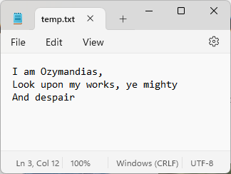
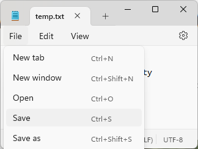

* TOC
{:toc}

# Data Persistence

**Persistence** is the idea that we want some information (typically *data*) in our programs to be saved, or *persisted*, from one run to the next. So far, most of the programs you have written for coursework likely don't worry about persistence. Your program performs some set of operations, calculations, etc. and produces some output that is visually displayed to the user, and then the program ends.

However, consider how limiting this is. For example, let's say you implement a command-line version of the game [Wordle](https://en.wikipedia.org/wiki/Wordle). Specifically, one feature of the game is to show users their guess count history, win%, etc., such as in the image below from the New York Times Wordle game.

Unlike real life Wordle, your command-line Wordle allows a player to play as much as they want. A user can play the game over and over and eventually build up a history. However, without **data persistence**, as soon as the user closes your program, or the terminal window they are playing it in, all of that history will be lost.

Instead of letting our programs lose any history or information, we can store that information in a couple of ways: **files** and **database**.

## Files

Consider using a simple text editing program like Notepad.

If, like the mentioned Ozymandias, I wish for my works to stand as a testament to my greatness through history, than I need to be able to *save* this file.

I can click the "Save" button (or use Ctrl+S on Windows). This will trigger a subroutine within the program that writes the contents of the file onto my computer's storage. If the file has been saved before, any previous version is overwritten. If the file hasn't been saved before, I will ask to give it a name.

Understand that the way Notepad saves a file is fundamentally no different from how you can write to a file in Java using [a `BufferedWriter` object](https://docs.oracle.com/javase/8/docs/api/java/io/BufferedWriter.html). 

Now, I can reopen this file *even if I close Notepad*, or *restart my computer*. I can open the file until I either delete the file, or my storage device becomes unusable/corrupted (such as a hard drive failure).

Files are an incredibly common means of persisting information. Consider the files you likely interact with all the time:

* Source code files (.java, .py, .c, etc.)
* Document files (.doc, .docx, .xlsx, .pdf)
* Executable programs or compiled code (.exe, .msi, .dmg, .class, .jar)
* Media files
  * Audio (.mp3, .wav, etc.)
  * Image (.jpg, .png, .gif)
  * Video (.mp4, .avi)

## Databases

Another common method of data persistence are databases. Now, database implementations *will* typically use files to store data long term, but databases abstract away the details of *how* the data is stored. Additionally, most database implementations feature significant optimizations that are difficult to implement on your own. Databases can be either local (we will look at SQLite which uses a local file to store the database) or remote (such as PostgreSQL and MySQL), where the database is access through a server. Often, developers may use a local database for testing, while the app is deployed with a remote database. Databases typically use some dialect of SQL (structured query language) to manage, access, store, and update data.

We will focus on using JDBC for direct database usage, as well as use Hibernate as a ORM (object relation model) to abstract away the actual SQL code out.

