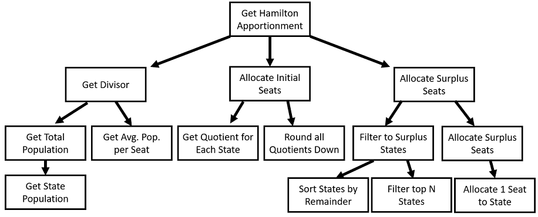

# Modularity

As we mentioned before, **modularity** refers to our desire to break up our big problem into smaller problems. We will look at two types of decomposition: functional and class decomposition. 

## Motivating Example

For the remainder of this unit, I will use the motivating example of [Homework 1A/B from Fall '22 semester of CS 3140 at the University of Virginia](https://docs.google.com/document/d/1BTVJw0l_fwBY9x7oHTwRkzkcjBnLL6pZ/edit?usp=sharing&ouid=102271757331661113983&rtpof=true&sd=true)

In this unit, we will often discuss design from the perspective of the above problem. A summary of this problem is:

"Given state names and populations and a number of representatives to allocate, produce an apportionment for the US House of Representatives."

We will use this question to explore ideas of modularity, functional independence, abstraction, and information hiding.

## Functional Decomposition

Functional decomposition is the practice of breaking up a complicated functional process into smaller functions. Often, we start with a major goal, like "generate an apportionment of representatives for the US Congress based upon state populations".

In general, we can start breaking things down in a top-down *breadth-first* way. That is, we don't need to figure out every single module we are writing immediately. Rather, we can decompose our highest-level module into lower level modules, and then decompose each sub-module, until we end up with modules that cannot be made easier to understand by further decomposition. We covered code level examples of functional decomposition in our [Extract Method](https://sde-coursepack.github.io/modules/refactoring/Extract-Method/) unit. However, in this unit, I don't want us specifically thinking about code, as the process of functional decomposition is not tied to any one specific language.

For instance, let's consider the process of applying the [Hamilton/Vinton Apportionment method](https://www.census.gov/history/www/reference/apportionment/methods_of_apportionment.html)

The description of this approach would be (quoting the above website):

> "The Hamilton/Vinton Method sets the divisor as the proportion of the total population per House seat. After each state's population is divided by the divisor, the whole number of the quotient is kept and the fraction dropped. This will result in surplus House seats. The first surplus seat is assigned to the state with the largest fraction after the original division. The next is assigned to the state with the second-largest fraction and so on."

Now, that sound like a lot of steps, so let's try to break it down:

1) Get the divisor, which is the proportion of total population per House  
2) Allocate the initial seats by dividing each state's population by the divisor and rounding down  
3) Allocate surplus seats in order of remainder  

Each of these problems are smaller, and I can start to imagine function signatures for them. For the below code, assume that each `State` describes a state by it's `name` and `population`.

```java
    //overall function
    public HashMap<State, Integer> getHamiltonApportionment(List<State> states, int seatCount) { ... }

    //step 1
    public double getDivisor(List<State> states, int seatCount) { ... }

    //step 2
    public HashMap<State, Integer> getInitialSeats(List<State> states, double divisor) { ... }

    //step 3
    public HashMap<State, Integer> getRemainingSeats(HashMap<State, Integer> initialApportionment, double divisor, int seatsRemaining) { ... }
```

Notice that each step provides some information the next step needs. For instance, we need the `divisor` from Step 1 to complete step 2 and step 3. In this way, we are defining a sequence of events.

We can decompose this step further. For example, consider Step 1. How do we get the divisor? Well, we:

1) Get the total population by summing each state's population.  
2) Divide the total population by the number of seats needed and return the quotient  

In the same way, we can decompose our other two steps. We often visually represent this as a tree:



This diagram can describe our functional decomposition. At the top, we have one overarching high-level behavior. We work in a *depth-first* way from left to right, so we first call **Get Divisor**. This sort of structure can help us design our functional decomposition.

A key advantage is now it becomes easier to break up work. For example, you could assign individual functions to different developers.

Another key advantage is that as we decompose the system, we might see places where we can re-use functions. For example, getting the Quotient for each state in Step 2 will be needed to get the remainders in Step 3. The same process for allocating seats in Step 2 can be used to allocate seats in Step 3. It allows us to think about how to write more DRY code.

### Limits of functional decomposition

This decomposition only shows us *one part* of our arching-system. While we could in theory perform a functional decomposition of our entire software system, this assumes that our software system runs in a sequence, from beginning to end, until completion. But much of software **doesn't run this way**. That is, our application may be persistent, where information is saved from one-run to the next, or the application is asynchronous, relying on external interaction, such as interactions from users or from external servers. In these systems, we can do functional decomposition of individual interactions, but that alone cannot paint a complete picture of our entire software.

Another weakness is that, in this approach, each high-level function is highly dependent on each low level function. That is, it needs to know what information the function needs, and how to handle the output. However, if implementation details need to change, those changes could cascade upwards. This is fine when our tree is relatively small, but as our process gets bigger and more complicated, these changes can become harder to predict and manage. 

## Class Decomposition

In Object-Oriented languages, we can decompose our system into various classes, each responsible for a single behavior or action. 

Note that when we say classes, we do not just mean `Data Structures`. For example, `State` in our Apportionment description above is just a Data Structure for combining data that describes a single state.

```java
public class State {
    private String name;
    private int population;

    public State(String name, int population) {
        this.name = name;
        this.population = population;
    }

    public String getName() { return name; }
    
    public int getPopulation() { return population; }
}
```

This module's purpose is to stored **cohesive** data (that is, data that describes a single state).

Beyond that, however, we may have classes that encapsulate functionality. For example, we may have a class that describes an apportionment, and has an interface that supports adding a given number of representatives to a state. Another class may be used for sorting our states based on quotient remainder, etc. We will discuss, throughout the rest of this unit, how to identify and break up classes. We covered this topic a little bit in our [Extract Class](https://sde-coursepack.github.io/modules/refactoring/Extract-Class/) unit.

### Cohesiveness

Cohesiveness refers to how much each class adheres to one specific purpose. That is, how much each par For example, in our `State` class above, a state's name and population are directly tied to the *idea* of a state. We store this data together as one unit because it describes that single purpose. The alternative would be having something like two parallel lists, List<String> stateNames and List<Integer> statePopulations to maintain each data separately. But in this case, decomposing the `State` into it's component parts makes our code **more complicated** and harder to understand. For instance, now if we sort our stateNames list, we have to match all sorting operations on statePopulations as well.

On the other hand, let's imagine we included the idea of quotient (that is, the state's population divided by the divisor) in our `State` class. 

```java
public class State {
    private String name;
    private int population;
    private double quotient;

    public State(String name, int population) {
        this.name = name;
        this.population = population;
    }

    public String getName() { return name; }
    
    public int getPopulation() { return population; }
    
    public void calculateQuotient(double divisor) { quotient = population / divisor; }
    
    public double getQuotient() { return quotient; }
}
```

Now, we've made our class less cohesive. Before, any part of our system that needs information about our `State` could use any part of the class they need. But now, several systems which use `name` and `population`, but do not use `quotient`, have to understand the reason `quotient` exists. In truth, we only need `quotient` in a **specific** context (i.e., Steps 2 and 3), but do not use it in ever context (Step 1). In this case, we have made our `State` class more specific to a particular context, and therefore less reusable in general.

### Levels of Cohesion

We can describe different levels of cohesiveness by describe how we chose to combine, or **couple** elements into a single class.

Below, we will broadly describe different levels of cohesiveness from **WORST** to **BEST**.

#### Coincidental Cohesion (worst)

Elements are combined into a module (such as a class) by effectively coincidence. That is, a module contains elements that are not clearly related to one another. In this case, it's likely that several modules exist within the single module we have, and we should decompose them further. Because elements are grouped that shouldn't be, it can make reusing modules in a new context nearly impossible. Additionally, because several disparate items are grouped together, it becomes likely that changes to one part of the module could result in strange behavior in other parts of our modules.

Having one giant `Main` class that handles all features is a worst-case example of coincidental cohesion.

#### Logical cohesion

Elements are grouped into a module because they described the same general activity, or have similar interfaces, or are otherwise categorized the same.

Example, imagine that we had a class to read in state information from different sources:

```java
public class StateReader {
    public List<State> readCSVFile(String filename);
    public List<State> readExcelFile(String filename);
    public List<State> readJSONFile(String filename);
    public List<State> readWebService(URL url);
}
```

On the face of it, this is better than coincidental cohesion, because at the very least we are now breaking up our modules in some fashion. After all, they all read in some data source and return a list of states. However, the **implementations** of each of these are largely unrelated. This means any fields or functions used by `readCSVFile()` are likely to be unused by any of the other functions. Thus, by grouping them together, we are 

When using this module, a client is typically picking only *one* of these options: the reader for the source of data we have. As such, there are large portions of this module that do not contribute to the same *functional purpose*, as they go unused *most* of the time.


#### Temporal Cohesion

A temporally cohesive module is where items are grouped because they occur at around the same time (but not in any particular sequence), but are otherwise unrelated. For instance, let's say we had an application that interacted with some external database, as well as a graphical user interface (GUI) and an external web server, and we decide to group all of the initialization routines for these sources into the same module.

```java
public class Initializer {
    public void initializeDatabaseConnection();
    public void initializeGUI();
    public void initializeRemoteServerConnection();
}
```

Here, these elements would better be handled in separate modules. For example, it would be better to have a module whose purpose is opening and closing the Database connection, as it relates to the functionality of handling the database connection. Similar to logical cohesion, we are grouping things whose **implementations** likely do not (and should not) interact with each other.

#### Procedural Cohesion

A module with only procedural coupling is supporting unrelated activities in which control passes from one activity to the next, ensuring they execute in a specific order. For example, consider a student registering for a course that has pre-requisites. A student can register for the course if there are seats available and they have met the pre-requisites.

```java
public class CourseRegistration {
    public StudentRecord getStudentRecord(Student student);
    public List<Prequisite> getPreRequisites(Course course);
    public boolean studentMeetsAllPrerequisites(Student student, List<Prerequisite> prerequisites);
    public boolean isCourseFull(Course course);
    public void addStudentToCourse(Student student, course course);
}
```

While this is better than our other examples, it still is group elements that do not adhere to the same function. For example, getting a StudentRecord has nothing, functionally, it do with getting the prerequisite for a given course. It only matters in the specific context we have here. As such, each module is less likely to be reusable in a DRY way, as it is written as part of a procedure. If I only want one step of this procedure in another module (such as getting the StudentRecord in order to print a transcript), it is awkward and confusing to use code from this module which isn't related to that single behavior.

#### Communicational cohesion

Elements are grouped together in a module simply because they perform actions on the same data for either input or output. For example, 

```java

public class StudentRecord {
    public void addGrade(Course course, Grade grade);
    public double getGPA();
    public int getTotalCreditHour();
    public void printTranscript();
    public void meetsPrerequisiteForCourse(Course course);
}
```

Here, these features all work on the same data: the student's course history. However, the behaviors are not tightly related to one another. For example, only a small subset of clients to this module will use each specific feature, and all or most clients of the module won't use every feature. This makes code re-use awkward, and makes the modules larger than they need to be, forcing clients to understand which methods to **not** use.

#### Sequential cohesion

Generally, sequential cohesion is considered "fine" if not ideal.

Similar to procedural cohesion, elements are grouped because they happen in sequence, where one element's output are directly used by the next elements inputs. That is, the elements must occur in sequence.

```java
public Class PrintDeansListFile {
    public Map<Student, Double> getStudentGPAMap();
    public List<Student> getDeansListStudents(Map<Student, Double> studentMap);
    public File generateDeansListPDF(List<Student> deansListStudents);
    public void printFile(File deansListPDF);
}
```

This may look similar to **procedural** cohesion, but the difference is that in sequential, each of our modules elements occur in exactly one order, where output from a step is used as input in the next step.

Cohesion here is very high. However, some of the functions could be re-used in other contexts, such as getStudentGPAMap(), or even printFile(), so it may be beneficial to extract those to more functionally specific modules.

That said, when we need to enforce a specific sequence of events, sequential cohesion is necessary.

#### Functional cohesion

A module exhibits functional cohesion if it describes a single well-supported function. I.e., a something that only does on thing. It is certainly useful to have our functions themselves work this way. Many of our classes may work this way as well. For example:

```java
public class CSVStateReader {
    public List<State> getStatesFromCSVFile(String filename) {
        
    }
}
```

In this case, this module only has one behavior, which is functional in nature (given some input, get some output). This is very maintainable, because so long as the interface remains the same, the implementation can change without propagating change to any other module. Additionally, the interface of this module is as simple as possible: there is only one element.

Of course, we can't always have **every** module have exactly 1 method. For example, data structure classes will typically have a constructor and getters and setters. However, when we can acheieve functional cohesion, it is worth doing so.
