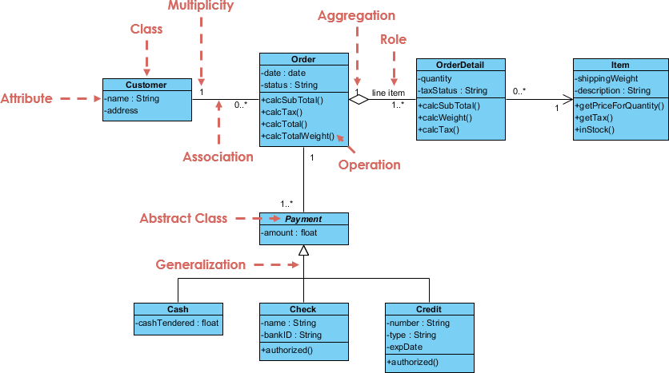

# UML Class Diagrams

In this module, we'll look at UML Class Diagrams. Class diagrams are a means of communicating design plan and structure. Note that there are many conventions in diagrams. In general, UML Class Diagram rules are not **commandments** describing an exact structure, but rather a set of general guidelines and common practices. Ultimately, the best diagram is one that *aids in communication*.


Image credit of [Visual Paradigm.](https://www.visual-paradigm.com/guide/uml-unified-modeling-language/uml-class-diagram-tutorial/) 

* TOC
{:toc}

## External Resources

UML Diagrams class overview: https://www.uml-diagrams.org/class-diagrams-overview.html 


Tutorial that follows class lecture: https://www.edrawsoft.com/article/class-diagram-relationships.html  


## CS 3140 Considerations

Before we go further, this article is very closely related with our discussion on [Class Relationships](https://sde-coursepack.github.io/modules/design/Class-Relationships/) in an earlier module, so be sure you are familiar with that content.

## Individual classes

When describing an individual class, we will often use a structure like this: 


Here, the class name is at the top. It may be indicated as `<<abstract>>` or `<<interface>>` when appropriate it is describing an `abstract class` or `interface`.

### Fields

In the middle, fields are listed by the format `[name]:[type]`. (A note that Kotlin and Typescript both use this naming scheme for their variables.) 

A common practice you will see is to not include aggregation, composition, or association fields in the set of fields. Rather, those relationships are described by the relationship. For example, in the image at the top of this document, you'll notice that the pane for `Order` doesn't include a `List<OrderDetail>`, but the diagram clearly communicates that each `Order` contains multiple `OrderDetail` objects. 

(As an aside, I don't have a strong opinion on this practice: I don't think it hurts to have the fields listed. For the course, either approach is fine, I only put this detail out so that when you see it you understand it)

### Methods

In the bottom section, the methods are listed, along with their parameters and return types (again using the `[name]:[type]` format). The constructors are always listed first.

You'll notice some plus and minus signs. As a common practice:

* `+` - `public` items (generally, any methods and constructors)
* `-` - `private` items (generally, fields)
* `#` - `protected` items

A note, however, is that while listing `private` fields makes sense, since it tells us the structure of the object and hints at it's purpose and usage, listing `private` methods (generally "helper" methods) doesn't. This is because a `private` method is an implementation detail that doesn't influence how the class should behave.


### Simplified UML Diagram

A simplified UML Diagram simply lists the classes, but doesn't include fields or method names.

## Relationship diagrams

Here we will show how relationships between classes are diagrammed. For this class, I want to focus on 6 relationship types in particular:


### Dependency

Dependency is the weakest form of coupling, where one class uses another, but does not "contain" another. The arrow points towards the class being used.

For instance, consider `ClosestCenterStateFinder` below

```java
public class ClosestCenterStateFinder implements StateFinder {
    private List<State> states;
    public State findState(Tweet t) {
        Coordinate c = t.getCoordinates();
        State closest = null;
        for (State state : state) {
            ...
        }
        return closest;
    }
}
```

Here, `ClosestCenterStateFinder` is **using** Tweet and Coordinate. It uses `Tweet` due to the findState function taking in `Tweet`, and it uses `Coordinate` because it interacts with that class by extracting it from the `Tweet`. 

(Note that in this case, the above is actually stamp coupling; it would be better just to send specifically the `Coordinate`, and not the whole Tweet object. I included Tweet just to show that "both class in arguments and classes interacted with in the method are dependencies".)

We illustrate this relationship below.


Notice specifically the direction: the arrow points from the **client** (`ClosestCenterStateFinder`) to the **dependency** (`Tweet`, `Coordinate`)

### Aggregation and Composition

Aggregation/Composition refer to when one class *possesses* another, specifically as a field (that is, one object aggregates other objects, or is composed of other objects).

For example, in `ClosestCenterStateFinder` above, the class possesses multiple instances of State (as a `List`, but since `List` is a common enough idea for storing a collection of data, we don't need to diagram `List` out in our diagram.) This can be diagrammed as below.


Specifically, the diamond is on the side of the **owner**, that is the class that has the field containing the other class. Additionally, we label the line with the field name (annotating that this is a `List`).

The visible numbers (`1` and `1..*`) refer to multiplicity, which we will address soon.

For the difference between aggregation and composition, refer back to the [Class Relationships module](https://sde-coursepack.github.io/modules/design/Class-Relationships/#composition).

### Bidirectional Association

In general, we can think of a bidirectional association as a relationship where both classes meaningfully are aware of one another, often through mutual aggregation. For example, if I have a `Student` object, I may want to get the `Course` objects that the `Student` is enrolled in, but similarly if I have a `Course` object, I may want to get the `Student` objects in the course.

In this way, it makes sense to model the data with a mutual aggregation. We illustrate that below.


Notice the key difference is a lack of a diamond indicating which side is the "owner".

#### Multiplicity

All aggregation, composition, and bidirectional association relationships should communicate "multiplicity". In general, this breaks down into 3 groups:

* **One-to-One** - Every student has one transcript, and every transcript is associated with one student
* **One-to-Many** or **Many-to-one** - Every student has multiple individual assignment submissions. However, each individual assignment submission is affiliated with only one student.
* **Many-to-Many** - Every student is on several class rosters. Every class roster has multiple students.

In general, we express the in the diagram using:

* `1` - Exactly one
* `1*`- One or more 
* `0*`- Zero or more
* `x..y` - between x and y (inclusive). Example, `0..1` means zero or one.


For instance, `ClosestCenterStateFinder` to `State` indicates that `ClosestCenterStateFinder` has 1 or more `States`.

Meanwhile, in our `Student` and `Course` example:


This means "Each student is enrolled in zero or more courses, each course has zero or more students".

Now, you might ask "But if someone is enrolled in zero courses, how are they a student? Or if a course has no students, the course doesn't exist?" My response would be "when a student is first created, they aren't enrolled in any courses, and when a course is first created, it has no students. Therefore, both zero cases are valid states."

#### Data, not entities

Here, it's important to remember we are talking about *data*, and the state that data can be in, not real objects. `Student` isn't a student. `Student` is data that *models* information *about* a student. A `Student` isn't a type of user. A `Student` can't actually enroll in courses. `Student` is just data that lets us know information about a human student, including which courses they are enrolled in, which we track with a `List<Course>`. 

For instance, if we had a class called `CourseCatalog`, well, a human student using our software would interact with that class while registering for courses. But that is not the same thing as saying `Student` **uses** `CourseCatalog`. Because `Student` isn't a human student using our software. 

Always remember, we are talking about how data and procedures are interacting **within our code base**, not the real world!


### Realization/Generalization

Finally, our last relationship is realization/generalization, which refers to inheritance (through implementing `interface`s or extended other `class`es). This is denoted with a triangular arrowhead. The arrow head points to the *class being implemented/extended* (i.e., the interface or parent class.)


In this context, the `interface` refers to `interface` as described in Java code: a set of abstract functions with an intended behavior, but not tied to any one specific implementation. An `interface` is *not* a user interface!

In the above, we see that `ClosestCenterStateFinder` *realizes* the `StateFinder` interface. In general, a dotted line is used for realization (implementing interfaces), and a solid line used for generalization (extending a class). 

## Criticisms of UML Diagrams

I will note that many developers view UML Diagrams to be a waste of time. In general, my view on the benefits UML Class Diagrams is two-fold:

1) Practicing UML diagrams as a newer developer can help you make mental connections that will pay off when designing software systems later. I liken this to learning LISP. Learning Common-LISP undoubtedly made me better at writing and testing functions. I moved away from "side effect" heavy code when unnecessary, and it's helped me learn how to decompose software more effectively. Do I use Common-LISP regularly? No, the last time I used it was 2012. But it helped me.
2) I do think diagrams can help act as a communication tool specifically to help people learn a new software system. However, even better than UML Diagrams is effective code documentation.

Does this mean I recommend diagramming everything? No! UML Diagrams take time to make, and, just like any other form of documentation, can become outdated if not readily maintained.

However, I have absolutely used UML Class Diagram relationships to "sketch out" a design idea on the board. Additionally, I find UML Diagrams are a useful way to help visually communicate design pattern structure, which will be important when learning common design patterns. But when I say "sketch out", I mean on a whiteboard to help me solidify an idea before I jump into code.

So do not take me presenting this unit as a vital industry skill that all companies require programmers to do: it isn't, and they don't. However, UML class diagrams are a common means of communication that are worth learning.

