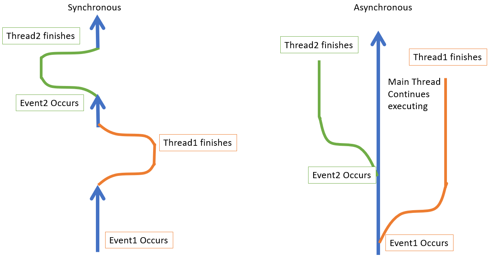

* TOC
{:toc}

# GUIs

GUI stands for **G**raphical **U**ser **I**nterface, and is often pronounced the same as "gooey". A GUI adds significant usability to an application or system, and allows users to more quickly and easily interact with software. 

It's no coincidence that as computing grew from a niche market to now being omnipresent in our home and society. Chances are, your first experience with computing (a desktop computer, a laptop, a smartphone, etc.) was likely with a GUI as opposed to command line applications. Whether you are doing productivity, communication, gaming, streaming entertainment, you are almost certainly interacting with a GUI. In fact, if you want your application to be used by a wider audience, you almost certainly need an effective GUI for your application to gain users.

## Why teaching so late?

If GUIs are so important, why are we teaching them so late? The primary alternative to GUIs in application software is command line applications, which is what you have developed so far. However, when learning programming, we tend to teach the basics using command-line applications. This is because implementing a GUI adds significant levels of complexity. Most likely, when you are building a GUI, you will use an existing **framework** (such as Swing, JavaFX, Spring, etc.) rather than build from scratch simply because of the complexity. And so, we start with command line applications simply because we must.

Command line applications are still used frequently. For example, when you compile java code, you are running a `javac` command from a command line. However, these commands are typically hidden by a GUI (for example, IntelliJ automatically compiles your code using Javac for you, whereas other IDEs may run the command when you hit the "compile" button). It is, in fact, common for software to be designed where a GUI primarily interacts with a command-line system, but hides that interaction behind the convenience of a GUI.

## Event-Driven

Most of the programs you have built so far are likely **procedural** programs. The idea of a **procedural** program is that you run the program, such as by running a .jar file from command line, and the program executes one step after the next until it is completed. There is no interaction **after** the program run begins, and the program runs without interruption until completion. If user interaction is expected, it is typically defined in the command line as arguments, or in some file that the program reads from.

By contrast **event-driven** programs will not "run to completion". In order to allow for user interaction, the program will effectively "wait" for user interaction, and then react to what the user does.

We can contrast this with the two programs below. Both programs are designed to say "Hello, [your name here]", the difference is how the name is given to the program, either *procedural* or *event-driven*.

### Procedural

```java
public class HelloWho {
    public static void main(String[] args) {
        if (args.length == 0) {
            throw new IllegalArgumentException("No name argument included!");
        }
        String name = args[0];
        System.out.printf("Hello, %s", name);
    }
}
```

Here, when you run the program, you run it with a command-line argument. However, the user input *must* be decided before the program is run, so this limits how interactive your program can be.

### Event-Driven

```java
public class HelloWho {
    public static void main(String[] args) {
        Scanner scanner = new Scanner(System.in);
        System.out.print("Enter your name: ");
        String name = scanner.nextLine();
        System.out.printf("Hello, %s", name);
    }
}
```

Here, when the program runs, it prompts the user to `Enter your name`, and then the program **waits** until the user hits enter, taking whatever they typed (with `scanner.nextLine()`), and then saying Hello to that name. In this case, hitting Enter is an **event** that tells Scanner the line is completed. The Scanner then **reacts** to that event. In this way, every use of getting input from a user can trigger the next set of procedures. Obviously this is a trivial example for illustration purposes, but you can imagine how this extends to a much larger, more complicated program.

We call this model **event-driven** programming. In the case of a scanner, this allows for more dynamic interaction, as it allows user to respond **during** the run of the program, rather than have to anticipate all of their needs when the program is first executed via command lines. You can now envision the user and the program having sort of a conversation, where the user interacts with the program based on their need, and the program acts on that user interaction.

## How Event Driven Works

There are a number of ways for Event-Driven to work. In GUIs (including JavaFX), it typically works where different user actions (events) are reacted to by executing a procedure. Often, there is some "main loop" or "main thread" that is alerted when a user action occurs (keyboard entry, mouse movement, button click, etc.), and triggers a procedure tied to that specific action (for example, clicking one button may call one procedure, but clicking a different button calls a different procedure).

Note that the above is a *general* statement of how many Event-Driven frameworks, including GUIs, operate. There are alternative implementations, some with more advanced architectures/structures. However, as a starting point, and with JavaFX, this description is useful.

### Synchronous vs. Asynchronous

The executed procedure that executes after the event can execute either synchronously or asynchronously.

**_Synchronous_** Means that when the event occurs, the reacting procedure occurs in the main thread of execution. This means the program begins executing the procedure, and cannot do anything else until that procedure is completed. In the usage above, Scanner is synchronous. The program cannot do anything else until the user hits Enter.

**_Asynchronous_** Means that when an even occurs, the procedure triggered executes in a separate thread of execution. This allows for multitasking (and concurrency on multiprocessor systems), and can create an interface that appears more rapidly responsive. However, in such a system, you do have to then consider common concurrency problems such as race conditions, deadlocks, etc. Such challenges, however, are beyond the scope of this course.



JavaFX, the GUI tool we will be using, is an **asynchronous** GUI framework.