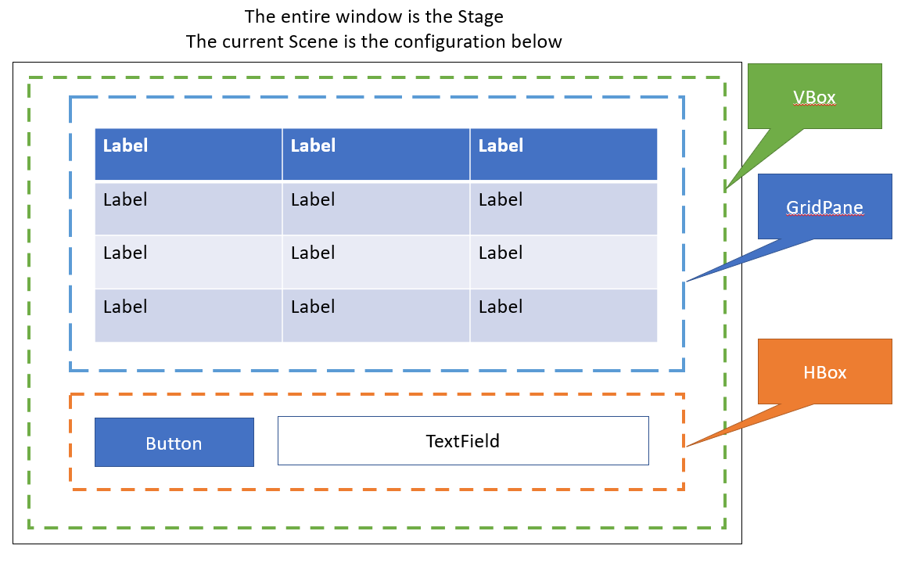
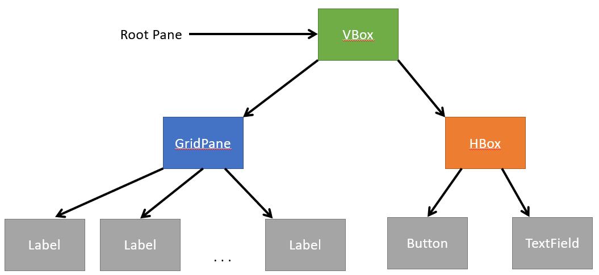

* TOC
{:toc}

# JavaFX Framework

[**JavaFX**](https://openjfx.io/) is a framework for building GUI applications. In the next several modules, we will use JavaFX to build some apps of increasing complexity. Note that this unit is intended to show "*just enough*" JavaFX to get started building simple applications. This is **not** intended to be a complete guide to JavaFX, nor is it a rich look at all the features available. The [JavaFX website](https://openjfx.io/) has significant documentation, as is worth bookmarking.

## Framework

A **framework** is a set of implemented programming tools that you can build from without having to reimplement. For instance, if you use `ArrayList`, `HashMap`, etc., you are using the Java Collections *Framework*. You don't implement these collections, you just use them to construct your program. Frameworks can act as a foundation to build our program on top of, allowing us to focus on the interesting features and logic of our program. The idea of frameworks is similar to the idea of **re-usable parts**. For instance, when building a car, car manufacturers are likely to *buy* the tires from a tire company, the glass from a glass manufacturer, etc. rather than manufacture everything in house.

## Installing JavaFX

You can find a guide for [installing and using JavaFX in IntelliJ here](https://openjfx.io/openjfx-docs/#IDE-Intellij). You can see how to add JavaFX to an [existing Gradle project in IntelliJ here](https://openjfx.io/openjfx-docs/#IDE-Intellij). Note that this requires the use of a module-info class.

## Java FX Vocabulary

The following words are important to define in JavaFX to understand how all the parts come together.

### Stage

A **Stage** is a top-level container in Java, and will generally be displayed as a window. The applications we will build will mostly only use one Stage. However, you can have multiple Stages in an application, but one Stage must act as the "primary stage."

### Scene

A **Scene** is a particular arrangement of a Stage. If you use the metaphor of a play, a play on a given Stage may have multiple Scenes. Each scene may have a very different stage setup, different props, different actors, etc. But only one scene is on stage at a given time. To show a different scene, we simply change the current scene on stage.

The scene is organized as a *tree* of *Nodes*.

### Node

A node is an abstract class for every *"thing"* that is in our scene. A "thing" can be a button, text field, etc., but it can also be a Pane. The Nodes in a given scene are organized in a tree, where the root node must be a Pane.

### Pane

A **Pane** is a container. The Pane is a place to put Nodes, such as Buttons, TextAreas, other Panes, etc. Each Pane can have a layout that determines how things are placed.

Every Scene must have exactly one **root Pane**. The Root Pane can contain additional Panes, but only one Pane serves as the root. You can think of the root pane, metaphorically, as the *floor* of the Scene. For instance, you may have a coat rack that could hold several coats in a given scene, but that coat rack must be on the floor. In this way, we can have a Node inside of a Pane inside of the root Pane (or a Node inside of a Pane inside of a Pane inside of...), but there must be one specifically defined root pane.

#### Layout

A layout describes how items (widgets or other panes) inside of a Pane are arranged. [You can find a guide with some visual examples of common Layouts here](https://docs.oracle.com/javafx/2/layout/builtin_layouts.htm). 

Note that in JavaFX, **Layouts describe a particular type of Pane**. For example, FlowPane **extends** Pane, in that FlowPane is a child class of Pane. It's important to be aware that a Layout is not a **property** of Pane that can be changed. If you want to change how a Pane is laid out, you have to call the constructor to create a new Pane object of the type that gives you the Layout you wish. There is no "setLayout" function.

Some examples worth knowing are:

* **FlowPane** - a very simple to use layout where Nodes are simply added in-order, left-to-right, top-to-bottom as space permits. However, your results will have effectively no formatting, so you're unlikely to get anything aesthetically pleasing.
* **HBox** and **VBox** - Nodes are aligned horizontally (HBox) or vertically) VBox. As items are added, , respectively, left-to-right or top-to-bottom within the box.
* **GridPane** - Like a combination of HBox and GridBox, Nodes in the Pane are laid out into a Grid, where each cell of the grid can contain some item (but can also be empty). You can set the number of rows and columns in the Grid to fit your need.
* **BorderPane** - The Pane is divided in 5 nodes: Top, Bottom, Left, Right, and Center. Other than Center, each region acts as a "margin" to put things in (for example, it's common to put menu dropdowns in the Top region).

There are more, but this is a good starting point.

### Control

A Control is, typically, a widget used to allow for display and/or user interaction. Like Panes, Controls are Nodes. However, while Pane nodes have children, Controls are Leaf Nodes, and do not have children. Some common controls are:

* **Label** - Displays some text to the user, but does not support user interaction. Useful for labels, status messages, etc.
* **Button** - A clickable button that performs some action when clicked by the user
* **TextField** and **TextArea** - Boxes for users to enter text. A TextField provides only one line, while a TextArea provides multiple lines.

For most of our examples we are building simple apps. As such, we will only use the above 4 to get started. There are lots of additional built-in controls. Additionally, you can import controls from other libraries to re-use. Some common control widgets I have used include CheckBox, RadioButton, PasswordField, DatePicker, ColorChooser, ListView, etc. Each of these has existing documentation, and you can find examples as need online to build from.

### Putting it all together:

The below picture is a rough illustration of what we may want a particular Scene in our application window (Stage) to look like:

In the above picture, the Root Pane is a VBox. The first Node in the VBox is a GridPane containing a 3x4 grid of Label controls. The second Node is an HBox containing a button and a TextField. In this way, we can think of this structure like the tree below:

Note that the children of each Node are ordered. For example, GridPane is the first child of the VBox, so it is **above** the HBox, which is the second child of the VBox. 

(As a quick note, the GridPane is organized as a one-dimensional list, not a two-dimensional list. The Nodes are numbered left to right, top to bottom. So the top left node is index 0, the last node in the first row is index 2, the first node of the next row is index 3, and the node at index 7 is the middle node of the 3rd row).