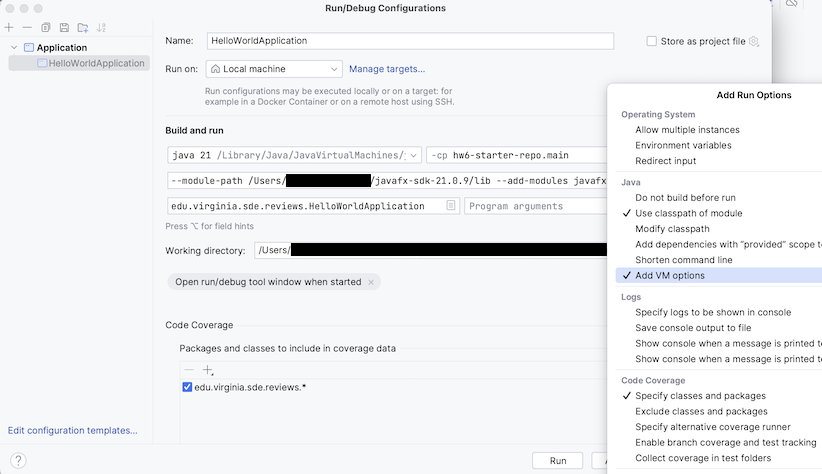

# Installing JavaFX

In this article, I walk through installing JavaFX such that you'll be able to run JavaFX applications on your local machine and running JavaFX programs in IntelliJ.

* TOC
{:toc}

You can find a guide for [installing and using JavaFX in IntelliJ here](https://openjfx.io/openjfx-docs/#IDE-Intellij). You can see how to add JavaFX to an [existing Gradle project in IntelliJ here](https://openjfx.io/openjfx-docs/#IDE-Intellij). Note that this requires the use of a module-info class, which we will talk about in this article.


## JDK and JavaFX version numbers

For this class, we will be using JavaFX 21.0.9, along with JDK 21.0.9. 

First, be aware that the _major_ version numbers for your JavaFX version and JDK version should match. For instance, if you were using, say, JDK 17.0.x, you should also use JavaFX 17.0.x in your development. 

The _minor_ version number (the number after the last decimal point) should not matter-- for instance, if you are running JDK 21.0.8, JavaFX 21.0.9 should still work without issue.

## JDK 21.0.9

You can download the installer for Java 21.0.9 here - https://www.oracle.com/java/technologies/downloads/#jdk21 

## JavaFX 21.0.9

JavaFX can be downloaded here - https://gluonhq.com/products/javafx/

Be aware, you will need to select the version you want from the dropdown:


Make sure you select JavaFX 21.0.9 if following this guide, then download the appropriate SDK (not any of the "jmods" options) for your operating system/processor combination.

## Setting JavaFX environment variables

It is recommended, though not required, to setup a system variable to help use JavaFX.

First, find where your JavaFX is installed, and specifically find the `lib` folder inside of the folder `javafx-sdk-21.0.9`

**On Linux/Mac,** you can run the following command, replacing `path/to` with the path to your `javafx-sdk-21.0.9` folder.

`export PATH_TO_FX=path/to/javafx-sdk-21.0.9/lib`

On Windows, you can use the following command, replacing `path/to` with the path to your `javafx-sdk-21.0.9` folder

`set PATH_TO_FX="path\to\javafx-sdk-21.0.9\lib"`

## build.gradle

JavaFX is not added like a dependency in Gradle. Rather, it is added as a plug-in. As such, here is an example `build.gradle` that sets up to use JavaFX 21.0.9. 

```groovy
plugins {
    id 'java'
    id 'application'
    id 'org.openjfx.javafxplugin' version '0.1.0'
}

javafx {
    version = '21.0.9'
    modules = ['javafx.controls', 'javafx.fxml']
}

repositories {
    mavenCentral()
}

dependencies {
    testImplementation platform('org.junit:junit-bom:5.9.1')
    testImplementation 'org.junit.jupiter:junit-jupiter'
}

test {
    useJUnitPlatform()
}
```

Be aware that you will still need to install JavaFX manually, as well as use VM arguments to run JavaFX applications.

## VM Arguments

To run a JavaFX Application in IntelliJ, you'll need to add **VM arguments** to the run configuration. To do this, go to Run Configurations, select the application file you want to run, and then you need to select "Modify Options" and turn on "Add VM options":



Then, set the VM options to:

On Mac/Linux:

`--module-path $PATH_TO_FX --add-modules javafx.controls,javafx.fxml`

On Windows:

`--module-path %PATH_TO_FX% --add-modules javafx.controls,javafx.fxml`

Do **NOT** add any extra spaces, such as adding a space after the comma after javafx.controls.

At this point, you should be able to run the file. If you are still having issues, try using the path to JavaFX directly in the VM Arguments, instead of the PATH_TO_FX environment variable: 

On Mac/Linux:

`--module-path path/to/javafx-sdk-21.0.9/lib --add-modules javafx.controls,javafx.fxml`

On Windows:

`--module-path path\to\javafx-sdk-21.0.9\lib --add-modules javafx.controls,javafx.fxml`

### Running without VM Arguments

If you run a JavaFX Application without the VM arguments, you'll get the following error message or something similar:

`JavaFX runtime components are missing, and are required to run this application`

And the application will not run. So make sure you set the VM arguments up correctly. If you are still getting this error after setting VM arguments, make sure you are using the path to the `lib` folder inside of your JavaFX folder, not the JavaFX folder itself, in the VM arguments.
