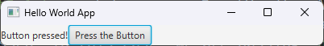

# Buttons and Events

In this unit, we will build on our code from the last module to add a Button and an EventHandler.

* TOC
{:toc}


## Starting Code

We will begin with the same starter code as the last module. However, for space, I have removed the import statements and comments, as we have already covered these basics. If you wish to follow along, you can either copy the import statements from the last unit or allow IntelliJ to add the correct imports for you (though make sure you are importing the classes in the `javafx` package).

```java
public class HelloWorld extends Application {
    @Override
    public void start(Stage primaryStage) throws Exception {
        Label helloLabel = new Label("Hello World!");
        
        Pane root = new FlowPane();
        root.getChildren().add(helloLabel);
        
        Scene scene = new Scene(root);
        primaryStage.setScene(scene);
        primaryStage.show();
    }
}
```

## Adding a button

Now, let's create a Button and add it to our application. As yet, our Button won't *do* anything yet, but that will be the next step.

Similar to Label, Button is a JavaFX Control that has a Constructor which takes in a String. That String is displayed on the Button as Text.

In addition to creating the Button object, we need to add it to our Pane for it to display.

```java
    ...
    Label helloLabel = new Label("Hello World!");
    Button myButton = new Button("Press the Button");
    ...
```

```java 
    ...     
    Pane root = new FlowPane();
    root.getChildren().add(helloLabel);
    root.getChildren().add(myButton);
    ...
```

Note that the order we add the nodes matter. Because we added `helloLabel` *before* `myButton`, `helloLabel` will be in the top-left of the app, while `myButton` will to the right of `helloLabel` (if the window is particularly small, `myButton` may "wrap" to the next line).

Now when I run the app, I see:


Of course, our button doesn't do anything yet, but let's fix that.

## Button EventHandler

Let's say that when our Button is pressed, we want to update `helloLabel` to say "Button pressed!". This is a simple behavior, but it`s a good starting point.

Clicking a button generates an Event object (think event-driven programming!). Specifically, this is an `ActionEvent` object. This object contains information about the Event, but for the sake of this app, we don't need to dive into its inner workings. In order to "do something" with the button, we want to tell our application how to **handle** that ActionEvent. This involves creating an `EventHandler` class.

The `EventHandler<T>` is an *interface*, so we are creating a class that `implements` this interface. Specifically, we are creating a class that implements the `EventHandler<ActionEvent>` interface. The interface has only one method:

```java
    public void handle(ActionEvent event);
```

This method defines the procedure that is run whenever the particular event tied to that handler occurs. In this case, when our `Button` is clicked, the `handle` function is called. Like the `start` method, we never directly call this method. Rather, it is invoked by the JavaFX framework.

## Creating an EventHandler

There are several ways to create an EventHandler and attach it to our button. In this module, we will show 4 different ways:

1) Public Class in a separate file
2) Private Inner Class
3) In-Line Anonymous Class
4) In-Line Lambda Body

There is another way to attach a function to an EventHandler using a JavaFX format file (.fxml file). We will cover that strategy in the upcoming FXML and MVC with Java unit.

### External Class

We could create a public class in a separate file like this:

#### MyButtonHandler.java

```java
public class MyButtonHandler implements EventHandler<ActionEvent> {
    private Label labelToUpdate;
    
    public MyButtonHandler(Label labelToUpdate) {
        this.labelToUpdate = labelToUpdate;
    }
    
    @Override
    public void handle(ActionEvent actionEvent) {
        labelToUpdate.setText("Button pressed!");
    }
}
```

And then attach a new instance of this class that uses `helloLabel` after creating the Button:

#### HelloWorld.java

```java
public class HelloWorld extends Application {
    @Override
    public void start(Stage primaryStage) throws Exception {
        Label helloLabel = new Label("Hello World!");
        Button myButton = new Button("Press the Button");
        myButton.setOnAction(new MyButtonHandler(helloLabel));
        ...
    }
}

```

The method `setOnAction` takes in an EventHandler<ActionEvent> object, which defines a `handle` method that is called when the button is pressed. In this case, we are passing `helloLabel` in a Constructor so that our `MyButtonHandler` instance has a connection to the label it needs to update.

We run our application, and when we press the button, we get:



We have a working button! Now, pressing the Button multiple times doesn't accomplish anything, as our handler is very simple, but this is a starting point.

You'll note our `handle` function doesn't actually *do* anything with the parameter `actionEvent`. This is okay in this context. In some more advanced cases, you may what to use the inputted event. For example, if you were writing a handler for a `MouseEvent`, you would want to check the position of the Mouse when the Event occurred. This would be accessible inside of the passed-in `MouseEvent` object. This event is syntactically necessary as part of the interface so that if we *do* need more information about the event, we are able to access it through the pass-in `Event` object. It doesn't mean we **have** to do something with it.

Still, using an external .java file to define a public class like this has some drawbacks:
1) We are creating a class that exists in the package's namespace, meaning we cannot reuse MyButtonHandler in any other class in the package.
2) By making the class public, it could end up being confused for code that some client class needs to use. Ultimately, we **only** intend for this class to be used by `HelloWorld`, and no other class in the package.
3) What the button does in our code is visually separated from the button itself. That is, a person reading the code has to open a completely different file to understand what the button does, reducing readability.
4) All we want to do is update one label's text, yet this is a lot of code to add to do so...there must be a more "shorthand" way, yes?

### Inner Class

We can address point 1 and 2 above by making our `MyButtonHandler` a `private` *inner* class of HelloWorld. That is, this class is only visible to code inside HelloWorld.java, and nowhere else. Here's what that would look like:

#### HelloWorld.java
```java
public class HelloWorld extends Application {
    @Override
    public void start(Stage primaryStage) throws Exception {
        Label helloLabel = new Label("Hello World!");
        Button myButton = new Button("Press the Button");
        myButton.setOnAction(new MyButtonHandler(helloLabel));
        ...
    }

    private class MyButtonHandler implements EventHandler<ActionEvent> {
        private Label labelToUpdate;

        public MyButtonHandler(Label labelToUpdate) {
            this.labelToUpdate = labelToUpdate;
        }

        @Override
        public void handle(ActionEvent actionEvent) {
            labelToUpdate.setText("Button pressed!");
        }
    }
}
```

In this case, we still only have one file, and the EventHandler is in the file.

We can simplify this further by storing `helloLabel` as an instance variable. This is acceptable, because the state of helloLabel affects the state of the application as a whole (specifically, what is displaying). In this way, our code now looks like:

```java
public class HelloWorld extends Application {
    private Label helloLabel;

    @Override
    public void start(Stage primaryStage) throws Exception {
        helloLabel = new Label("Hello World!");
        Button myButton = new Button("Press the Button");
        myButton.setOnAction(new MyButtonHandler());

        ...
    }

    private class MyButtonHandler implements EventHandler<ActionEvent> {
        @Override
        public void handle(ActionEvent actionEvent) {
            helloLabel.setText("Button pressed!");
        }
    }
}
```
We now no longer need a constructor in our Button Handler, since it is accessing a field of the class, `helloLabel`. The trade-off is that this EventHandler is now non-reusable, but given the scope of our application, that's acceptable. Remember the YAGNI principle - you don't need a general solution in every situation.

### Anonymous Class

Of course, we still have to scroll down to find the MyButtonHandler inner class, so there is still a visual separation between where the ButtonHandler is used and what it does. Further, we are still creating a name (`MyButtonHandler`) that we are only using one-time.

This is where we can define an in-line anonymous class:

```java
public class HelloWorld extends Application {
    @Override
    public void start(Stage primaryStage) throws Exception {
        Label helloLabel = new Label("Hello World!");
        Button myButton = new Button("Press the Button");
        myButton.setOnAction(new EventHandler<ActionEvent>() {
            @Override
            public void handle(ActionEvent actionEvent) {
                helloLabel.setText("Button pressed!");
            }
        });
        
        ...
    }
}

```

Here, we are defining the procedure of our `EventHandler` more dynamically. We aren't creating a permanent named class, rather we are defining an un-named (anonymous) class inline. Because we are in the scope where `helloLabel` is defined, we don't need helloLabel to be an instance variable anymore (though, when we get to FXML, we often will have our controls accessible via an instance variable, so there isn't harm in having `helloLabel` remain and instance variable).

That said, this code is somewhat awkward to read. From the perspective of someone unfamiliar with the code, it's jarring to be reading a function that gets interrupted by a class. Is there a fix for this?

You will have seen similar code with something like `Comparator` in our Functional Programming Unit. Which brings up a point...hey, isn't `EventHandler<T>` a SAM (Single Abstract Method) interface? Why, it is! That means we can implement the class as a...

### Lambda Body

Because `EventHandler<T>`'s only function is:

```java
    public void handle(T event);
```

Then we can implement our EventHandler as a lambda body:

```java
public class HelloWorld extends Application {
    @Override
    public void start(Stage primaryStage) throws Exception {
        Label helloLabel = new Label("Hello World!");
        Button myButton = new Button("Press the Button");
        myButton.setOnAction(e -> helloLabel.setText("Button Pressed!"));
        
        ...
    }
}
```

Our lambda body, `e -> helloLabel.setText("Button Pressed!")` means
"take in the ActionEvent e, and set the text of `helloLabel` to "Button Pressed!". This by far uses the least code.

### Complex Lambda bodies

But what if our button is more complicated? Say we had a `boolean` instance variable `isPressed` that is initially `false`, and, in addition to updating `helloLabel`, our event handler needs to update the value to true. We could implement that as:

```java
public class HelloWorld extends Application {
    private boolean isPressed = false;

    @Override
    public void start(Stage primaryStage) throws Exception {
        Label helloLabel = new Label("Hello World!");
        Button myButton = new Button("Press the Button");
        myButton.setOnAction(e -> {
            helloLabel.setText("Button Pressed!");
            isPressed = true;
        });
        ...
    }
}
```

Another option would be to make the EventHandler a separate function in the HelloWorld class and simply call that instead:

```java
public class HelloWorld extends Application {
    private boolean isPressed = false;
    Label helloLabel;

    @Override
    public void start(Stage primaryStage) throws Exception {
        Label helloLabel = new Label("Hello World!");
        Button myButton = new Button("Press the Button");
        myButton.setOnAction(e -> handleButton());
        
        ...
    }

    private void handleButton() {
        helloLabel.setText("Button Pressed!");
        isPressed = true;
    }
}
```

This could also be replaced with a method-capture:

```java
public class HelloWorld extends Application {
    private Label helloLabel;
    private boolean isPressed = false;

    @Override
    public void start(Stage primaryStage) throws Exception {
        helloLabel = new Label("Hello World!");
        Button myButton = new Button("Press the Button");
        myButton.setOnAction(this::updateLabel);

        Pane root = new FlowPane();
        root.getChildren().add(helloLabel);
        root.getChildren().add(myButton);

        Scene scene = new Scene(root);
        primaryStage.setTitle("Hello World App");
        primaryStage.setScene(scene);
        primaryStage.show();
    }

    private void updateLabel(ActionEvent e) {
        helloLabel.setText("Button Pressed");
        isPressed = true;
    }
}
```

You'll note we made `helloLabel` a field again in both of the above to avoid the need to pass it as an argument, though we could if we wish. 

The following solution is designed to be more generalizable if, for example, we had several buttons tied to several labels, where each button updates the text to a particular String:

```java
public class HelloWorld extends Application {
    private boolean isPressed = false;

    @Override
    public void start(Stage primaryStage) throws Exception {
        Label helloLabel = new Label("Hello World!");
        Button myButton = new Button("Press the Button");
        myButton.setOnAction(e -> updateLabel(helloLabel, "Button Pressed"));

        ...
    }

    private void updateLabel(Label label, String newText) {
        label.setText(newText);
        isPressed = true;
    }
}
```

So which approach should you use? It really depends. Ultimately, our program is small enough that it almost doesn't matter which approach we use. However, as our Application class grows, finding ways to break up bigger functions into *easier-to-understand* smaller functions is generally encouraged. Ultimately, the best approach is the one that is understandable by you and your team.

Ultimately, here is my preferred approach unabridged, but remember, this is my subjective opinion on readability of my own code. Your mileage may vary:

## Final Code

```java
import javafx.application.Application;
import javafx.scene.Scene;
import javafx.scene.control.Button;
import javafx.scene.control.Label;
import javafx.scene.layout.FlowPane;
import javafx.scene.layout.Pane;
import javafx.stage.Stage;

public class HelloWorld extends Application {
    private boolean isPressed = false;

    @Override
    public void start(Stage primaryStage) throws Exception {
        Label helloLabel = new Label("Hello World!");
        Button myButton = new Button("Press the Button");
        myButton.setOnAction(e -> updateLabel(helloLabel, "Button Pressed"));

        Pane root = new FlowPane();
        root.getChildren().add(helloLabel);
        root.getChildren().add(myButton);

        Scene scene = new Scene(root);
        primaryStage.setTitle("Hello World App");
        primaryStage.setScene(scene);
        primaryStage.show();
    }

    private void updateLabel(Label label, String newText) {
        label.setText(newText);
        isPressed = true;
    }
}
```