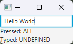

# Using the Enter Key

For now, after you type the number in the TextField, you must use your mouse to click the "Calculate" button. Wouldn't it be nice if, since we're typing anyways, we could just hit Enter on our keyboard to trigger the "Calculate" button handler? Well we can!

## Starter Code

We will be starting with the SQRT Calculator code we ended with last time:

```java
public class SqrtCalculator extends Application {
    Label instructions;
    TextField input;
    Label resultDisplay;
    Button calculateButton;

    @Override
    public void start(Stage stage) {
        createUIObjects();
        Pane root = generateRootPane();
        createAndShowScene(stage, root);
    }

    private void createUIObjects() {
        instructions = new Label("Enter a number:");

        input = new TextField();

        resultDisplay = new Label("");
        resultDisplay.setVisible(false);

        createCalculateButton();
    }

    private FlowPane generateRootPane() {
        FlowPane root = new FlowPane();
        root.getChildren().addAll(instructions, input, calculateButton, resultDisplay);
        return root;
    }

    private void createAndShowScene(Stage stage, Pane root) {
        stage.setTitle("Square Root Calculator");
        Scene scene = new Scene(root, 300, 200);
        stage.setScene(scene);
        stage.show();
    }

    private void createCalculateButton() {
        calculateButton = new Button();
        calculateButton.setText("Calculate"); //sets the button's text
        calculateButton.setOnAction(e -> handleCalculateButton()); //defines what happens when the button is clicked
    }

    private void handleCalculateButton() {
        resultDisplay.setVisible(true);
        try {
            double x = Double.parseDouble(input.getText());
            if (x < 0.0) {
                resultDisplay.setText("Error: cannot calculate square root of negative number");
            } else {
                double sqrt = Math.sqrt(x);
                resultDisplay.setText("Answer: " + sqrt);
            }
        } catch (NumberFormatException e) {
            resultDisplay.setText("The value you entered was not a number");
        }
    }
}
```

## KeyEvents

Whenever we type in a TextField, each button on the keyboard we press generates a KeyEvent. This KeyEvent contains information like:
* What button was pressed
* What the text of the TextField is after the button was pressed
* What kind of event occured (either key pressed, released, or typed)

### Types of Key Event handler

There are three types of KeyEvent handlers we can add to a TextField:

1) `myTextField.setOnKeyPressed`
2) `myTextField.setOnKeyReleased`
3) `myTextField.setOnKeyTyped`

The first two are straightforward enough. When you press a button, you have both a press action when your finger pushes the key down, and a release action when you lift your finger back up. `setOnKeyPressed` triggers when the key is first pressed, and `setOnKeyReleased` when the key is released.

It may seem unclear what the difference between `setOnKeyPressed` and `setOnKeyTyped` is, however. The key difference is that `setOnKeyTyped` only occurs *when a character is typed into the text field*. It's also worth noting that while `setOnKeyPressed` and `setOnKeyReleased` use a KeyCode that can be accessed via something like `keyEvent.getCode()`, `setOnKeyTyped` **does not include a KeyCode** object. For example, look at the following mini-program:

```java
public class KeyEventExample extends Application {
    private TextField textField;
    private Label pressedLabel, typedLabel;

    public static void main(String[] args) {
        launch(args);
    }

    @Override
    public void start(Stage primaryStage) {
        textField = new TextField();
        pressedLabel = new Label("Pressed: ");
        typedLabel = new Label("Typed: ");
        textField.setOnKeyPressed(e -> pressedHandler(e));
        textField.setOnKeyTyped(e -> typedHandler(e));

        Pane root = new VBox();
        root.getChildren().addAll(textField, pressedLabel, typedLabel);

        Scene scene = new Scene(root);

        primaryStage.setScene(scene);
        primaryStage.show();
    }

    private void pressedHandler(KeyEvent e) {
        pressedLabel.setText("Pressed: " + e.getCode());
    }

    private void typedHandler(KeyEvent e) {
        typedLabel.setText("Typed: " + e.getCode());
    }
}
```

If we run this program, no matter what we type, we'll always see:



That's because `getCode` gets the Code of the **keyboard key** that was pressed, not the value typed! For example, if you hit **Shift** and then, while holding it down, hit the number `1`, that would type an exclamation mark (!). However, if you look at the KeyCode for the pressed key, you'll see `DIGIT1`. That's because you didn't press the exclamation mark key, you pressed the `1` key (after pressing the Shift key). They KeyCode used by `setOnKeyPressed` and `setOnKeyReleased` tell you what happens *with the keyboard* while you are clicked in the TextField, **not** what happens with the *TextField itself!* In the same vein, *setOnKeyTyped* tells you what is **typed** in the TextField, but doesn't tell you anything about the *keyboard*.

Instead, to get the value typed, we want to use `keyEvent.getCharacter()`. So if we update our code:

```java
public class KeyEventExample extends Application {
    private TextField textField;
    private Label pressedLabel, typedLabel;

    public static void main(String[] args) {
        launch(args);
    }

    @Override
    public void start(Stage primaryStage) {
        textField = new TextField();
        pressedLabel = new Label("Pressed: ");
        typedLabel = new Label("Typed: ");
        textField.setOnKeyPressed(e -> pressedHandler(e));
        textField.setOnKeyTyped(e -> typedHandler(e));

        Pane root = new VBox();
        root.getChildren().addAll(textField, pressedLabel, typedLabel);

        Scene scene = new Scene(root);

        primaryStage.setScene(scene);
        primaryStage.show();
    }

    private void pressedHandler(KeyEvent e) {
        pressedLabel.setText("Pressed: " + e.getCode());
    }

    private void typedHandler(KeyEvent e) {
        typedLabel.setText("Typed: " + e.getCharacter());
    }
}

```

You'll now see that both of our labels show different things: one shows the keyboard button pressed while the other shows the typed character.

## Reacting to the Enter Key

Using this, let's update our SQRT application so that we can hit *Enter* in the textField, and it work to handle the calculation the same way that hitting the button does.

Before we go, we have to answer one question: **do we want our Event Handler to use `setOnKeyPressed` or `setOnKeyTyped`?

In this case (and in most cases), we want to use `setOnKeyPressed`, since we care about the user **Pressing** the enter key, not typing a linebreak character (which, given that this is a TextField, we don't want line breaks anyways, and by default the TextField control suppresses them). Using that, we can add the following to our code:

```java
public class SqrtCalculator extends Application {
    Label instructions;
    TextField input;
    Label resultDisplay;
    Button calculateButton;

    ...

    private void createUIObjects() {
        instructions = new Label("Enter a number:");

        input = new TextField();
        input.setOnKeyPressed(keyEvent -> handleEnterOnInput(keyEvent));

        ...
    }
    
    ...

    private void handleCalculateButton() {
        ...
    }

    private void handleEnterOnInput(KeyEvent keyEvent) {
        if (keyEvent.getCode() == KeyCode.ENTER) {
            handleCalculateButton();
        }
    }
}
```

Here, we are attaching the function `handleEnterOnInput` as an eventHandler for when a key is pressed inside of the `input` TextField. You'll note that, unlike what we did for our button handler, we are actually including the `keyEvent` as an argument for our `handleEnterOnInput` method. That's because we need to be able to determine what key was pressed. With our Button handler, we know the button was pressed, and we don't need the extra information, so I chose not to include it in the method signature.

From there, I simply check "Is the key that you pressed the Enter key?":

```java
    if (keyEvent.getCode() == KeyCode.ENTER) {
        ...
    }
```

If it is, then we simple call `handleCalculateButton()`. This is because we already implemented the logic for calculating and printing the square root (or any error messages) in that button handler, so there is no need to implement them. This keeps our code DRY, and also separates two different concerns:

1) Ensuring the Enter key was hit
2) Calculating and displaying the squareroot of the Text Field

Now, we have two different ways to calculate the square root after we type our number:

1) Click the "Calculate" Button
2) Hit enter inside the TextField

Once again, this improves our application's *usability* as it gives the user to be flexible in how they interact with our software. 

## Final full code

```java
public class SqrtCalculator extends Application {
    Label instructions;
    TextField input;
    Label resultDisplay;
    Button calculateButton;

    @Override
    public void start(Stage stage) {
        createUIObjects();
        Pane root = generateRootPane();
        createAndShowScene(stage, root);
    }

    private void createUIObjects() {
        instructions = new Label("Enter a number:");

        input = new TextField();
        input.setOnKeyPressed(keyEvent -> handleEnterOnInput(keyEvent));

        resultDisplay = new Label("");
        resultDisplay.setVisible(false);

        createCalculateButton();
    }

    private FlowPane generateRootPane() {
        FlowPane root = new FlowPane();
        root.getChildren().addAll(instructions, input, calculateButton, resultDisplay);
        return root;
    }

    private void createAndShowScene(Stage stage, Pane root) {
        stage.setTitle("Square Root Calculator");
        Scene scene = new Scene(root, 300, 200);
        stage.setScene(scene);
        stage.show();
    }

    private void createCalculateButton() {
        calculateButton = new Button();
        calculateButton.setText("Calculate"); //sets the button's text
        calculateButton.setOnAction(e -> handleCalculateButton()); //defines what happens when the button is clicked
    }

    private void handleCalculateButton() {
        resultDisplay.setVisible(true);
        try {
            double x = Double.parseDouble(input.getText());
            if (x < 0.0) {
                resultDisplay.setText("Error: cannot calculate square root of negative number");
            } else {
                double sqrt = Math.sqrt(x);
                resultDisplay.setText("Answer: " + sqrt);
            }
        } catch (NumberFormatException e) {
            resultDisplay.setText("The value you entered was not a number");
        }
    }

    private void handleEnterOnInput(KeyEvent keyEvent) {
        if (keyEvent.getCode() == KeyCode.ENTER) {
            handleCalculateButton();
        }
    }
}
```