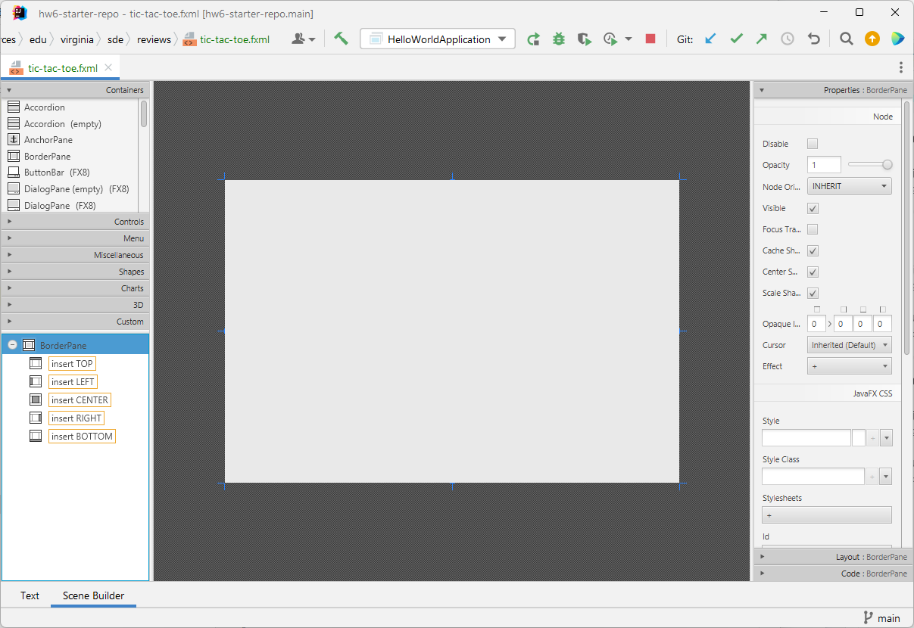
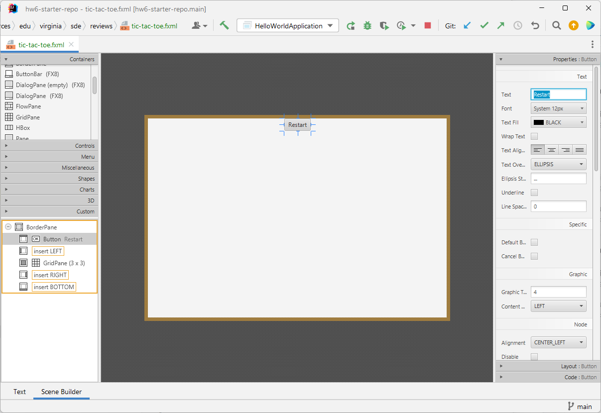
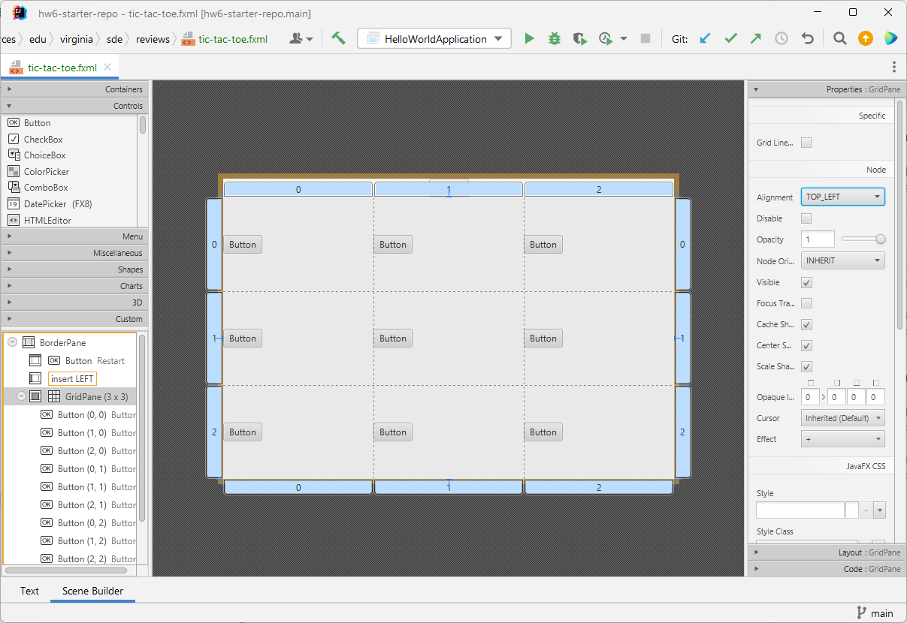
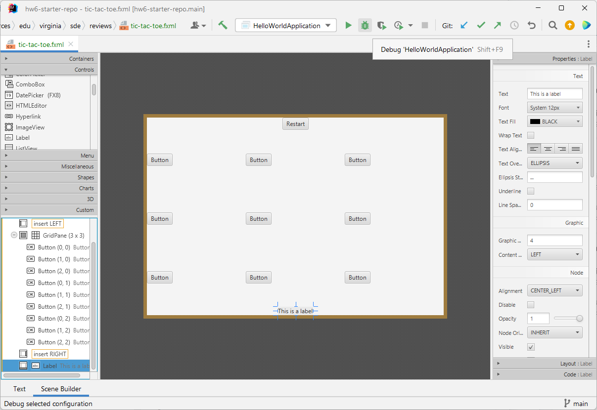

# Scenebuilder and FXML

Imagine you were building a complicated GUI application, which had several scenes, controls, layouts, etc. While it is possible to build those applications at the code level, it would be difficult and time-consuming, especially because you wouldn't have a clear visualization of how your app looked until you ran it.

A tool that can help is [Gluon's SceneBuilder](https://gluonhq.com/products/scene-builder/) - this application gives you a "drag and drop" interface for creating application layouts and visuals.

* TOC
{:toc}


## SceneBuilder in Intellij
It's worth noting that this tool *is* accessible within IntelliJ, but you must first install SceneBuilder on your computer. When installing, make note of **where** SceneBuilder is installed, as you will need it:

Set your SceneBuilder install folder in IntelliJ by going to:

File -> Settings -> Languages and Frameworks -> JavaFX

And then fill in the path where SceneBuilder was installed (or you can use Browse to find it's install location). Specifically, you want the SceneBuilder.exe file

### Word of caution

A note that I have found SceneBuilder within IntelliJ to sometimes be a bit unstable. Most of the time it works fine, but every now and then, it freezes up or starts producing unintended behavior. Additionally, I've seen several students say they have issues getting SceneBuilder to work at all inside of IntelliJ In those cases, you can close all .fxml files (which is what SceneBuilder edits) and restart IntelliJ. You can also simply use SceneBuilder as a standalone application outside of IntelliJ, and I've not seen any problems.

## Using SceneBuilder

SceneBuilder is a "drag and drop" interface for designing scenes. In general, we start with some base Layout, and can add layouts and controls to it.

For example, say I wanted to make a game of TicTacToe, I might start with a BorderPane



From there, I may add a 3x3 GridPane to the center (to represent the board) as well as a button to "restart" in the top pane (leaving left/right/bottom empty for now:)

In this case, it's important to note that the dropdowns at the top left group things by their classification. Panes are in the Containers Group, while widges like Buttons, labels, etc. are in the Controls group.

When I click on the button at the top, on the properties at the left I can change the display text to "Restart"



### Adding to the Grid

From there, I'm going to add one button to the grid in each cell:

Now, at this point, I haven't done any formatting to make this look pretty, but this should help get you started on at least seeing how SceneBuilder works.



## FXML Files

From there, if you click on the tab labeled **Text** in the bottom left, you will see the following:

```xml

<?xml version="1.0" encoding="UTF-8"?>

<?import javafx.scene.control.*?>
<?import javafx.scene.layout.*?>


<BorderPane maxHeight="-Infinity" maxWidth="-Infinity" minHeight="-Infinity" minWidth="-Infinity" prefHeight="400.0" prefWidth="600.0" xmlns="http://javafx.com/javafx/17.0.2-ea" xmlns:fx="http://javafx.com/fxml/1">
   <top>
      <Button mnemonicParsing="false" text="Restart" BorderPane.alignment="CENTER" />
   </top>
   <center>
      <GridPane BorderPane.alignment="CENTER">
        <columnConstraints>
          <ColumnConstraints hgrow="SOMETIMES" minWidth="10.0" prefWidth="100.0" />
          <ColumnConstraints hgrow="SOMETIMES" minWidth="10.0" prefWidth="100.0" />
            <ColumnConstraints hgrow="SOMETIMES" minWidth="10.0" prefWidth="100.0" />
        </columnConstraints>
        <rowConstraints>
          <RowConstraints minHeight="10.0" prefHeight="30.0" vgrow="SOMETIMES" />
          <RowConstraints minHeight="10.0" prefHeight="30.0" vgrow="SOMETIMES" />
          <RowConstraints minHeight="10.0" prefHeight="30.0" vgrow="SOMETIMES" />
        </rowConstraints>
         <children>
            <Button mnemonicParsing="false" text="Button" />
            <Button mnemonicParsing="false" text="Button" GridPane.columnIndex="1" />
            <Button mnemonicParsing="false" text="Button" GridPane.columnIndex="2" />
            <Button mnemonicParsing="false" text="Button" GridPane.rowIndex="1" />
            <Button mnemonicParsing="false" text="Button" GridPane.columnIndex="1" GridPane.rowIndex="1" />
            <Button mnemonicParsing="false" text="Button" GridPane.columnIndex="2" GridPane.rowIndex="1" />
            <Button mnemonicParsing="false" text="Button" GridPane.rowIndex="2" />
            <Button mnemonicParsing="false" text="Button" GridPane.columnIndex="1" GridPane.rowIndex="2" />
            <Button mnemonicParsing="false" text="Button" GridPane.columnIndex="2" GridPane.rowIndex="2" />
         </children>
      </GridPane>
   </center>
</BorderPane>

```

This FXML is how JavaFX represents the layout of our scene. The advantage of the SceneBuilder is that it lets us *see* what our scene will look like, and build it with drag-and-drop features. However, we can also manually edit this FXML file to modify our scene.

For example, if in between `</center> and </BorderPane>` at the bottom, I add:

```xml
    <bottom>
      <Label text="This is a label" BorderPane.alignment="CENTER" />
   </bottom>
```

...and then go back to Scene Builder, you'll see that the label was added to the Border Pane in the bottom section:



### Scene Builder additional features

Be aware that on the right the "Property", "Layout", and "Code" menus can be used to help setup your GUI. However, these are ultimately just editting the FXML file itself. Therefore, you should feel comfortable making changes *both* in the GUI *and* in the FXML file.

This is especially true for tags like `fx:id` and `onAction`, which we will use heavily in the next module where we start to show how to get FXML to interact with JavaFX.


