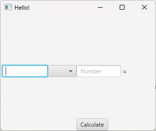
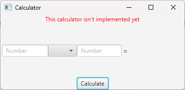
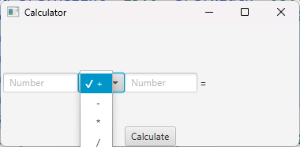
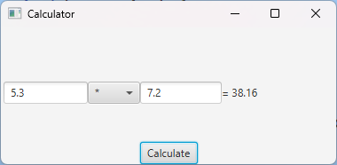
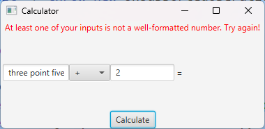
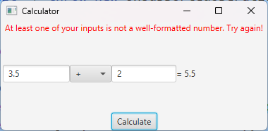

# JavaFX and FXML

Using FXML files with JavaFX is actually quite convenient. While this new framework may seem overwhelming at first, if you make a point to explicitly connect the FXML file with the underlying code in the Controller class, you'll see this gives us a lot of power to complete tasks.

For this assignment, we will make an application that acts like a simple calculator.

* TOC
{:toc}

## FXML File

Let's start with the following fxml scene (saved as `calculator.fxml`)

```xml

<?xml version="1.0" encoding="UTF-8"?>

<?import javafx.scene.control.*?>
<?import javafx.scene.layout.*?>

<BorderPane xmlns="http://javafx.com/javafx/17.0.2-ea" xmlns:fx="http://javafx.com/fxml/1">
   <center>
      <HBox alignment="CENTER" maxHeight="-Infinity" maxWidth="-Infinity" minHeight="-Infinity" minWidth="-Infinity" prefHeight="112.0" prefWidth="378.0">
         <children>
            <TextField prefHeight="25.0" prefWidth="95.0" promptText="Number" />
            <ChoiceBox prefHeight="25.0" prefWidth="59.0" />
            <TextField prefHeight="25.0" prefWidth="92.0" promptText="Number" />
            <Label prefHeight="17.0" prefWidth="126.0" text=" = " />
         </children>
      </HBox>
   </center>
   <top>
      <Label BorderPane.alignment="CENTER" />
   </top>
   <bottom>
      <Button mnemonicParsing="false" text="Calculate" BorderPane.alignment="CENTER" />
   </bottom>
</BorderPane>
```

Here, the layout visually looks like:



As yet, our application won't *do* anything, but we can at least load this FXML into an Application to run.

## Loading an FXML file

The following file, `CalculatorApplication.java`, is a JavaFX Application that loads the `calculator.fxml` file we just created.

```java
package edu.virginia.cs.javafx;

import javafx.application.Application;
import javafx.fxml.FXMLLoader;
import javafx.scene.Scene;
import javafx.stage.Stage;

import java.io.IOException;

public class CalculatorApplication extends Application {
    @Override
    public void start(Stage stage) throws IOException {
        FXMLLoader fxmlLoader = new FXMLLoader(CalculatorApplication.class.getResource("calculator.fxml"));
        Scene scene = new Scene(fxmlLoader.load());
        stage.setTitle("Hello!");
        stage.setScene(scene);
        stage.show();
    }

    public static void main(String[] args) {
        launch(args);
    }
}

```

Specifically, our file structure is as follows:

Application file: src/main/**java**/edu/virginia/cs/javafx/CalculatorApplication.java

FXML file: src/main/**resources**/java/edu/virginia/cs/javafx/calculator.fxml

That is, our FXML file is saved into our src/main/resources folder in the same package as our Application file, which is saved in the src/main/java folder.

We load the FXML as a resource using our class loader:

```FXMLLoader fxmlLoader = new FXMLLoader(CalculatorApplication.class.getResource("calculator.fxml"));```

From there, we load our `scene` from the `fxmlLoader` variable, and set the `stage` to show the `scene` we just loaded

```java
    Scene scene = new Scene(fxmlLoader.load());
        stage.setTitle("Calculator");
        stage.setScene(scene);
        stage.show();
```

Additionally, we add a "main" class that calls the inherited Application function "launch" with the existing command line arguments:

```java
    public static void main(String[] args) {
        launch(args);
    }
```

In this way, we can run our file with the appropriate JavaFX VM arguments to create a Window that includes the scene we just build with FXML. However, as yet, our scene doesn't *do* anything. Additionally, we haven't put anything in the ChoiceBox yet, which we will want to do.

In the next section, we will our .fxml scene to create a **Controller* class that the scene FXML interacts with.

## Controller Class

A **Controller** class is a class that directly handles interactions with our user interface scene. In general, every `.fxml` scene file will have one Controller.

First, let's create our Controller class (initially empty):

```java
public class CalculatorController {
    
}
```

### `fx:controller`

From there, we need to connect our FXML to this controller. We do this by adding the attribute `fx:controller` to the **root** pane of our scene. So in `calculator.fxml`:

```xml
<BorderPane fx:controller="edu.virginia.cs.javafx.CalculatorController" xmlns="http://javafx.com/javafx/17.0.2-ea" xmlns:fx="http://javafx.com/fxml/1">
   <center>
      <HBox alignment="CENTER" maxHeight="-Infinity" maxWidth="-Infinity" minHeight="-Infinity" minWidth="-Infinity" prefHeight="112.0" prefWidth="378.0">
         ...
```

Specifically, our `fx:controller` tag should reference the class including its package name.

## Application vs. Controller

You might think "Hey wait, we already have a CalculatorApplication.java, shouldn't we use that". While you *can* use that, I generally recommend against it. The idea of the Application class is to start-up and run our Java Application. We want to separate that from the Controller which handles interactions with the interface.

## fx:id

You'll notice in the `BorderPane's` top section of our `calculator.fxml`, we have a blank label. 

```xml
    <top>
      <Label BorderPane.alignment="CENTER" />
   </top>
   ```

This label is intentionally blank, because it will serve as our "error message" label, displaying any error messages due to incorrect application usage. For instance, right now, we cannot select any operation from our choice box (will will eventually have operations like "+", "-", etc.) So, if someone tries to "calculate", we want to change our label to display "no calculation operation selected."

However, in order to do any of this, we need to enable our `CalculatorController` class to **find** our label. To this end, we give our label an `fx:id`:

```xml
<top>
      <Label fx:id="errorLabel" BorderPane.alignment="CENTER" />
   </top>
   ```

Specifically, this is attached to a Label control, and what we are saying here is "give this Label object the variable name `errorLabel`". We can then add that variable to our Controller class:

```java
import javafx.fxml.FXML;
import javafx.scene.control.Label;

public class CalculatorController {
    @FXML
    private Label errorLabel;
}
```

Now, the `errorLabel` variable in our Controller class is tied to the Label with the same `fx:id` in our `calculator.fxml` file.

## Connecting event handler via FXML

To illustrate this, let's add a temporary method `handleCalculate` (which we will replace later):

```java
public class CalculatorController {
    @FXML
    private Label errorLabel;

    public void handleCalculate() {
        errorLabel.setStyle("-fx-text-fill: red;");
        errorLabel.setText("This calculator isn't implemented yet");
    }
}
```

Whenever `handleCalculate` is called, it will change the text and text color of our error label to say "This calculator isn't implemented yet". We can then attach this new method to our "Calculate" button in the Bottom Pane of our application using the `onAction` tag:

```xml
<bottom>
<Button onAction="#handleCalculate" mnemonicParsing="false" text="Calculate" BorderPane.alignment="CENTER" />
</bottom>
```
Specifically, by adding `onAction="#handleCalculate"`, we have told JavaFX that whenever this button is clicked, it should call the method named `handleCalculate` in our controller class.

When we do this, and run our application, clicking the button correctly updates the errorMessage:



Now our FXML and Controller are working together! This is the start of building an interactive FXML based application.

## ChoiceBox

Right now, our `ChoiceBox` is empty. There are two ways we could update it.

```xml
<ChoiceBox prefHeight="25.0" prefWidth="59.0" value="+">
    <String fx:value="+"/>
    <String fx:value="-"/>
    <String fx:value="*"/>
    <String fx:value="/"/>
</ChoiceBox>
```

If we run our application, you'll now see that the ChoiceBox defaults to "+", and has 4 choices: "+", "-", "*", and "/".



Similar to what we did with errorLabel, we can connect our ChoiceBox to a variable in our controller class by adding an `fx:id`

`<ChoiceBox fx:id="operationChoiceBox" prefHeight="25.0" prefWidth="59.0" value="+">`

And then add a matching variable in our CalculatorController class

```java
public class CalculatorController {
    @FXML
    private ChoiceBox<String> operationChoiceBox;
    
    @FXML
    private Label errorLabel;

    public void handleCalculate() {
        errorLabel.setStyle("-fx-text-fill: red;");
        errorLabel.setText("This calculator isn't implemented yet");
    }
}
```

Notice specifically that I store the variable `operationChoiceBox` as a `ChoiceBox<String>` rather than just a `ChoiceBox`. This is because `ChoiceBox` is a parameterized type, similar to `List` and `Set`, where we can specify the types of the variables in our dropdown.

From there, to ensure our ChoiceBox variable is set up correctly, let's edit the `errorLabel.setText` method call:

```java
public class CalculatorController {
    @FXML
    private ChoiceBox<String> operationChoiceBox;

    @FXML
    private Label errorLabel;

    public void handleCalculate() {
        errorLabel.setStyle("-fx-text-fill: red;");
        var operation = operationChoiceBox.getValue();
        errorLabel.setText("Selected operation - " + operation);
    }
}
```

From there, we can run our application and hit the button:


You'll now see that we're able to get the `String` of the selected operation from the choice box and update our error label accordingly.

## Implementing calculation.

Let's now fully implement our calculator:

First, we need to add three additional variables to track parts of our user interface:

* `firstTextField` - the first textField which will contain the first operand.  
* `secondTextField` - the second textField which will contain the second operand.  
* `resultLabel` - the label that currently just says "=" with no value, this is where our result will show.

Below is our final .fxml file:

```xml
<?xml version="1.0" encoding="UTF-8"?>

<?import javafx.scene.control.*?>
<?import javafx.scene.layout.*?>

<?import java.lang.String?>
<BorderPane fx:controller="edu.virginia.cs.javafx.CalculatorController" xmlns="http://javafx.com/javafx/17.0.2-ea" xmlns:fx="http://javafx.com/fxml/1">
   <center>
      <HBox alignment="CENTER" maxHeight="-Infinity" maxWidth="-Infinity" minHeight="-Infinity" minWidth="-Infinity" prefHeight="112.0" prefWidth="378.0">
         <children>
            <TextField fx:id ="firstTextField" prefHeight="25.0" prefWidth="95.0" promptText="Number" />
            <ChoiceBox fx:id="operationChoiceBox" prefHeight="25.0" prefWidth="59.0" value="+">
               <String fx:value="+"/>
               <String fx:value="-"/>
               <String fx:value="*"/>
               <String fx:value="/"/>
            </ChoiceBox>
            <TextField fx:id ="secondTextField"  prefHeight="25.0" prefWidth="92.0" promptText="Number" />
            <Label fx:id = "resultLabel" prefHeight="17.0" prefWidth="126.0" text=" = " />
         </children>
      </HBox>
   </center>
   <top>
      <Label fx:id="errorLabel" BorderPane.alignment="CENTER" />
   </top>
   <bottom>
      <Button onAction="#handleCalculate" mnemonicParsing="false" text="Calculate" BorderPane.alignment="CENTER" />
   </bottom>
</BorderPane>

```

We create the corresponding variables in our Controller:

```java
package edu.virginia.cs.javafx;

import javafx.fxml.FXML;
import javafx.scene.control.ChoiceBox;
import javafx.scene.control.Label;
import javafx.scene.control.TextField;

public class CalculatorController {
    @FXML
    private TextField firstTextField;
    
    @FXML
    private ChoiceBox<String> operationChoiceBox;

    @FXML
    private TextField secondTextField;
    
    @FXML
    private Label resultLabel;

    @FXML
    private Label errorLabel;

    public void handleCalculate() {
        errorLabel.setStyle("-fx-text-fill: red;");
        var operation = operationChoiceBox.getValue();
        errorLabel.setText("Selected operation - " + operation);
    }
}
```

And now, we're ready to implement `handleCalculate` to actually calculate our operation.

Let's start with a simple implementation with no error checking:

```java
    public void handleCalculate() {
        var firstNumber = Double.parseDouble(firstTextField.getText());
        var secondNumber = Double.parseDouble(secondTextField.getText());
        var operation = operationChoiceBox.getValue();
        var result = switch(operation) {
            case "+" -> firstNumber + secondNumber;
            case "-" -> firstNumber - secondNumber;
            case "*" -> firstNumber * secondNumber;
            case "/" -> firstNumber / secondNumber;
            default -> throw new UnsupportedOperationException();
        };

        resultLabel.setText("= " + result);
    }
```

This function gets the two numbers from the text field, and then sets the result to display the result given the selected operation in the Choice Box.

When I enter two numbers in the box with the "*" operation, I get the correct result:



However, we currently have no error handling, which is a problem. For instance, if I enter "Five point three" in the first box, my program will crash:

```text
Exception in thread "JavaFX Application Thread" java.lang.RuntimeException: java.lang.reflect.InvocationTargetException
	at javafx.fxml@18/javafx.fxml.FXMLLoader$MethodHandler.invoke(FXMLLoader.java:1857)
	at javafx.fxml@18/javafx.fxml.FXMLLoader$ControllerMethodEventHandler.handle(FXMLLoader.java:1724)
	at javafx.base@18/com.sun.javafx.event.CompositeEventHandler.dispatchBubblingEvent(CompositeEventHandler.java:86)
...
Caused by: java.lang.NumberFormatException: For input string: "Five point three"
	at java.base/jdk.internal.math.FloatingDecimal.readJavaFormatString(FloatingDecimal.java:2054)
Caused by: java.lang.NumberFormatException: For input string: "Five point three"

	at java.base/jdk.internal.math.FloatingDecimal.parseDouble(FloatingDecimal.java:110)
	at java.base/java.lang.Double.parseDouble(Double.java:651)
	at edu.virginia.edu.javafx/edu.virginia.cs.javafx.CalculatorController.handleCalculate(CalculatorController.java:25)
	at java.base/jdk.internal.reflect.DirectMethodHandleAccessor.invoke(DirectMethodHandleAccessor.java:104)
```

Specifically, we have a `NumberFormatException` because "Five Point Three" cannot be turned into a Double.

**As a rule: Do not let the application crash due to bad user input.** Instead, catch the exception and let the user know what they did wrong and how to fix it.

So, update my method `handleCalculate` method:

```java
    public void handleCalculate() {
        try {
            var firstNumber = Double.parseDouble(firstTextField.getText());
            var secondNumber = Double.parseDouble(secondTextField.getText());
            var operation = operationChoiceBox.getValue();
            var result = switch(operation) {
                case "+" -> firstNumber + secondNumber;
                case "-" -> firstNumber - secondNumber;
                case "*" -> firstNumber * secondNumber;
                case "/" -> firstNumber / secondNumber;
                default -> throw new UnsupportedOperationException();
            };
            
            resultLabel.setText("= " + result);
        
        } catch (NumberFormatException e) {
            errorLabel.setText("At least one of your inputs is not a well-formatted number. Try again!");
            errorLabel.setStyle("-fx-text-fill: red");
        }
    }
```

Now, our application no longer crashes on bad input!



However, if we simply proceed to fix the error and re-run calculate...



...our error message is still visible even though we don't have an error anymore! As such, we want to ensure that whenever we call `handleCalculate`, we want to clear any error message left over from a previous function call:

```java

    public void handleCalculate() {
        try{
            errorLabel.setText(""); // clear existing error message

            var firstNumber=Double.parseDouble(firstTextField.getText());
            var secondNumber=Double.parseDouble(secondTextField.getText());
            ...
```

## Final Code:

### `calculator.fxml`

```xml
<?xml version="1.0" encoding="UTF-8"?>

<?import javafx.scene.control.*?>
<?import javafx.scene.layout.*?>

<?import java.lang.String?>
<BorderPane fx:controller="edu.virginia.cs.javafx.CalculatorController" xmlns="http://javafx.com/javafx/17.0.2-ea" xmlns:fx="http://javafx.com/fxml/1">
   <center>
      <HBox alignment="CENTER" maxHeight="-Infinity" maxWidth="-Infinity" minHeight="-Infinity" minWidth="-Infinity" prefHeight="112.0" prefWidth="378.0">
         <children>
            <TextField fx:id ="firstTextField" prefHeight="25.0" prefWidth="95.0" promptText="Number" />
            <ChoiceBox fx:id="operationChoiceBox" prefHeight="25.0" prefWidth="59.0" value="+">
               <String fx:value="+"/>
               <String fx:value="-"/>
               <String fx:value="*"/>
               <String fx:value="/"/>
            </ChoiceBox>
            <TextField fx:id ="secondTextField"  prefHeight="25.0" prefWidth="92.0" promptText="Number" />
            <Label fx:id = "resultLabel" prefHeight="17.0" prefWidth="126.0" text=" = " />
         </children>
      </HBox>
   </center>
   <top>
      <Label fx:id="errorLabel" BorderPane.alignment="CENTER" />
   </top>
   <bottom>
      <Button onAction="#handleCalculate" mnemonicParsing="false" text="Calculate" BorderPane.alignment="CENTER" />
   </bottom>
</BorderPane>
```

### CalculatorController.java

```java
package edu.virginia.cs.javafx;

import javafx.fxml.FXML;
import javafx.scene.control.ChoiceBox;
import javafx.scene.control.Label;
import javafx.scene.control.TextField;

public class CalculatorController {
    @FXML
    private TextField firstTextField;

    @FXML
    private ChoiceBox<String> operationChoiceBox;

    @FXML
    private TextField secondTextField;

    @FXML
    private Label resultLabel;

    @FXML
    private Label errorLabel;

    public void handleCalculate() {
        try {
            errorLabel.setText(""); // clear existing error message
            
            var firstNumber = Double.parseDouble(firstTextField.getText());
            var secondNumber = Double.parseDouble(secondTextField.getText());
            var operation = operationChoiceBox.getValue();
            var result = switch(operation) {
                case "+" -> firstNumber + secondNumber;
                case "-" -> firstNumber - secondNumber;
                case "*" -> firstNumber * secondNumber;
                case "/" -> firstNumber / secondNumber;
                default -> throw new UnsupportedOperationException();
            };

            resultLabel.setText("= " + result);

        } catch (NumberFormatException e) {
            errorLabel.setText("At least one of your inputs is not a well-formatted number. Try again!");
            errorLabel.setStyle("-fx-text-fill: red");
        }
    }
}

```