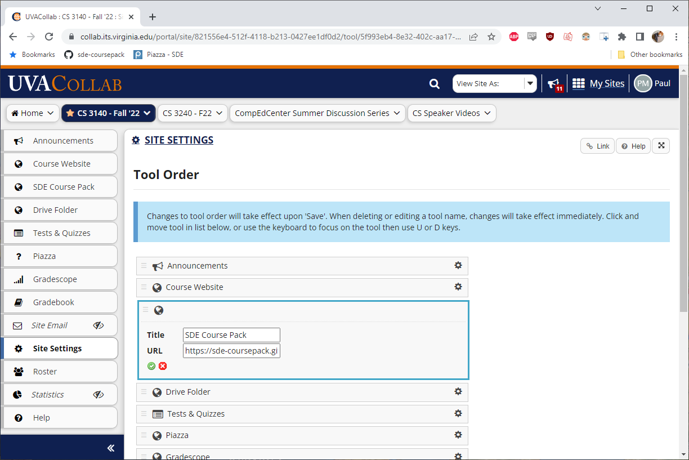

# Software Quality

What does it mean to say software is "good"? You will probably think of things like:

- It performs a task accurately and correctly
- It doesn't crash, or I won't lose significant progress if something goes wrong
- It's inexpensive to purchase
- It runs as fast as needed, and doesn't use up too many computer resources (memory, processor time, etc.)
- It can work across multiple devices (PC, Phone)
- The user interface is easy to work with
- It looks nice visually
- It gets regular updates to fix bugs, add new features

All of these are often what people think of when they think of when they think of quality.
And these are good measure of software quality...from the customer perspective. Now consider
from the perspective of a developer. 

This may seem an odd perspective to take; if this were
a restaurant, we'd say "well, the cook is being paid to make the food, only the customer
satisfaction really matters." But consider that kitchen: what if every morning the chef
has to make their own cooking fire using two sticks and some kindling before they could
start making food? What if the kitchen has no electricity? What if the restaurant is
expected to make french fries, but the cook doesn't have a fire or oil to cook it in?
Well, that cook is likely to be unhappy, and that cook is less likely to be able to 
serve as many customers, or produce as big a menu the customers want. 

In order to serve customers effectively, the kitchen needs to have all the 
necessary tools for the chef to be productive, and it must be kept clean and in 
good working order. New kitchen
staff must be trained in the tools in the kitchen, they need to be trained on how
to keep things clean. If an oven or fryer breaks, it must be replaced. The kitchen
must constantly monitor and maintain the state of the restaurant: are there enough 
clean plates? How many orders are pending? Has any order come back to the kitchen
because of an error?

Ultimately, we cannot make our customers happy if our kitchen is dingy,
dirty, broken, and poorly maintained. So just as important as external software
quality is internal software quality, because we cannot maintain the former without
the latter.

## ISO 9126

Enter the organization ISO, the International Organization of Standardization.
ISO organizes experts to develop and publish standards (technical and non-technical)
The abbreviation ISO doesn't directly come from an abbreviation in any one 
language, but rather from the Greek "isos", meaning *equal*. ISO 9126 is an
internal standard for the evaluation of *software quality*. ISO 9126 broke
software quality down into **external** and **internal** measures of
quality.

## External Quality

*External software quality* refers to the quality of the software from
the perspective of the **stakeholders**. *Stakeholders* are anyone affected
by the software, not just the user; that is, anyone who "holds a stake"
in the usage of the software.

To explain the distinction between *stakeholders* and *users*, consider 
an electronic medical records system at a large hospital. Who are 
the stakeholders?

* Doctors and nurses - they fill out and maintain medical records. 
They will also want to view medical history, monitor medication,
change in conditions over time, etc.
* Resource Managers - they will need to track medical expenditures,
medication supplies, how many beds are available in which departments,
whether or not a hospital has the resources to treat a patient
* IT Employees - If something goes wrong with the medical records, or someone
is unsure how to perform a specific task with the electronic medical records,
they are the primary support staff.
* Insurance Managers - will look at treatments to determine coverage.
* Patients - While they are unlikely to use the system directly, they are
directly affected by it. A data corruption could result in incorrect
medication or treatment.
* The hospital board - While they will likely never use the system directly, 
the board of the hospital is probably going to make the purchasing decision 
on any large-scale software for the department. While they will likely
work with their staff to select the best system, the board is going
to have to weigh factors that the doctors, nurses, and IT staff may not,
like price, warranties, insurance, etc.

All of these stakeholders have different priorities of goals! So we
want to define external software quality broadly enough to encompass
this.

With this in mind, let's consider the following **external** quality measures:
* Functionality
* Reliability
* Usability
* Efficiency
* Portability

### Functionality

*Is the software functionally complete? That is, does it do
everything it is supposed to do?* 

Functionality is about to what extent the system meets the customer's
needs in what the software *does*. Does the software have all the
features the customers need or expect? Is the software sufficiently
secure? Are the results the software produces accurate?

### Reliability

*What is the capability of the software to maintain performance
under certain conditions over a certain period of time?*

Consider Amazon Web Services (AWS): Many web applications rely on AWS,
like Airbnb, Slack, Lyft, Netflix, Yelp, etc. If Amazon Web Services
had a significant outage. However, it also runs Amazon's own
distribution and shipping infrastructure. If your website, application,
or technology rely on AWS, what could go wrong? In an AWS outage last year,
smart appliances like Refrigerators, Door Locks, Robot Vacuum Cleaners,
Self-Cleaning Litter Boxes, etc. stopped working. Imagine how
this could affect, say, a customer that doesn't carry their physical
keys with them because they use their phone to lock and unlock their door?

### Usability

*How much effort is needed for a customer to use software?*

How much learning is required to interact with software? Do the
layouts, aesthetics, and colors help guide the user's vision effectively?

In Collab, instructors can add a Web Link to the tabs on their course page,
like we have on our Collab for the Coursepack and Course Drive Folder.
What if I need to edit the Web Link? Well, if I go to Site Settings,
I Can See tabs for:

* Site Information
* Edit Site Information
* Manage Tools
* Tool Order
* Add Participants
etc.

Which of those would you go to change the the URL of a Web Link? The obvious
answer is "Manage Tools". The obvious answer is also wrong. If I want
to change the URL of a Web Link, I go to Tool Order!

The first time I used Collab, I honestly thought this feature didn't exist.
I spent months where, if I needed to change a URL, I would use "Manage Tools"
to delete the existing Web Link and create another, which was far less efficient.

Why do I use a Google Drive Folder for class resources instead of
the Resources tool in Collab? Because it's far less efficient.

These are *usability* issues, that make the customer experience of using the
software worse, thus lowering the overall software quality.

Accessibility is also a factor in Usability: that is can the software
be used by people with a broad range of characteristics.

### Efficiency

*When operating, what resources are used, and to what extent, by the software?*

*Resources* above typically refers to time and memory, but can also reference
other resources. For example, if a program is using an internet connection,
how much bandwidth does it use? What are the necessary speeds for the program
to operate? Generally, the fewer resources a program consumes, the better.

### Portability

*How able is the software to be transferred from one environment to another?*

Can your software run on Windows, Mac, Linux, etc.? Does your app
work in Chrome, Firefox, Edge, etc.? Can elements within the software
adapt to a change in how and where the users uses the software?

## Internal Quality

With Internal software quality, we are concerned with the software
quality *from the perspective of the developers.* The primary
measure of Internal Quality is **Maintainability**. That is, the
internal quality of software is how **maintainable** it is from
the developers.

Maintenance in this context relates to anything from the evolution
of software over initial development, bug fixes, new features,
changing features, etc. We can break maintainability down into:

* __Analyzability__ - to what extent can the software construction be understood?
* __Changeability__ - the effort it requires to makes changes to the software
* __Stability__ - the extent to which changes in one part of a software construction affect other parts
* __Reusability__ - the extent to which parts of the construction can be reused in other parts of the construction or in other software projects.
* __Testability__ - the extent to which the software can be tested to find faults or defects in the software construction

##E The key to internal quality

In this class we will spend a lot of time focusing on internal
software quality. We will improve the analyzability of our
software by writing clean code and using decomposition to
make each portion of our code more modular. We will use
version control software to ensure our software is changeable,
and follow good design principles to ensure our code is
receptive to change. We will use modularity and design patterns
to decouple unrelated portions of our system, increasing stability.
We will use object-orientation to improve and refactoring
to improve the reusability of our code. We will use JUnit and
Test Driven Development to ensure our software is not only
testable, but thoroughly tested.

And the most important step to achieving high internal 
software quality is **design**. We have to design our
software in a way to make it maintainable. We cannot
add maintainability after the fact! We have to use good
practice to ensure our software *stays* maintainable.

## Software Entropy

*Entropy* is the idea that in our Universe, energy within
a closed-system cannot become more orderly overtime, and
not all processes are reversible. A consequence of this
is that the chemical energy in gasoline cannot be perfectly
turned into kinetic energy. We will lose
some energy to heat and sound energy, and it is impossible
to turn all that *back* into chemical energy without needing
even more energy. Ultimately, given enough time, even our
[observable universe itself will no longer produce stars](https://www.youtube.com/watch?v=F1CddzgVW14), as
all energy becomes so spread out as to never meaningfully
interact again.

In the same way, overtime, software naturally becomes harder
and harder to modify. The *maintainability* of the software
decreases. This is party because the software becomes larger and
more complex; the more code there is, the longer it takes
to understand. This is also partly because of bad design or
haphazard changes, leading to things like Spaghetti code, where
changing code in one system produces unexpected results in
seemingly unrelated systems. 

Even relatively small applications can fall prey to software entropy.
Think back to homework you've done in the past. How many times
have you tried to fix a bug, thought it was a simple "one line fix",
only to realize changing that one line broke other parts of the program?

A common parody of the children's song "99 Bottles of Beer on the Wall"
may go something like:

> 99 unfixed bugs in the code
> 99 unfixed bugs
> You take one down, patch it around
> 105 unfixed bugs in the code

For some software, this song never ends: we never fix all of
the known defects (let alone unknown defects), because doing so 
would require more effort than it is worth. If a bug only occurs 
in exceedingly rare cases, is hard to recreate, and fixing would
require a massive redesign of several highly connected sub-systems,
we often may not fix it at all.

But that's bad! If we're at this point, we've already had
a design failure! Ultimately, we can never create a perfect
design that will always ensure are software stays maintainable
forever. But a good design can dramatically slow down entropy,
whereas a bad design guarantees entropy is going to be nearly
instantaneous (for example: write a large application entirely
in a single main function or class).
