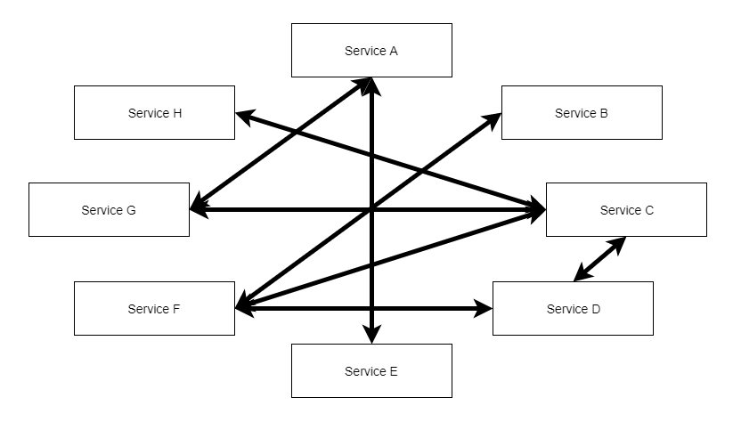
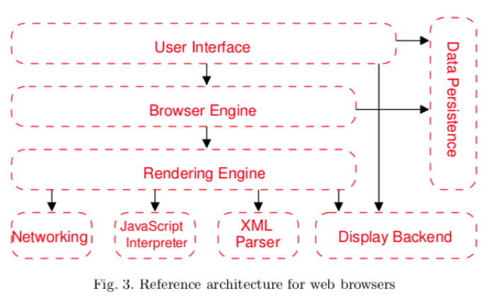

---
Architectural Patterns
---

# Architectural Patterns

In this unit, we will discuss some common Architectural ideas and structures.

## What is a Pattern

A pattern is a known strategy to addressing design concerns. However, patterns are inherently abstract. That is, you cannot simply copy and paste a pattern, or `import pattern`. Rather, it is an established idea of how to solve design problems. We will look at some architectural patterns in this unit.

## Pattern vs Framework

If your mind drifted to things like `Angular` and `ASP.NET`, let me slow you down. Software packages like these are called **frameworks**. A **framework** is existing code/structure that you use to build your own programs. For example, you have at this point certainly become very familiar with the Java Collections Framework. This **framework** provides existing features, like `List`, `Set`, and `Map` (as well as several concrete implementations) to allow you to organize collections of data.

One **framework** we will look at in our GUI unit is JavaFX, which is a framework for making GUI-based Applications. JavaFX supplies a number of pre-built widgets, like buttons and form fields, as well as the infrastructure to interact with a *controller* class that acts as the gateway between the GUI and the rest of the software.

## Common Architectural Patterns

Here are some common Architectural patterns we will cover in a light-on details way. The goal is to just introduce some common terms and get you familiar with how the ideas we covered in the previous module apply here.

### Big Ball of Mud - avoid at all costs!

The Big Ball of Mud is when a software system has a lack of a clear and disciplined software architecture. Components interact in often something like an ad-hoc basis, which tends to lead to complicated tangling, and breaks down modularity and functional independence. Even a software system that starts with a well-established architecture can degrade into a Big Ball of Mud overtime if developers do not take deliberate steps to ensure correct functionality.

### Layered Architecture

A Layered Architecture is one where each component interacts with the component(s) in the layer above it and the layer below it. Specifically, a layer provides services to the layer above, and sends requests to the layers below. For example, the `Control` layer above receives request from the `Global Planning` layer, and sends requests to the `Navigation` layer. In general, layered architectures are generally set up such that no layer interacts with any layer other than the ones it is adjacent to. Additionally, no layer should be aware of layers above it, or send requests to it. Rather, each layer's service should be described as an abstract interface to bolster the functional independence of each layer.

This decomposition is helpful, because it allows us visualize the system like we think of it: from high-level at the top to low-level at the bottom.

This architecture shows up in many places, such as web-browsers. Below is a **reference architecture** for a web-browser. A reference architecture is an architecture that is good for solving a set of problems (such as a web browser). To be clear, not every web browser follows this general structure. But many of the most popular ones do.

In this layered architecture, the User Interface represents the part you as a user see and interact with. When a user navigates to a new webpage, they send the request for handling that page to the Browser Engine, which usings the Rendering Engine to handle the external aspects, such as Networking, interpretting HTML and Javascript, etc.

### Networked Architectures

Many software applications work over the internet. From streaming entertainment, to shopping, to filing taxes, etc., we want applications that can communicate over the network.

#### Client Server

In a Client-Server architecture, we have effectively two separate components communicating with one another. The Client application runs on their own device (computer, phone, smart device, etc.) and communicates with a centralized server over the internet. While these applications are part of the same software system, they will almost always be largely functionally independent components.

For example, if you were to build a mobile application for managing a Google Calendar, the application will have to run on a smartphone (such as an Android). That local app will have a GUI, it will have features like adding events to your calendar, or viewing upcoming events. However, that application would almost certainly want to interact with Google Calendar's servers in order to synchronize your calendar across multiple devices, as well as handle invites and shared events. A separately deployed application will run on the remote server that will receive requests from the client-side (your phone), likely interact with some database, and then send information back over the internet to your phone. The application on your phone then interprets that data to update its own local set of events and display.

Challenges in client-server include handling things like monitoring server load (how many active users can you handle) and dealing with synchronization issues. Additionally, a consideration needs to be made about how the application functions if the server is unreachable (for example, if the client loses internet access). Some notable examples of where this has failed is when a power outage in New York City resulted in many people with smart locks being locked out of their apartments, due to their Wi-Fi routers being down.

#### Peer-to-Peer

Peer-to-Peer is similar to Client-Server, but with a critical difference. Namely, in Client-Server, there is a centralized server or set of servers that clients interact with. In Peer-to-Peer, there is no centralized resource. Rather, clients communicate with each other directly over the network, with no one user being considered the "main" user. Often, Peer-to-Peer can be used for things like file-sharing, to reduce the burden on any one peer sharing a file by distributing it. Peer-to-Peer is also often used in high-end computing to directly network multiple computers/servers together to distribute the workload of tasks. However, peer-to-peer has security concerns that must be accounted for, as well.

### Monolithic Architecture

In a monolithic architecture, we deploy an application (often to a remote server for hosting) as a single application. An advantage of this approach is its scalability: if you need more server space to handle your users/requests, you can redeploy the same application onto more servers. Additionally, deploying updates is similarly easy as you can simply deploy your updated distributable file to your servers.

However, Monolithic Architectures can fall prey to the same problems as any applications: the larger the application gets, the harder it becomes to maintain, update, change, and fix. Often, with monolithic architectures, any technologies we use with our first deployment, we can be stuck with. For example, if our application is JVM based, like Java or Kotlin, we cannot meaningfully introduce non-JVM languages into our architecture.

### Microservice Architecture

To address the flaws of monolithic architecture, especially complexity, a modern idea is to build your applications as several microservices. Each microservice typically creates an API that exposes a single cohesive set of features/operations. The goal here is to build several small services that interact to meet the customer's needs, rather than having a single application.

Each microservice is deployed on a different server or set of servers with their own address. Because each microservice is independent, it can be deployed separately from other microservices, allowing for modular maintenance. The microservices are ideally functional in nature, where their API acts like a function call. One or more microservices are interacting directly with a datasource (such as a database), and handles responding to request with raw data. Each microservice can then be designed to take in some data, perform some action on it, such as a query, and then send back results of that query. In this way, each module can be Data Coupled based upon usage of a functional interface.

The trade-off, however, is that while each microservice itself is typically small enough to be easily maintained, we now have to handle deploying several different microservices (which means we are effectively handling several different applications), and monitoring the load on all of them. Additionally, we have to consider the bandwidth and memory considerations. Because a single transaction may require interacting with several microservices, we end up with redundant memory storage, and use finite bandwidth in communicating between services.