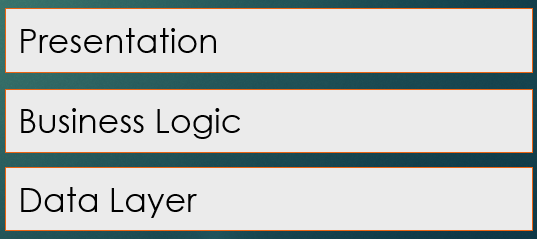

* TOC
{:toc}

# Three Layer Architecture

A Three Layer Architecture is a notable example of a Layered Architecture.

Let's imagine we were building a course registration website for a University. What are some concerns we would have?

- How are students and professors interacting with our system? Likely through a web application of some kind.
- How are we storing persistent information so that every user interacting over the internet has their transactions processed, like what courses are available, what courses have each student registered for? How are the courses for each semester being entered into the system? Are they pulled from an external registrar's system, via upload, etc
- Where are we handling decisions like enforcing pre-requisites, ensuring students don't sign up for overlapping classes, checking for professor overrides, etc.

Each of these relates to 3 major types of concern. Respectively:

- __Presentation__ - How users/other services see and interact with our system. This can range from a GUI based web-application, to an API like [balldontlie.io](https://app.balldontlie.io) that outputs json data based on arguments entered through a URL, and everything in between.
- __Business Logic__ - Enforcing real world business rules on our system, such as Course Pre-requisites, Enrollment limits, scheduling limits, etc.
- __Data__ - Where is our data acquired from and stored? This might be, for example, a database and code that handles storing and retrieving data as our website is used.

A natural approach to this is to separate each of these concerns into separate component layers:



While a Three Layer architecture may not necessarily be exactly three layers, it tends to be the most straightforward decomposition of concerns to start with.

An advantage of this approach is that each component can be managed independent of others so long as the expected interface between Layers is maintained.

## Example - NYTimes Bestseller List

I made a small system for getting the New York Times Bestsellers List from their public API (be aware to use this code yourself you will need to generate your own API key by signing up for an [account here](https://developer.nytimes.com/docs/books-product/1/overview) ). While this application is fairly limited (a user can specify which NYTimes list they want to see and it shows them), it's a good chance to explain a Three Layer Architecture.

## [Data Layer](https://github.com/sde-coursepack/ThreeLayerBooks/tree/master/src/main/java/edu/virginia/cs/threelayer/data)

There are a few classes here to highlight.

- [`BestSellersApi`](https://github.com/sde-coursepack/ThreeLayerBooks/blob/master/src/main/java/edu/virginia/cs/threelayer/data/BestSellersApi.java) - this class handles getting the raw BestSellers data (as JSON) from the New York Times API
- [`BestSellersJSON`](https://github.com/sde-coursepack/ThreeLayerBooks/blob/master/src/main/java/edu/virginia/cs/threelayer/data/BestSellersJSON.java) - this class interprets the JSON from BestSellersApi to produce `Book` and `BestSellerList` data objects which are passed up to the Business Logic and Presentation layer.
- [`BestSellersFacade`](https://github.com/sde-coursepack/ThreeLayerBooks/blob/master/src/main/java/edu/virginia/cs/threelayer/data/BestSellersFacade.java) - This class exists to simplify interactions with the data. Our Business Logic Layer directly interacts with this facade to get the `Book` and `BestSellerList` objects. A facade is a design pattern of hiding multiple modules behind a single, simpler interface. Here, this Facade hides the other classes in the Data Layer related to the New York Times Best SellerList.

As you can see, the primary purpose of this class is to **manage data**. In this case, I'm managing data using an external API, and my Data Layer simply creates the data structures I use to interpret the data in higher layers.


## [BusinessLayer](https://github.com/sde-coursepack/ThreeLayerBooks/tree/master/src/main/java/edu/virginia/cs/threelayer/business)

In this particular layer, I only have one service [`BestSellerService`](https://github.com/sde-coursepack/ThreeLayerBooks/blob/master/src/main/java/edu/virginia/cs/threelayer/business/BestSellersService.java), which exists to get information from the New York Times best seller list and generate summaries.

Some of these summaries are simple, simply passing data from the Data Layer up to the presentation layer:

```java
    public BestSellersList getCurrentBestSellerList(ListName listName) {
        return facade.getCurrentBestSellerList(listName);
    }

    public BestSellersList getHistoricBestSellerList(ListName listName, Date date) {
        return facade.getHistoricBestSellerList(listName, date);
    }
```

One of these analyzes the data to find the book that has been on a particular BestSeller list the longest:

```java
    public Book getLongestCurrentBestSeller(ListName listName) {
        BestSellersList bestSellers = getCurrentBestSellerList(listName);
        Optional<Book> longestCurrentBook = bestSellers.getBooks().stream()
                .max(Comparator.comparing(Book::getWeeksOnList));
        if (longestCurrentBook.isEmpty()) {
            throw new EmptyBestSellerListException(bestSellers.toString());
        }
        return longestCurrentBook.get();
    }
```

This is an example of business logic: analyzing the data and applying real-world rules to produce some insight, summary, or modification of the data.

### About Services...

Before we go on, I want to note that currently my app is only performing one service: interacting with the New York Times Bestseller List. However, as I add features to my application, I may start adding additional services, such as storing bestseller lists in my own database long term, or interacting with other Book related services like Goodreads and Kindle, or creating my own accounts system to handle user login and user history (such as "liked" books). 

Each of these services would have their own set of modules in the Data Layer, and at least one module in the Business Logic layer. I would also have additional modules that handle specific crosscutting features (like finding the price of books on Amazon that are on the Best Sellers List and are on your Goodreads Wishlist).

## [Presentation Layer](https://github.com/sde-coursepack/ThreeLayerBooks/tree/master/src/main/java/edu/virginia/cs/threelayer/presentation)

You'll notice the Presentation Layer has two classes, both, in this case, with a `main` function. This is because I intentionally made two different "front-ends" for the BestSeller application.

### Arguments Version

- [CommandLineArgs](https://github.com/sde-coursepack/ThreeLayerBooks/blob/master/src/main/java/edu/virginia/cs/threelayer/presentation/CommandLineArgs.java) uses user given command line arguments to print a summary of the Best Seller list. For example (at this time of this posting on October 13, 2022), the argument `-ef` produces

```text
Best Sellers List:
	 1. FULL PACKAGE - by Lauren Blakely
	 2. THE GUERNSEY LITERARY AND POTATO PEEL PIE SOCIETY - by Mary Ann Shaffer and Annie Barrows
	 3. THE WHISTLER - by John Grisham
	 4. RING OF FIRE - by Brad Taylor
	 5. SMALL GREAT THINGS - by Jodi Picoult
	 6. SHELTER FOR ADELINE - by Susan Stoker
	 7. A MAN CALLED OVE - by Fredrik Backman
	 8. THE MISTRESS - by Danielle Steel
	 9. THE GUESTS ON SOUTH BATTERY - by Karen White
	10. NO MAN'S LAND - by David Baldacci
	11. BELOW THE BELT - by Stuart Woods
	12. CROSS THE LINE - by James Patterson
	13. THE DRY - by Jane Harper
	14. A DOG'S PURPOSE - by W Bruce Cameron
	15. THE SLEEPWALKER - by Chris Bohjalian
	
Longest Running Book:
	THE WHISTLER - by John Grisham
	It has been on the BestSellers List for 12 weeks
```

I use command-line arguments for the user to select their list. For example, `-ef` means E-Book Fiction, while `-hn` means Hardcover Non-Fiction.

This is used to define the `ListName` enumerated variable that is pass down through the Business Logic Layer to the Data Layer.

### CLUI Version

The CLUI (Command-Line User Interface Version) acts a bit differently: it prompts me to enter information in the menu. For example:

```text
Please make a selection:
    1) Fiction Hardcover
    2) Fiction E-Book
    3) Fiction Combined
    4) NonFiction HardCover
    5) NonFiction E-Book
    6) NonFiction Combined

> 6
	 1. CONFIDENCE MAN - by Maggie Haberman
	 2. I'M GLAD MY MOM DIED - by Jennette McCurdy
	 3. LIVE WIRE - by Kelly Ripa
	 4. KILLING THE LEGENDS - by Bill O'Reilly and Martin Dugard
	 5. THE BODY KEEPS THE SCORE - by Bessel van der Kolk
	 6. ADRIFT - by Scott Galloway
	 7. STARRY MESSENGER - by Neil deGrasse Tyson
	 8. THE MYTH OF NORMAL - by Gabor Mat with Daniel Mat
	 9. THE DIVIDER - by Peter Baker and Susan Glasser
	10. IF YOU WANT SOMETHING DONE - by Nikki R. Haley
	11. WHEN MCKINSEY COMES TO TOWN - by Walt Bogdanich and Michael Forsythe
	12. DINNERS WITH RUTH - by Nina Totenberg
	13. GRACE - by Cody Keenan
	14. WHAT IF? 2 - by Randall Munroe
	15. THE MOSQUITO BOWL - by Buzz Bissinger
```

In this above case, I use `6` to select the `Nonfiction Combined` List. This is more user friendly than the Arguments version. However, if I were hosting the application on a remote server, the Arguments version would be easier for automated programs to interact with.

I want to draw your attention specifically to how both of these interact with the Business Logic:

__CommandLineUI__

```java
        int choice = Integer.parseInt(entry);
        ListName listName = getListNameFromEntry(choice);
        BestSellersList bestSellersList = service.getCurrentBestSellerList(listName);
        for (int rank = 1; rank <= bestSellersList.getMaxRank(); rank++) {
            Book book = bestSellersList.getBookByRank(rank);
            System.out.printf("\t%2d. %s - by %s%n", rank, book.getTitle(), book.getAuthorName());

```
__CommandLineArgs__

```java
        BestSellersService bestSellersService = new BestSellersService();
        BestSellersList bestSellersList = bestSellersService.getCurrentBestSellerList(listName);
        System.out.println("Best Sellers List:");
        for (int rank = 1; rank <= bestSellersList.getMaxRank(); rank++) {
            Book book = bestSellersList.getBookByRank(rank);
            System.out.printf("\t%2d. %s - by %s%n", rank, book.getTitle(), book.getAuthorName());
    }
```

You'll notice that **both** of these versions interact with the rest of the application *exactly the same*. That is, the same Service Layer used in one app can be used in another. 

A huge advantage of this approach is **portability**. For example, we could make a GUI Application that can run on a desktop simply by creating the modules to handle the UI in our Presentation Layer, but otherwise interacting with the same services in the same way.

We could also use this to create our own API that is used to send data in a *client-server* fashion. For example, to a mobile application on Android or iOS. The application on the phone would take in the data from the server to display in app, and send requests out to the server based upon what a user requests.

*This means we don't have to reimplement the entire app for every platform!* Instead, we can simply create the UI interface needed for the app to work on Android, iOS, and any other device we want to port to, and then simply interact with my existing services to get and send relevant data and interactions!