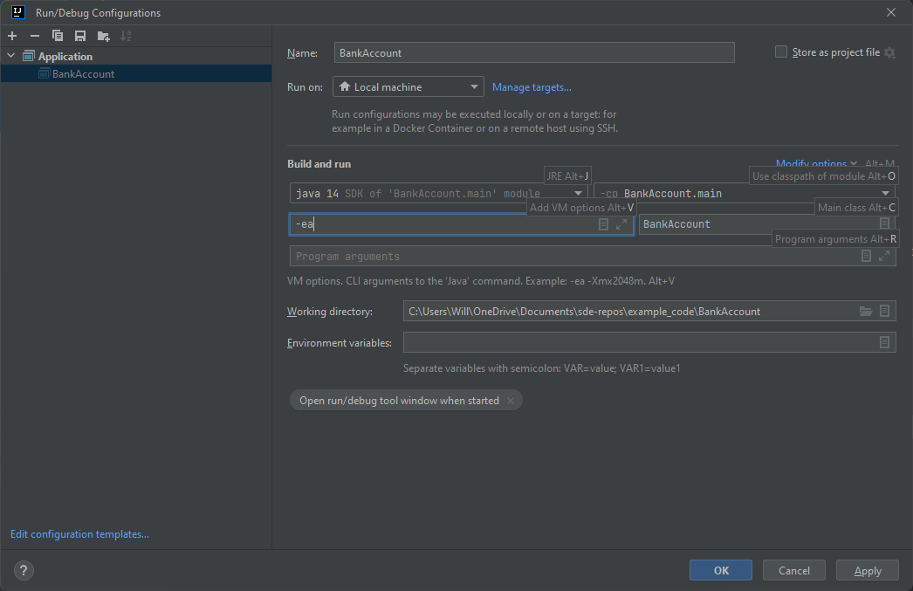

* TOC
{:toc}

# Defensive Programming

I like to introduce the idea of defensive programming by talking about defensive driving.

When you were learning to drive, you were likely told that you should drive *defensively*. But what does that actually mean? Are we saying you should drive ready to protect yourself, with violence if needed, like some Mad Max action sequence? 

As fun as that sounds, no. **Defensive driving** is the idea that, when driving, you should be prepared for people around you to *do incorrect things*. For example, the car you are passing in the right lane may try to switch lanes for no clear reason while you are passing, so you should pay attention to that car as you pass. When the traffic light turns green, you should still look before you go to ensure the intersection is clear or no one is running the red light. As you go around a blind corner, you should be mentally prepared in case someone coming the other direction strays out of their lane and into yours.

Driving defensively is *driving so that if other drivers make a mistake, you won't get caught up in it.* You cannot control how other people drive. You can only drive in a way to maximize your own safety.

## Understanding Defensiveness

Consider writing a command line program that takes in the name of, say, an Excel file, and performs some data manipulation or summarization based on the contents of the file. Consider all the ways the program could fail that are *not* the fault of the developer of that program:

1. The user may not include any command line arguments  
2. The user may link to an invalid file  
3. The user may have errors in their input file, such as missing columns, or bad format.  
4. The user may have the file open in Excel, which can result in the file not being openable within your program  

In general, all of these exceptions are not the fault of the program, but rather how the program is being used.

These exceptions are fundamentally different from programmer errors, like NullPointerExceptions caused by not correctly initiating your data structures. In essence, we are drawing a line between programmer error and user error.

In general:

1. A user should never see a programmer error: the program as released to the user should be stable and function correctly.  
2. A user should be informed when they make a user error. The error message should include a clear description of what the user did incorrectly in their interaction with the software

## Client Class

When developing our own classes, we have to consider **clients**. A client class is any class that uses the code we are writing. This can be another class in the project or this could be someone using our class like a library (such as the spreadsheet libraries in poi). In this case, we want to design our class so that:

1. The client uses our class correctly and as intended
2. If the client uses our class incorrectly, they are made aware of this
3. Our class cannot be used incorrectly by the client to produce an erroneous state.

## Example: `BankAccount`

Consider the following class BankAccount:

```java
public class BankAccount {
    private final int id;
    private double balance;
    
    public BankAccount(int id, double startingBalance) {
        this.id = id;
        this.balance = startingBalance;
    }
    
    public BankAccount(int id) {
        this(id, 0);
    }
}
```

For now, we simply have a constructor. Let's say that we are implementing this `BankAccount` for a new bank. The bank tells you that they want to ensure that no BankAccount can never have a negative balance. You start writing this constructor, and already, you notice a problem.

Using this constructor, a client class could violate this rule:

```java
    BankAccount negativeAccount = new BankAccount(23145, -2000);
```

The above line creates a bank account with a negative balance. Because this is a constructor method, we can't "not return" an object. However, we also can't do something like "just set the balance t0 zero," because whatever client instantiates a BankAccount object this way is clearly confused about this "no negative balance rule." So, instead, we can throw an exception!

### Creating our Exception

```java
public class NegativeBalanceException extends IllegalArgumentException{
    public NegativeBalanceException(String message) {
        super(message);
    }
}
```

I created an exception with its own error message that indicates why the constructor was used wrong when trying to create an account with the negative balance. Because this exception relates to illegal arguments in the constructor, I decided that `NegativeBalanceException` should extend `IllegalArgumentException`.

Now, we update our constructor:

```java
    public BankAccount(int id, double startingBalance) {
        this.id = id;
        if (startingBalance < 0) {
            throw new NegativeBalanceException(getNegativeBalanceMessage());
        }
        this.balance = startingBalance;
    }

    private String getNegativeBalanceMessage() {
        return "Error: attempted to create account #" + id + " with a negative balance.";
    }
```

## withdraw and deposit

Consider the following simple functions for `withdraw` and `deposit` for our `BankAccount` class.

```java
    public void withdraw(double amount) {
        balance -= amount;
    }
    
    public void deposit(double amount) {
        balance += amount;
    }
```

These function perform the basic functionality we intend. But now, consider the `withdraw` function. Could this function
be used to violate our "no negative balances" rule? Yes! We need to ensure no one can withdraw more money than their balance.


### Error codes

One way we could handle this is changing `withdraw` to a boolean function. For example:

```java
    public boolean withdraw(double amount) {
        if (amount > balance) {
            return false;
        }
        balance -= amount;
        return true;
    }
```

This approach falls under the example of "error codes." That is, return a value that indicates the function was used incorrectly. In this case, `true` means the transaction was valid and accepted, and `false` means it is not. There are cases where this approach is used. For example, the Java built-in `Set.add(E e)` function returns `true` if the object was added to the set, and `false` if it is not. However, one downside of error codes is that they can be ignored. The client calls the illegal `withdraw` call and then proceeds assuming the call worked correctly, never checking the return value. To avoid this, we instead can use an exception:

```java
    public void withdraw(double amount) {
        if (amount > balance) {
            throw new InsufficientFundsException(getInsufficientFundsMessage(amount));
        }
        balance -= amount;
    }

    private String getInsufficientFundsMessage(double amount) {
        return "Error: insufficient funds in account #" + id + " - balance: " + balance + 
                " for transaction amount: " + amount;
    }
```

With our `InsufficientFundsException` class:

```java
public class InsufficientFundsException extends RuntimeException {
    public InsufficientFundsException(String message) {
        super(message);
    }
}
```

### Order of statements

Note that we check the pre-condition (`amount` shouldn't be greater than `balance`) *before* we perform the actual transaction. There is a reason for this. Say we do this in the opposite order:

```java
    public void withdraw(double amount) {
        balance -= amount;
        if (amount > balance) {
            throw new InsufficientFundsException(getInsufficientFundsMessage(amount));
        }
    }
```

You might think this makes no difference, because after all, an Exception is being thrown. However, let's consider the programmer of the client class knows just enough about Exceptions to be dangerous, but not enough to actually work with them correctly. They might write code like the following:

```java
    BankAccount account = new BankAccount(8675309, 200);
    account.withdraw(300);
    System.out.println(account.getId() + " - " + account.getBalance())
```

Then, when the developer gets an `InsufficientFundsException` on line 2, they decide to "handle" the exception by adding a `try-catch` block, but they don't actually do anything:

```java
    BankAccount account = new BankAccount(8675309, 200);
    try {
        account.withdraw(300);
    } catch (Exception e) {
        //make the error go away
    }
    System.out.println(account.getId() + " - " + account.getBalance())
```

Now obviously, the above code is silly. But remember, we are practicing **defensive** programming. If, in our `withdraw` method, we change the balance **before** throwing, like we do in the most recent version of `withdraw`, this can result in incorrect behavior:

```shell
8675309 - -100.0
```

Our goal is to make our code **impossible to use incorrectly**. But the above breaks that rule. On the other hand, if we change our implementation of withdraw back to checking the pre-condition and, if necessary, throwing an exception **first**:

```java
    public void withdraw(double amount) {
        if (amount > balance) {
            throw new InsufficientFundsException(getInsufficientFundsMessage(amount));
        }
        balance -= amount;
    }
```

...then running the above silly client code will print:

```shell
8675309 - 200.0
```

That is, the transaction never "goes through." We have ensured correct behavior, even if the client tries to get around our exceptions.


### Another Example

Consider our `transfer` function below:

```java
    public void transfer(BankAccount recipient, double amount) {
        balance -= amount;
        recipient.balance += amount;
    }
```

Now imagine our bad client developer writes:

```java
        BankAccount a = new BankAccount(1234, 400);
        try {
            a.transfer(null, 200);
        } catch (Exception e) {

        }
        System.out.println(a.getId() + " - " + a.getBalance());
```

In this case, our `transfer` function would throw a `NullPointerException` when we try to access `recipient.balance`. However, because of the try-catch handling, we still get erroneous behavior. The above code prints:

```shell
1234 - 200.0
```

...indicating that the first half the transfer (deducting from the BankAccount `a`) still occurred! We could fix this in two ways, either add a `null` check:

```java
    public void transfer(BankAccount recipient, double amount) {
        if (recipient == null) {
            throw new NullPointerException();
        }
        balance -= amount;
        recipient.balance += amount;
    }
```

...or we could simply reverse the order of our operations so a `NullPointerException` would be thrown *before* we adjust any values:

```java
    public void transfer(BankAccount recipient, double amount) {
        recipient.balance += amount;
        balance -= amount;
    }
```

### Rollback and Throw

Sometimes while executing a function, it may not be obvious that a given request will violate our pre- or post- conditions of our functions until after we have completed the transactions. In this case, if an erroneous state is detected, then it's important to **rollback** any changes the method made **before** throwing an exception, for the same reasons as in our `withdraw` case. That is, to make sure our code cannot be used to create an erroneous state.

For instance, imagine in our `transfer` function, we checked the value of the balances of each account at the end and realize that the sending account now has a negative balance! Well, we can't let that stay, so we **rollback** the transaction, restoring both accounts to their starting balances, and then **throw**. However, the **rollback** must always occur before the **throw**.

```java
public void transfer(BankAccount recipient, double amount) {
        recipient.balance += amount;
        balance -= amount;
        
        if (balance < 0) {
            //rollback
            recipient.balance -= amount;
            balance += amount;
            //and throw
            throw new InsufficientFundsException(getInsufficientFundsMessage(amount));
        }
    }
```

It is worth noting in this case, we could have checked the transaction at the start of the function to ensure that `amount` was greater than the sending account's `balance`. However, I checked the post-condition status instead simply for the purposes of illustrating **rollback and throw**. The point is that there may be a situation where checking the post-conditions of a given operation may not be feasible before executing that operation. If you ever find yourself in that situation, remember to always rollback before throwing an exception.


## assert keyword

One tool that can help *during development* (but not when you deploy) is the `assert` keyword. Similar to what *assertTrue* function does in JUnit, the `assert` statement takes the following format:

`assert [boolean_statement]`

If the asserted statement is `false`, then this results in an `AssertionError`, which is not the same as an exception, and cannot be caught with a `try-catch` for `Exception` or any sub-types.

```java
    public void withdraw(double amount) {
        assert amount > 0 && amount <= balance;
        balance -= amount;
    }
```

However, by default in Java, `AssertionError`s are actually disabled. To enable `AssertionError`s to be thrown, you must add `-ea` to the VM Arguments (not command line arguments) in the run-configurations window:



Note that by default, VM arguments are hidden in IntelliJ. You can find them by clicking "modify options" (up and left of the class name you are running, in the above picture `BankAccount.main`). From there, click "add VM Options" They can also be enabled with the hotkey `Alt + V` in the run configurations window.

However, `assert` statements should not be replied upon for deployed software! Instead, if you need an `assert` to enforce correct behavior, especially if the class is a library that will be used by client programs, then replace `assert` statements with `Exceptions`. 