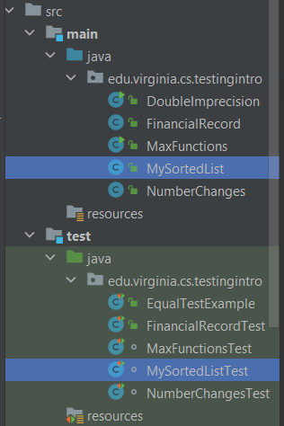
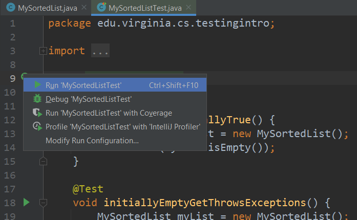
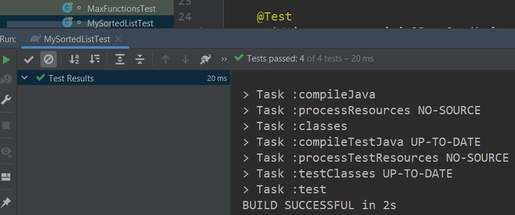
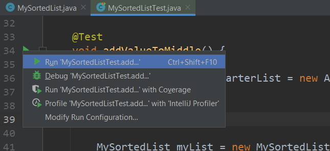
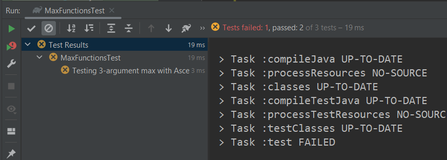
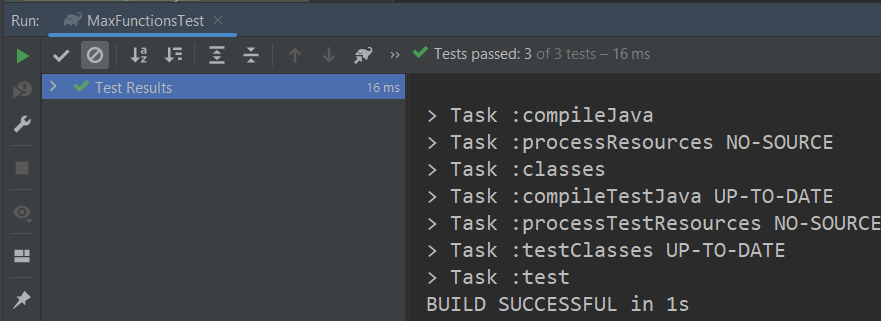

# JUnit 5

JUnit 5 is a testing framework and platform for testing software.
It is primarily designed for unit testing, but can be used
for integration testing and, in some cases, system testing as well. In this module, we will begin using JUnit5 and understanding its syntax and purpose.

---

* TOC
{:toc}

## [Source Code Example](https://github.com/sde-coursepack/TestingIntro)

*Note: this page only covers basic JUnit Jupiter testing. Future
modules, including some modules not released in the initial
semester of the course, will show more advanced usage of Junit5

---


## JUnit 5 and Gradle

JUnit 5 is incorporated into our project through Gradle. In the
[build.gradle file](https://github.com/sde-coursepack/TestingIntro/blob/main/build.gradle)
of this module's sample project:

```groovy
dependencies {
    testImplementation 'org.junit.jupiter:junit-jupiter-api:5.8.1'
    testRuntimeOnly 'org.junit.jupiter:junit-jupiter-engine:5.8.1'
}

test {
    useJUnitPlatform()
}
```

The dependencies include the testing framework for JUnit 5 as well
as the run-time engine that executes all our tests. The `test` label
is used to define how we are testing our code. Specifically, it tells
gradle that when we test our code, we want to use the JUnit Platform.

---


## Why not main method testing?

In the last module, we tested our code by adding test code to
the `main` method. This is a great way to get started thinking
about testing, but it is actually an awful way to do large scale
testing over a long-development cycle. This is for the following
reasons:

1. When testing in `main` we have to check whether a test passes
or fails by **manually reading test output.** This means our testing
suite is not automated, and relies on humans accurately reading potentially
dozens or hundreds of print statements to determine if code is working
as specified.
2. The `main` method of a class may have responsibilities, like
actually executing the software. We want to isolate *testing our
software* from *executing our software*, as end-users only want
to see the software working, not seeing a giant set of print statements
that have nothing to do with them.
3. If we want to run multiple sets of tests, we have to run
multiple Java classes one at a time, interpreting the results each
time.

For these reasons, we want a dedicated testing framework, which
is only executed when we are testing our software.

---


## Test class

In JUnit we typically organize our unit-test classes into classes that
are **parallel** with the class that is being tested.

For example, consider the class [MaxFunctions](https://github.com/sde-coursepack/TestingIntro/blob/main/src/main/java/edu/virginia/cs/testingintro/MaxFunctions.java)
in the package `edu.virginia.cs.testingintro`. This package and class
are in the project folder

`src/main/java`

Therefore, when testing this class, we will often make a class like 
[MainFunctionsTest](https://github.com/sde-coursepack/TestingIntro/blob/main/src/test/java/edu/virginia/cs/testingintro/MaxFunctionsTest.java)
which is also in the package `edu.virginia.cs.testingintro`. However,
this file will be in the project folder

`src/test/java`

When we are **testing**, gradle will fold our `main` and `test` folders
together, so that the `test` classes can access the classes in `main`.
However, when **executing** the software, gradle will only use the `main`
folder and not use anything in `test`. (A note that there are ways to 
include testing classes in execution, but you should almost never actually do so,
so we will not cover them).

This is useful, because it keeps our **testing** isolated from our
**execution**, allowing us to test as much as we feel we need
without having to worry about affecting the actual execution results.

---


## Test methods 

A test class is typically made up of several test methods. Each
of these methods is designed to execute some code and verify its
output. A test **fails** if it crashes or throws an `AssertionError`.
A test **passes** if the code executes completely without throwing
an **AssertionError**.

Consider the following test method from [MaxFunctionsTest](https://github.com/sde-coursepack/TestingIntro/blob/main/src/test/java/edu/virginia/cs/testingintro/MaxFunctionsTest.java):
```java
package edu.virginia.cs.testingintro;

import org.junit.jupiter.api.*;

import static org.junit.jupiter.api.Assertions.*;

class MaxFunctionsTest {
    @Test
    @DisplayName("Testing 3-argument max with Descending order arguments: 3, 2, 1")
    public void testMaxDescendingArguments() {
        // input
        int a = 3, b = 2, c = 1;
        //expected output
        int expected = 3;
        //actual output
        int actual = MaxFunctions.max(a, b, c);
        //assertion
        assertEquals(expected, actual);
    }
}
```

For now, we will only look at the first test method to get an
idea of the syntax and structure of JUnit tests. We will, of course,
look at more tests, including more complicated tests, as we go
further into the unit.

### @Test

The @Test tag is used to identify a *test-method*. In our test
classes, we may want to have other methods that we can use,
in the same way that we want to decompose our programs into methods.

All test methods will include a @Test tag. The @Test tag tells the
JUnit testing framework "Hey, this method is a test, and you should execute it!"

@Test methods must meet the following conditions:

1. The method must be `public` and **not** `static`
2. The method must return `void` (that is, no returned output)
3. The method must take in **no arguments.**

There are some more advanced testing setups we can use where
you can have arguments or a return type, but most of our tests
will be written as they are here.

---

## Assertions

In a test method, we verify that our solution is working
*as intended* through one or more **assertions**. When we
make an assert statement, we are saying "this should be the
state of our system/value of our variables/etc." If an assertion
is incorrect, we throw an **AssertionError**, which causes
the test to fail.

#### assertEquals

Consider our test above:

```java
    @Test
    @DisplayName("Testing 3-argument max with 3, 2, 1")
    public void testMaxDescendingArguments() {
        // input
        int a = 3, b = 2, c = 1;
        //expected output
        int expected = 3;
        //actual output
        int actual = MaxFunctions.max(a, b, c);
        //assertion
        assertEquals(expected, actual);
    }
```

What we are saying with this test is "we want to test the max
function with inputs (3, 2, 1). The function should return 3." A
test method is used to implement a testing *scenario*. Let's consider
each part of our testing scenario:

* __input__: where we specify our function inputs at 3, 2, and 1, stored in the variables `a`, `b`, and `c`
* __expected output__: what we expect the output of the function call should be (in this case, 3) stored in the variable `expected`
* __actual output__: what the function call with the input **actually returns**, stored in the variable `actual`

From there, we say a testing scenario **passes** if the *expected output* and that *actual output* match.
In this case, the test **passes** if the value of `expected` and `actual` match. To
check this, JUnit has several built-in assertion functions. The simplest,
and the one we use in this case, is `assertEquals`. This function takes
in two values. Those values are, in-order:

1. The expected output
2. The actual output

In this case, we are saying "this function should output `expected` (3),
and it does output `actual` (in this case, also 3)." Because the two values
are in-fact equal, the test passes. Because this is the only assert
statement, the function therefore finishes with no `AssertionError`,
and the test is considered **passed**.

__`assertEquals` failure__

Consider the "buggy" 3-argument max function from our Testing unit:

```java
    public static int max(int a, int b, int c) {
        if (a > b) {
            if (a > c) { 
                return a; 
            }
            else { 
                return c; 
            }
        } else {
            if (b > c) { 
                return b; 
            }
            else { 
                return a;  // should be return c
            }
        }
    }
```

There is a known bug in this code. Our previous test, however,
didn't manifest the bug because it's input never executed the defect.
Remember, the defect is that the last return statement should be `return c;`

One test case that *does* cause the bug to manifest is the input `(1, 2, 3)`.
This will cause the buggy statement to execute and return an incorrect
value (that is, it will return 1 instead of 3). And so, we can
write this test with a very similar structure as our first test:

```java
    @Test
    @DisplayName("Testing 3-argument max with Ascending order arguments: 1, 2, 3")
    public void testMaxAscendingArguments() {
        // input
        int a = 1, b = 2, c = 3;
        //expected output
        int expected = 3;
        //actual output
        int actual = MaxFunctions.max(a, b, c);
        //assertion
        assertEquals(expected, actual);
    }
```

In this case, because of the bug in our code, `actual` will be
equal to `1` instead of `3`. This is because that when we assert that
`expected` equals `actual`, we get an `AssertionError`. This
indicates to us, the developer, that the test **failed**. The error
message will look something like:

```java
expected: <3> but was: <1>
Expected :3
Actual   :1
<Click to see difference>

org.opentest4j.AssertionFailedError: expected: <3> but was: <1>
	at app//org.junit.jupiter.api.AssertionUtils.fail(AssertionUtils.java:55)
	at app//org.junit.jupiter.api.AssertionUtils.failNotEqual(AssertionUtils.java:62)
	at app//org.junit.jupiter.api.AssertEquals.assertEquals(AssertEquals.java:150)
	at app//org.junit.jupiter.api.AssertEquals.assertEquals(AssertEquals.java:145)
	at app//org.junit.jupiter.api.Assertions.assertEquals(Assertions.java:527)
	at app//edu.virginia.cs.testingintro.MaxFunctionsTest.testMaxAscendingArguments(MaxFunctionsTest.java:31)
```
Note that the error message's stack trace was cut-off at the line that caused the
AssertionError, but the stack trace is *much* longer. I just wanted
to show that the specific line that created the `AssertionError` is
in the stack trace.

Be aware that whenever an assertion statement is violated, the test
**stops executing at that point**. As such, if you have multiple
assertion messages within a single test that could fail, you will 
only see the AssertionError from the **first** failure.

__`assertEquals` argument order__

When using assertEquals, we always want to put **the expected value
first** and the **actual value second**. Syntactically, Java won't be able to tell the difference and
will accept either. However, semantically, JUnit assumes the first argument
is the expected value. For example, if you said `assertEquals(3, 1)`,
the following error message would print:

```shell
expected: <3> but was: <1>
Expected :3
Actual   :1
```

This error message is written where JUnit **assumes the first argument
is the expected value**. Therefore, if you get the expected and
actual in the wrong order, this error message would be *misleading*,
and thus make it harder for you or anyone else to interpret the test
output and decide what to do to fix the defect.

Note that this test is written out "long-form" in this way in order
to make the test easier for someone new to JUnit to understand. This test
can be written in much shorter form as:

```java
    @Test
    @DisplayName("Testing 3-argument max with Ascending order arguments: 1, 2, 3")
    public void testMaxAscendingArguments() {
        assertEquals(3, MaxFunctions.max(3, 2, 1))
    }
```


#### assertEquals with Objects

`assertEquals` works with all primitive data types as you would
expect. However, when the arguments are of type `Object`, assertEquals
uses the `.equals` method of the class of `expected` to compare to
`actual`. For example:

```java
    @Test
    public void stringTest() {
        String a="Will ";
        a += "McBurney";
        String b="Will McBurney";
        assertEquals(a,b);
    }
```

In this case, because `a` and `b` are of type `String`, this test would
pass, since the `String.equals` method compares the *content* of the
Strings.

However, now consider arrays.

```java
    @Test
    public void arrayTestFail() {
        String[] a = {"Will", "McBurney"};
        String[] b = new String[2];
        b[0] = "Will";
        b[1] = "McBurney";
        assertEquals(a, b);
    }
```

In Java, the .equals method for arrays returns true **if and only-if
the two arrays are stored at the same memory address.** That is, two
arrays are equal only when they are **literally the same array.** In
the above, `a` and `b` have the same *contents*, but they are still
**not equal** because they are not literally the same array at the same
memory address.

**As such, the above test fails**:

```shell
expected: [Ljava.lang.String;@29d80d2b<[Will, McBurney]> but was: [Ljava.lang.String;@58e1d9d<[Will, McBurney]>
org.opentest4j.AssertionFailedError: expected: [Ljava.lang.String;@29d80d2b<[Will, McBurney]> but was: [Ljava.lang.String;@58e1d9d<[Will, McBurney]>
    at app//org.junit.jupiter.api.AssertionUtils.fail(AssertionUtils.java:55)
    at app//org.junit.jupiter.api.AssertionUtils.failNotEqual(AssertionUtils.java:62)
    at app//org.junit.jupiter.api.AssertEquals.assertEquals(AssertEquals.java:182)
    at app//org.junit.jupiter.api.AssertEquals.assertEquals(AssertEquals.java:177)
    at app//org.junit.jupiter.api.Assertions.assertEquals(Assertions.java:1141)
    at app//edu.virginia.cs.testingintro.EqualTestExample.arrayTest(EqualTestExample.java:22)
```

However, in the case of arrays, there is a method `assertArrayEquals`
that compares the **contents** of arrays. For example, the following
test **passes**:

```java
    @Test
    public void arrayTestPass() {
        String[] a = {"Will", "McBurney"};
        String[] b = new String[2];
        b[0] = "Will";
        b[1] = "McBurney";
        assertArrayEquals(a, b);
    }
```

When in doubt when comparing two objects, always check the
class for the .equals method to ensure it behaves the way
you intend. If it does not, you can write your own
test function to say whether the objects are `equal` as
defined by your testing needs that returns a `boolean`, and then
use `assertTrue`, or `assertEquals(true, myFunction(expected, actual))`

#### assertEquals with doubles and Doubles

In Java, as well as nearly every other popular programming language,
there is an *imprecision* you have to consider with floating point numbers.

Consider the following test:

```java
    @Test
    public void doubleTestFail() {
        double a = 2.0;
        double rootA = Math.sqrt(a);
        double b = rootA * rootA;
        assertEquals(a, b);
    }
```

Logically, this test should pass. It appears that `b` is set
equal to the square-root of `a` times the square-root of `a`. Well,
the square-root of `a` squared should, by mathematical definition, be
`a`. Since `b` is the square root of `a` squared, `b` and `a` should
be equal.

However, they fail with the following message:

```java
expected: <2.0> but was: <2.0000000000000004>
Expected :2.0
Actual   :2.0000000000000004
```

This error is caused by **floating-point imprecision**. Like the `int`,
`double` also has limited storage. And many numbers **cannot be
perfectly represented in binary** with any finite space. This is
true of irrational numbers like the square-root of` 2`. However, this
is also true of many rational numbers, like `0.1`. Surprisingly, 0.1
cannot be represented perfectly in binary. You need an *infinite* binary
decimal for `0.1`:

`0.00011001100110011001100`...and so on.

Because of this, we can get weird results with seemingly simple operations
with doubles. Consider the following:

```java
    double x = 0.0;
    int n = 10;
    while (n > 0) {
        n--;
        x += 0.1;
    }
    System.out.println("x = " + x);
```

What prints? There's no trick here, this simply adds `0.1` 10 times.
By all logic and math, this should equal `1.0`. But it doesn't print
`x = 1.0`. Instead, it prints:

`x = 0.9999999999999999`

Before we go further, be aware that this **isn't a Java problem!** This
is a computing problem! C, Python, C++, etc. all behave this way!
This is, in fact, an intentional decision. [IEEE 754](https://en.wikipedia.org/wiki/IEEE_754)
defined a floating point standard that was intended to be used
by most hardware to improve **portability**. Because perfect precision 
in floating point mathematics was impossible,
developers wanted to avoid a problem where their code featuring floating
point numbers would return **different results** on **different hardware**.
Since it's not feasible to solve all floating-point imprecisions, IEEE 754
established a standard for floating point arithmetic where **everyone
would get the same imprecision** when using the same floating point data types.

As a result, we **always** must be careful when testing with floating-point
numbers (specifically, `double`, `float`, and `Double`) in Java to **allow
for a tolerance factor.** That is, "if the numbers are **close enough**, we call them equal".

Thus, when comparing `double` variables, we want to use:

`assertEquals(double expected, double actual, double tolerance)`

For example, in this modification of the above test:

```java
    @Test
    public void doubleTestPass() {
        double a = 2.0;
        double rootA = Math.sqrt(a);
        double b = rootA * rootA;
        assertEquals(a, b, 1e-9);
    }
```

This test **passes** because we set the tolerance to `1e-9`, or
*one billionth*. Because these numbers are within `0.000000001` of each
other, we are considering them "close enough" to pass our equality test.

__What value should we use for tolerance__

There is no universally correct number to use for tolerance, as it's going
to depend on the size of the numbers you are testing with. For example, let's
imagine instead of comparing `2` and `2.0000000000000004`, we're
instead simulating the motions of the planets.

<iframe width="560" height="315" src="https://www.youtube.com/embed/dW020tl16rk" title="YouTube video player" frameborder="0" allow="accelerometer; autoplay; clipboard-write; encrypted-media; gyroscope; picture-in-picture" allowfullscreen></iframe>

This is an assignment I have given in Java in the past at the
University of Pennsylvania in the intro-programming course.

If we are simulating the planets in units of **kilometers**, would we
expect our results to be correct within **1 micrometer** (that is, one
billionth of a kilometer)? Consider that typical human hair
is 75 micrometers. Would we expect our simulation of our entire solar
system to be accurate down to the level of fractions of a human hair?
No, that would be silly. After all, at the scale of our solar system, distances are
measured in hundreds millions of kilometers. As such, our error tolerance
will be much higher, possible on the scale of 10s or 100s of kilometers, even.

Therefore, when deciding your tolerance, you should select a number
that is appropriate for the scope you expect the function to be
used in.

#### assertTrue and assertFalse

These methods work as you expect. Effectively, 

`assertTrue(actual)`

...is the exact same thing as saying:

`assertEquals(true, actual)`

Same with assertFalse. You can use these when checking boolean
values to have shorter tests.

Consider the test class [MySortedListTest](https://github.com/sde-coursepack/TestingIntro/blob/main/src/test/java/edu/virginia/cs/testingintro/MySortedListTest.java) 
and the method `isEmptyTestInitiallyTrue`. This method checks
that if you do not specify a starting list in the constructor
for MySortedList, that the List is initially empty:

```java
    @Test
    void isEmptyTestInitiallyTrue() {
        MySortedList myList = new MySortedList();
        assertTrue(myList.isEmpty());
    }
```

That is, the above test will **fail** if `myList.isEmpty()` is `false`.

__Downside of `assertTrue`/`assertFalse`__

One downside of assertTrue and assertFalse is that the
default error message isn't particularly useful:

```
expected: <true> but was: <false>
Expected :true
Actual   :false
```

Like assertEquals, you can add a more specific error message to
add context. If you have several `assertTrue` and `assertFalse` in
a given test method, it may not be immediately clear *which* assert
statement failed, and you'd have to dig into the stack trace to
look for a line number, something like:

```java
org.opentest4j.AssertionFailedError: expected: <true> but was: <false>
    at app//org.junit.jupiter.api.AssertionUtils.fail(AssertionUtils.java:55)
    at app//org.junit.jupiter.api.AssertTrue.assertTrue(AssertTrue.java:40)
    at app//org.junit.jupiter.api.AssertTrue.assertTrue(AssertTrue.java:35)
    at app//org.junit.jupiter.api.Assertions.assertTrue(Assertions.java:179)
    at app//edu.virginia.cs.testingintro.MaxFunctionsTest.testMaxDescendingArguments(MaxFunctionsTest.java:19)
    at java.base@17.0.3/jdk.internal.reflect.NativeMethodAccessorImpl.invoke0(Native Method)
    at java.base@17.0.3/jdk.internal.reflect.NativeMethodAccessorImpl.invoke(NativeMethodAccessorImpl.java:77)
    at java.base@17.0.3/jdk.internal.reflect.DelegatingMethodAccessorImpl.invoke(DelegatingMethodAccessorImpl.java:43)
    at java.base@17.0.3/java.lang.reflect.Method.invoke(Method.java:568)
    at app//org.junit.platform.commons.util.ReflectionUtils.invokeMethod(ReflectionUtils.java:725)
   
```

As such, you'll want to include your own Test Fail messages. See
the section [Test Fail Messages](https://sde-coursepack.github.io/modules/testing/JUnit5/#test-failures-in-junit-5) below.

### AssertNull and AssertNotNull

Very similar to `assertTrue` and `assertFalse`.

`assertNull(x)` throws an `AssertionError` if x is **not null**.
`assertNotNull(x)` throws an `AssertionError` if x **is null**.

Like `assertTrue` and `assertFalse`, it is highly recommended
to include a failure message. See [Test Fail Messages](https://sde-coursepack.github.io/modules/testing/JUnit5/#test-failures-in-junit-5) below.

### AssertThrows

`assertThrows` is used when we expect the code we are using to
throw an exception. This may seem strange, but when we get to
defensive programming, we will talk about why we would want
to intentionally throw Exceptions when our classes are used in
ways they aren't intended.

Below is an example:

```java
    @Test
    void initiallyEmptyGetThrowsExceptions() {
        MySortedList myList = new MySortedList();
        assertThrows(IndexOutOfBoundsException.class,
                () -> myList.get(0));
    }
```

This test is saying that when calling `get(0)`, an empty instance of `MySortedList`,
the program **should throw** an `IndexOutOfBoundsException`. We will
use this in our future unit on [Defensive Programming](https://sde-coursepack.github.io/modules/refactoring/Defensive-Programming/). It's also worth putting
a dog-ear in this syntax:

`() -> myList.get(0)`

This is what's called a **Lambda body**. We will deep dive into this syntax more
later on.

---


## Testing Documentation

We can use various tools within Java to help document our tests so
that test output is more readable, and therefore actionable.

### @DisplayName

We must give each test a unique method name. However, method names
are limited by Java Syntax, meaning they must be one token with
no special characters, spacing, or punctuation. Thus, to make
interpreting our test output more easily, we can add a `String` as a
`DisplayName`, which will be used to identify the test **if it fails**.

A good display name is one that helps you quickly identify:

* What function or module was being tested
* What type of input, or specific input, was being tested
* What a test failure would indicate.

Consider our @DisplayName above:

`@DisplayName("Testing 3-argument max with Descending order arguments: 3, 2, 1")`

If I see this String tied to a test failure, it can help me quickly
identify the test that failed. The more quickly I identify
the failing test, the more quickly I can jump into debugging.


### Test Fail Messages

All `assert` functions have an optional message argument after their
required arguments. For example:

`assertEquals(int expected, int actual, String message)`  
`assertEquals(double expected, double actual, double tolerance, String message)`

This allows you to add your own custom "fail message." This message
will print if and only if the assertion statement fails.

This is especially useful when you have a test with multiple
assertions, as it can help you determine which specific assert
failed in the test. You can also include variable information in
the output String. For example:

```java
    @Test
    void addValueToMiddle() {
        //create starter List
        ArrayList<Integer> starterList = new ArrayList<>();
        starterList.add(1);
        starterList.add(3);
        starterList.add(5);

        MySortedList myList = new MySortedList(starterList);
        myList.add(4); //should be added between 3 and 5

        assertEquals(4, myList.size());
        assertEquals(4, myList.get(2));
        assertEquals(3, myList.get(1));
        assertEquals(5, myList.get(3));
    }
```

Don't worry too much about the full meaning of the test. The idea
is that MySortedList should maintain a list of ints in *sorted order*.
As such, after `myList.add(4)` is called, the size of the
list should increase to `4`, and the newly added value `4` should be inserted at
index `2`, between the values `3` and `5`.

Here, imagine we had a test failure with the following message:

```
expected: <4> but was: <3>
Expected :4
Actual   :3
```

Which test failed? Was it size? Was it the value at index 2? We don't
know. But now, imagine we added our own fail messages:

```java
    @Test
    void addValueToMiddle() {
        //create starter List
        ArrayList<Integer> starterList = new ArrayList<>();
        starterList.add(1);
        starterList.add(3);
        starterList.add(5);

        MySortedList myList = new MySortedList(starterList);
        myList.add(4); //should be added between 3 and 5

        assertEquals(4, myList.size(), "Incorrect size of list");
        assertEquals(4, myList.get(2), "4 not added at the correct index");
        assertEquals(3, myList.get(1), "3 not immediately before 4");
        assertEquals(5, myList.get(3), "5 not immediately after 4");
    }
```

Now, our failure error message might read:

```java
Incorrect size of list ==> expected: <4> but was: <3>
Expected :4
Actual   :3
```

**Now** we can act on this! We know that the issue is that
the size of our resulting list is wrong. This is valuable
debugging information, and we can start narrowing down what
caused this bug!

---


## A note on tests

Because, for many, this is the first time you have seen unit
testing, I wrote out tests in a deliberate "long-form" to be more
readable. For example:

```java
    @Test
    @DisplayName("Testing 3-argument max with Ascending order arguments: 1, 2, 3")
    public void testMaxAscendingArguments() {
        // input
        int a = 1, b = 2, c = 3;
        //expected output
        int expected = 3;
        //actual output
        int actual = MaxFunctions.max(a, b, c);
        //assertion
        assertEquals(expected, actual);
    }
```

I can shorten this test considerably:

```java
    @Test
    @DisplayName("Testing 3-argument max with Ascending order arguments: 1, 2, 3")
    public void testMaxAscendingArguments() {
        assertEquals(3, MaxFunctions.max(3, 2, 1));
    }
```

This is a completely acceptable way to write tests! You do not
need to write out tests in the long-form from the first version.
In fact, **you want to write tests in such a way that you are unlikely
to copy and paste!** Copying and pasting code is generally bad, as
it leads to bugs and hurts modularity! Later on, we will
show a way to test multiple inputs in the same test.

---

## Benefits of Testing

### Improved code construction efficiency

Often times, I will hear students say:

> "I'm basically done with the assignment, I just have to test it."

Let me be clear: few sentences should instill raw panic more
than that sentence. This sentence tells me this student is about
to have a very long evening fighting NullPointerExceptions, weird
output, and mathematical errors they can't explain.

But why is this idea so common?

I think the root of the problem is how people learn to code in most
introductory programming classes. That is:

1) You are given an assignment that tells you what your code should do  
2) You are given a submission system with an auto grader that checks if your code produces the correct output  
3) You are given near immediate feedback as to the correctness of your code  

Because of this, many people develop a circular work habit:

* Write code that you think works
* Submit to the submission system
* If something goes wrong, try to change something
* Resubmit and see if it works
  * If something goes wrong, try to change something
* Resubmit and see if it works
  * If something goes wrong, try to change something
* Resubmit and see if it works
* ...
* Eventually you pass

Now, this system is necessary to often handle the size of our
intro courses (in Fall 2022, there are **over 900** students taking
intro programming in the Department of Computer Science at 
the University of Virginia).

However, it also trains bad habits, and leads to this complaint
from students when I ask them to test their code with me in office
hours:

> "I don't have time to do all this testing!"

However, this statement is categorically incorrect. I would go 
further than that and say this statement is [**not even wrong!**](https://en.wikipedia.org/wiki/Not_even_wrong).
That's because, baked into this statement is the following assumption:

> "Thorough unit testing will cost me more time than it saves"

And this statement is **absolutely false!** If you are testing
your code effectively as you write it, you **will finish faster!**

It's not that you **don't have time to test**. The problem is
**you don't have time NOT to test**. Waiting to test until you "finish coding"
will always make you take longer to debug your code and fix it!

...eventually.

It is true that *when you first start testing*, it will likely slow you down.
However, that's because you aren't good at testing **yet**. Think
back to my [learning how to ride a bike](https://sde-coursepack.github.io/modules/intro/Improving/) under
the heading "Learning is Hard".

> I had everything in my favor pushing me towards riding a bike, 
> and yet I never learned. Why? Because I **built bad habits**.

Consider the earlier workflow. I see many students use the autograder in
a very bad way: they write their code and then decide what to change seemingly
at random before submitting to the autograder over and over and over and over. I have seen
students spend hours of work this way rather than take 10 minutes, write the test they are
failing, and work through it on their own.

This is like me refusing to give up my training wheels, convinced that if I continue to
lean on them more and more, eventually I'll get better at riding a bike without them.
And that thinking is obviously backwards. In that article, I compared this failure in thinking directly to Unit Testing

> Unit testing does slow [students] down **at first**! But that isn’t because 
> unit testing slows everyone down. It’s because students are, like me, 
> trying to ride for the first time without training wheels: 
> they keep falling over. They don’t write effective tests. 
> Or they take too long to think about the test, and how to 
> design it. Or they write their code in a way that makes 
> it difficult to test. **But the only way to get better, 
> faster, and more efficient, is PRACTICE.**

As you develop your testing muscles and your testing instinct, you
will come to find that as you test your code **while it is being built**,
you will dramatically reduce your "after it's written" debugging time! This is because
when you are unit-testing, you , by definition, testing a small
slice of code. It's typically relatively easy to find a bug if you
can narrow that bug down to 10 or so lines of code.

When you are **system testing**, aka "I'll just test my code 
when I'm done writing it", every bug you encounter could be the result
of *anything* in the entire code base! **You've actively made your
debugging harder, slower, and more frustrating!** Instead, test code
as you write code. 

Above all: *Never **trust** code you wrote; instead; **test** code you wrote*. Put another way, don't trust, verify!

### More modular code

Eventually, when we get to design, we will talk about the need
for modular code. The simplest way this can be expressed is that
each of our functions should be **short** and should **only do one
thing**. When we are unit testing, we can think of each "operation"
that we want to test as a function, and it naturally pushes us
to breaking up big, complicated functions, into small, modular functions
which are much smaller and easier to test. This is because if we find
a bug, it's much easier to debug a shorter function than a bigger one.

Thus, by making sure we keep our code **easy to test**, we also keep
it well-designed!

### Tests are a form of documentation

Consider the class [`MySortedList`](https://github.com/sde-coursepack/TestingIntro/blob/main/src/main/java/edu/virginia/cs/testingintro/MySortedList.java). How do you use it if you
want a sorted list of numbers?

Well, if you look at [`MySortedList`](https://github.com/sde-coursepack/TestingIntro/blob/main/src/test/java/edu/virginia/cs/testingintro/MySortedListTest.java),
you can see a number of usage examples.

For example, want to make an initially empty `MySortedList`? The
test below tells you how!

```java
    @Test
    void isEmptyTestInitiallyTrue() {
        MySortedList myList = new MySortedList();
        assertTrue(myList.isEmpty());
    }
```

What to add values to a MySortedList?

```java
    @Test
    void addValueToMiddle() {
        //create starter List
        ArrayList<Integer> starterList = new ArrayList<>();
        starterList.add(1);
        starterList.add(3);
        starterList.add(5);

        MySortedList myList = new MySortedList(starterList);
        myList.add(4); //should be added between 3 and 5

        assertEquals(4, myList.size(), "Incorrect size of list");
        assertEquals(4, myList.get(2), "4 not added at the correct index");
        assertEquals(3, myList.get(1), "3 not immediately before 4");
        assertEquals(5, myList.get(3), "5 not immediately after 4");
    }
```

From the test above, we know we can create our instance, and then
just use the `add` function to add values.

Thus, the tests have the added benefit of telling people **how to use**
the classes we create!

---


## So yes, you really have to test

And yes, at first it will be frustratingly slow. And you'll have
to look-up syntax. And you will struggle with JUnit. But just like
me on the bike, **you will get better, and it will let you go farther
and faster with testing than you every could have gone without it**.

## Running Tests in IntelliJ

In an IntelliJ Gradle project, we want to make sure our **Test classes**
are *parallel* to the classes being tested. For example, consider [`MySortedList`](https://github.com/sde-coursepack/TestingIntro/blob/main/src/main/java/edu/virginia/cs/testingintro/MySortedList.java)
and [`MySortedListTest`](https://github.com/sde-coursepack/TestingIntro/blob/main/src/test/java/edu/virginia/cs/testingintro/MySortedListTest.java)
are both in the package `edu.virginia.cs.testingintro`. However, `MySortedList` is
in the `main` folder, while `MySortedListTest` is in the `test` folder.



Now, let's say we wanted to run *all of the tests* in `MySortedListTest`

We can simply click the green play arrow next to the class name and
select **Run 'MySortedListTest'**.



If we run all the tests, you will see that they pass at the
bottom of IntelliJ:



Additionally, if you want to run only 1 test, you can click the
arrow next to the test function name. For example, if we only
want to run the test `addValueToMiddle()` :



This is especially useful when one test is failing and you want
to run the debugger on it. You can put a break-point
at the start of the test and run through the test to see the values
change with each step in order to identify where the failure is
occurring.

### Test failures in JUnit 5

Now let's look at [`MaxFunctions`](https://github.com/sde-coursepack/TestingIntro/blob/main/src/main/java/edu/virginia/cs/testingintro/MaxFunctions.java)
and [`MaxFunctionsTest`](https://github.com/sde-coursepack/TestingIntro/blob/main/src/test/java/edu/virginia/cs/testingintro/MaxFunctionsTest.java).
As noted in earlier examples, are 3-argument max-function **has a bug**. However, the
bug doesn't make all of our tests fail. In fact, of our three tests:

1. `MaxFunctions.max(3, 2, 1)` should be 3
2. `MaxFunctions.max(1, 2, 3)` should be 3
3. `MaxFunctions.max(3, 3, 3)` should be 3

Only the second test fails. We can see this when we run
all tests in `MaxFunctionsTest`



Here, the box on the left will list all failed tests. If you 
click on "Test 3-argument max with Ascending..." in the test list
on the left, you will see the detailed output of why the test failed:

```shell
expected: <3> but was: <1>
Expected :3
Actual   :1
```
...and in the strack trace below that you will see:

```shell
at app//edu.virginia.cs.testingintro.MaxFunctionsTest.testMaxAscendingArguments(MaxFunctionsTest.java:31)
```

which tells us our test failed at line 31 (the line of our faulty assert statement).

If we fix the bug that caused this failure, however, by changing the
incorrect `return a` to `return c` in `MaxFunctions`, and then
re-run our tests, then we will see that all 3 tests pass:



Finally, if you want to run *all tests in the project*, you can
either:

* run `./gradlew test` from the terminal
* Right click on the `test` folder in the project explorer and 
click "Run Tests in \[project name\]"

Be aware that in today's code example, there are several
tests that fail intentionally, as they are intended to show
things to be aware of when testing with Java.

---


## Why we need automated testing

Automated testing provides a number of benefits, especially in projects as scale.

### Onboarding

Onboarding is the process of adding new developers to an existing software project. Put yourself
in the shoes of a new developer. You may be unsure of yourself, and more worried about breaking everything
than you are about actually implementing new features. How are you going to avoid breaking the project?

With Testing! The existing battery of tests will act as a safety net so you can feel free to get aggressive
trying to make changes and learning the code base! In the worst case you break something, you will be notified
with a test failure. If you get to a point where you can't reconcile your new code with the existing battery
of test, you can simply rollback to an earlier commit and start-over!

### Refactoring

Refactoring is changing code to improve the internal maintainability without changing the external
behavior of the code. In our next unit, we will begin talking about the idea of Clean Code. A key to understand is that
nobody writes clean code on the first try! Just like writing prose, you start with a rough draft first
that gets the basic message across, and then edit later. But how can you make sure your refactoring doesn't
break the existing code base?

With Testing! Because you have an existing battery of tests, you can feel safe to refactor aggressively. If you
make an error while refactoring, you'll know immediately due to a failed test, and you can rollback or fix the bugs
you introduced with the refactor!

### Evolution

As software grows and evolves, we will constantly need to meet new demands. New bug fixes; new portability
concerns; new infrastructure (for example, just a week before I wrote this in early September 2022, Heroku announced they are getting
rid of the free tier for their website hosting, which we used in CS 3240). How can we be sure that as we evolve
our software, we are still providing existing functionality?

With Testing!

When we receive a Bug report, how can we ensure we have fixed the bug without breaking other working features?

With Testing!

Testing is the backbone of iterative development of software. It is the foundation that allows us to build
further, to change existing software without fear, and to remain confident in our tests!

It takes practice to get comfortable testing, but it is a skill absolutely beneficial to develop!