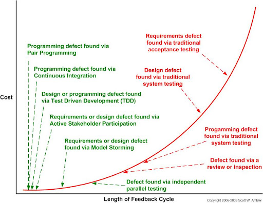

# V&V

How are you going to tell your software is ready to release?

By this point, you have started on the first homework in the class
and have hopefully made significant progress. But the question is:
when are you done? And, importantly, how will you **know** when that
time comes? How are you going to be sure that when you submit the homework,
it is sufficient?

This lies at the heart of Verification and Validation.

---

## Verification

Verification is asking the question: "Does our code meet our specification?"

With verification, we are concerned with whether our code does what
we intended it to do. Are the tests passing? Did we implement
all the features we specified?

---

## Validation

Validation is asking the question: "Is the customer satisfied with our product?"

Can the customer use the software as written? Are they able to understand
the interface, does the software meet their real-world need. We build software
to solve problems -- does the software we wrote actually solve the customers problems?

---

## Differences

These may sound similar, but there is an important distinction. Just like
software quality, we have an *internal* and *external* distinction here.

When we are discussing *verification*, we are largely focused on an **internal**
perspective. That is, we as developers implemented the software that meets
the specification. 

In an idealized, if not unrealistic setting, this make take the form of the
developers being satisfied with their product. They said "The software should do X", and the software does
indeed do X. The developers tested, and have no known bugs. All of the
features the developer intended are present. This would be the gold standard
for verification.

On the other hand, *validation* is primarily external. That is: is this what
the customer wanted, and does it solve their problem?

It's important to remember as we dive into code to not get too tunnel-visioned
on the code. Ultimately, software exists to simplify a process, creating its
efficiency, accuracy, and cost. We cannot lose sight of the real world, and
the customers we are building the software for.

For example, let's say you built the *perfect* Chess app. This app works great,
has online multiplayer, lets you play against a dynamic computer opponent that
plays to your level, has great aesthetics, is easy to use, etc. You have all your
planned features working and all your test passing. You have achieved a high
degree of verification - your software does what you intended it to do.

You show it to the customer and they say, "But I wanted Checkers!". In this case,
the customer's problem isn't solve! You've built the wrong system, and all that
effort is wasted! This is an issue of validation. The customer is ultimately
dissatisfied with the product.

Commonly, we express the distinction of verification and validations as:
* __Verification__ - Did you build the **thing right**?
* __Validation__ - Did you build the **right thing**?

---

## Defects, Failures, Mistakes, Errors

The words above may all seem like synonyms, but there are slight
differences.

* __Defect__ - an existing problem according to the software specification in the product that has not been discovered yet
* __Failure__ - the inability of the software system to perform its function according to the specification.
* __Mistake__ - a human error that produces something incorrect, such as a bug in the code or a misunderstood customer need
* __Error__ - the difference between the current state and the correct state

Let's frame this in the context of the [Mars Climate Orbiter](https://en.wikipedia.org/wiki/Mars_Climate_Orbiter).

* Lockheed Martin developers made a **mistake** by calculating thrust in English units instead of SI units
* This created a **defect** which wasn't identified by NASA until after the satellite was lost.
* This resulted in a **failure** of the satellite which was unable to enter a stable Martin orbit, and so it couldn't carry out it's task of observing the Martian climate and atmosphere.
* The **error** in the thrust calculation was incorrect by a factor of 4.45, in that the thrust value calculated by less than a quarter of the correct value

---

## Find Defects early!

Going back to our Chess/Checkers example. If we show our customer a finished Chess
application, and they say "I wanted Checkers", that is a worst-case scenario!

Our mistake occurred very early: when getting the requirements of the system from
the customer, we fundamentally misunderstood what game they want. This means we
designed, planned, implemented, tested, debugged, documented and deployed a
complete incorrect system! All of our work on those steps is effectively wasted.

What if when designing the system, we reached out to the customer for feedback
on our design. "Hey, is this what you want the app to look like?" They could have
said, "Yes, that's fine, but why are those chess pieces?". We could have caught this
mistake much earlier. Which means we wouldn't have wasted a ton of effort
implementing, testing, debugging, documented, and deploying an incorrect product!

The earlier we find a defect, the easier and less time-consuming it will be to fix.
This is similar to the ["fruit of the poisonous tree"](https://en.wikipedia.org/wiki/Fruit_of_the_poisonous_tree)
metaphor in criminal law. If an investigator conducts and illegal search, and that
search turns up evidence that leads, later, to more evidence being discovered, both
the first search *and* new evidence should be inadmissible as evidence in court.
This is because the new evidence (fruit) is tainted by the means of reaching
that evidence (poisoned tree).

In software, a defect, whether in the requirements, design, implementation, testing, etc.
is like a poisonous tree. If we have bad requirements, we will make faulty designs that implement
those faulty requirements. If we have faulty designs, our implementation will inherently
be faulty, as will our testing plan.

  
Image above, credit of Scott Ambler, displays a cost estimate of fixing a defect (Y axis) relative to the length
of time between when the defect is introduced, and it can be identified by feedback. For example, if you find a defect
immediately after introduction due to test driven development, then you can immediately begin fixing it. If you are
testing effectively and running your tests frequently, then you can be reasonably sure that the defect was introduced
in code you added recently. On the contrary, if you write your entire program and "test at the end" and only realize 
there must be a defect at the end when system testing, now you have to search hundreds if not thousands of lines of
code looking for that defect. The debugging time on the same defect would be exponentially longer.

Because of this, the cost of fixing a defect increases **exponentially** with
how long the defect exists in the software construction process.

This is why testing is valuable, and why we have dedicated an entire unit to it!

