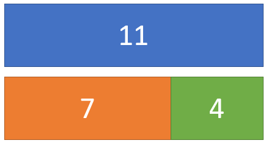

# Testing

__Testing__ is **executing** all or part of a program's code in a 
**controlled manner** for the purpose of **finding defects**.

In this unit, we will start our deep dive into Testing. We will start
by discussing what we mean by testing. In the next module, we'll
discuss different types of testing. And then, in the remaining units
we will focus on writing JUnit tests in Java.

---

## Purpose

What is the primary purpose of testing?

**TO FIND DEFECTS**.

This is the mindset you should have! You should always assume your code has bugs,
because it probably does. And having this mindset will change how you test.

If you approach testing with the mindset "I'm checking if my code works", you will
almost certainly test too little, and not find the one defect that's going to make
your code crash when graded. If you are trying to prove your code works, you're
going to setup the best possible scenario with your code, with ideal inputs, and
check for ideal outputs. And then you'll be satisfied.

But if this mindset were used everywhere, crash safety ratings from IIHS would be
useless. They don't delicately bump into a car with a small tricycle at slow speeds
to test a car's safety. They do this:

<iframe width="560" height="315" src="https://www.youtube.com/embed/n8vf9EJBBfw?start=24" title="YouTube video player" frameborder="0" allow="accelerometer; autoplay; clipboard-write; encrypted-media; gyroscope; picture-in-picture" allowfullscreen></iframe>

They ram the car at high speeds into the wall. They don't just test with dopplegangers
for adult passengers, they use child sized dummies in car seats, because they
want to test that too. Then, they hit the car in the side. Then they launch the
car into a pole for a driver side impact. Then they hit the car in the back. Then they
roll the car over. They *destroy* these cars in worst possible incidents.

This is your mindset when testing. I want to torture-test this code, and try to
find it's weakest points in extreme situations, because that's where most bugs hide.

---

## Need for testing

> "But I know my code work!"  
> -Student whose code doesn't work (c. 2022)

Consider the following code for a function that takes in two numbers and tells you
which is larger.

```java
    public static int max(int a, int b) {
        if (a > b) {
            return a;
        } else {
            return b;
        }
    }   
```

Does this code have any bugs? You may confidently say no, but now let's *slightly*
complicate this code. Now, let's take in three numbers.

```java
    public static int max(int a, int b, int c) {
        if (a > b) {
            if (a > c) return a;
            else return c;
        } else {
            if (b > c) return b;
            else return a;
        }
    }
```

Are there any bugs in this code? Really take time to be confident
in your opinion before moving on.

---

Did you find a bug? How long did it take you to find it? How would
you fix it? How confident are you that your solution *will* fix it?

There is a bug in this code, namely the last `else` statement

```else return a;```

Should instead be

```else return c;```

---

Okay, now let's go back to two numbers:

```java
    public static int max(int a, int b) {
        return (a + b + Math.abs(a - b)) / 2;
    }
```

Does this method work? This may seem weird to ask. This method doesn't even have
any `if` statements. How could this work? Well, it turns out this does
work!...most of the time. But how can you tell? And when doesn't it work? Well, we design some testing
scenarios.

If these simple samples can trip us up, how can we *ever* be confident that
a project made of hundreds, let alone thousands, let along hundreds of thousands,
of lines of code is working? The simple truth is that the essential difficult
of *complexity* is going to get in our way, and no matter how good we get at 
writing code, we still make mistakes when writing and reading it.

So how can we check if these functions work, or where they fail? By using
testing scenarios!

---

## Testing Scenario

A testing scenario is where you create a controlled scenario with specifically
defined inputs and expected behaviors. The test is then executed and the
actual results are measured and compared to the expected result.

__A test passes__ when the expected and actual results match
__A test fails__ when the expected and actual results do not match

A testing scenario is a constructed case to test a code by executing it
under controlled conditions.

---

## Main method testing

For now, we can write our tests in the main method. Later on, we will talk
about why this is a bad strategy, and is not scalable. But to get started
with the idea of a testing scenario, we are going to use our main method.

### Input

Consider our 3-max argument function with a known defect:

```java
    public static int max(int a, int b, int c) {
        if (a > b) {
            if (a > c) return a;
            else return c;
        } else {
            if (b > c) return b;
            else return a; // should be return c
        }
    }
```

The function takes in 3 integers. Let's try testing this function with the
arguments `(3, 2, 1)`. So our **input** is (3, 2, 1).

### Expected Output

Now, our expected output, we are going to work out by hand. Since we know the
point of this function is to find the largest number of our three inputs, we can 
trivially say that our output should be `3`.

### Actual Output

Now we can write some code in a main method to execute this function with
our input:

```java
    public static void main(String[] args) {
        int actual = max(3, 2, 1);
        System.out.println(actual + " - should be 3");
    }
```

And what prints is:

```3 - should be 3```

Which means our test passes!

---


## Hey, wait a minute...

This code has a known bug! How is our test passing if we know for certain
there is a bug?

Well, it's because this code never executes our *static fault*. The *static fault*
is the actual bug in our code. This line produces incorrect behavior regardless
of the state of the system.

So this means any test that executes the static fault, right? **Well, no, it's not that simple.** Consider this 
test case:

```java
    public static void main(String[] args) {
        int actual = max(3, 3, 3);
        System.out.println(actual + " - should be 3");
    }
```

This test will absolutely execute our buggy line and return `a` when it should
return `c`. However, because,in this test case, `a` and `c` happen to be equal,
the behavior appears correct even if the code itself is faulty. As such, our
test will pass!

## Test can find bugs, not prove their absence

Let's go back to what we said earlier:

> What is the primary purpose of testing? **TO FIND DEFECTS**.

Tests can help us find defects, and they are arguably our best tool for doing so.
However, **tests can never prove your code is bug free**.

### Tests cannot prove code works

Consider our *strange* max function:

```java
    public static int max(int a, int b) {
        return (a + b + Math.abs(a - b)) / 2;
        }
```

Let's design a test for this:

```java
    public static void main(String[] args) {
        int actual = max(7, 11);
        System.out.println(actual + " - should be 11");
    }
```

This prints out a pass! "11 - should be 11". The reason this function
works can be explained graphically. First, recognize what `Math.abs(a - b)` means,
mathematically. It means "the absolute [positive] `difference` between a and b".

So if a is 11, and b is 7, the `difference` is 4. But if we switch the numbers, the `difference`
is still positive 4. So because of that, we can illustrate the sum of `a`, `b`, and the `difference` as:



This gives us a total sum that is twice the largest number, which is why
we divide by two.

But does this work with negative numbers? Well, let's test!

```java
    public static void main(String[] args) {
        int actual = max(-25, -12);
        System.out.println(actual + " - should be -12");
    }
```

`-12 - should be -12`

This function works! In fact, you can test this why any combination of positive
and negative numbers and it will work...until the number gets too big.

### Where The Wild Bugs Are

Looking at the chart above, you'll notice that we need to represent the
sum of 'a', 'b', and the 'difference', which is **twice** the maximum value.
This sum is represented as an integer. However, in Java, as well as C, C++, etc.
(but not Python), `int` means *an integer number represented in 4 bytes*, or 32-bits.

Because half of our numbers need to be negative, this means that the `int` ranges
from -(2<sup>31</sup> ) to +( 2<sup>31</sup> ) - 1. Or:

-2,147,483,648 to 2,147,483,647

Realize how surprisingly small those numbers are. For instance, `int` cannot
be used to measure the global population. In fact, that last time `int` could be
used to measure world population would have likely been around 1930, before the 
advent of the modern computer.

### Why this causes a bug

So, what happens when you add 1 to the largest integer? Well, let's find out:

```java
    int x = 2147483647;
    System.out.println(x + 1);
```

This prints:

`-2147483648`

That is, just like the world, if you keep going right (east), you'll eventually
loop back around to the left (west)! Also worth nothing, if you try to write a line
of code like: 

```java
    int x = 3000000000; //3 billion
```

This won't actually compile, because the number can't be represented as an int.


**This** is ultimately what breaks our
max function. Because, if our largest number is more than half of the
maximum integer, we cannot correctly represent the number doubled.

And so if we test:

```java
    public static void main(String[] args) {
        int actual = max(1200000000, 3);
        System.out.println(actual + " - should be 1200000000");
    }
```

We get:

```-947483648 - should be 1200000000```

This weird behavior is because we cannot represent 2.4 billion with
an int, and so our results are inaccurate!

Testing allows us to test our hypotheses for whether or not a particular input will be defective. Testing is our best tool for understanding our own code, and so we should use it frequently!

### A quick fix

One simple fix to this problem is to use `long`s, which are like
`int`s, but instead of 4 bytes, we have 8 bytes. 

```java
    public static long max(long a, long b) {
        return (a + b + Math.abs(a - b)) / 2;
    }

    public static void main(String[] args) {
        long actual = max(1200000000, 3);
        System.out.println(actual + " - should be 1200000000");
    }
```

```1200000000 - should be 1200000000```

This means our range
of numbers is **exponentially larger**: -(2<sup>63</sup> ) to +( 2<sup>63</sup> ) - 1. Or:

-9,223,372,036,854,775,808 to 9,223,372,036,854,775,807

This number (>9 quintillion) is extraordinarily large. 9 quintillion
seconds would be roughly 292 billion years, roughly 20 times the
estimated age of our observable universe. However, the trade-off
is that each number takes up twice as much memory. Regardless, no
matter what language you use, or what computer you have, you cannot
represent an infinite number of integers, so our approach of adding
two numbers and their difference and dividing by two will always
have an upper limit of effectiveness.

## The Mindset of Testing

> "Most coders think debugging software is about fixing a mistake, but that’s bulls- - -. **Debugging’s actually all about finding the bug**, about understanding why the bug was there to begin with, about knowing that it’s existence was no accident. It came to you to deliver a message, like an unconscious bubble floating to the surface, popping with a revelation you’ve secretly known all along."
> Mr. Robot, Season 1 Episode 2

It's important to remember why we test: to find defects. It's important to remember: **The defects are already there**. If we do not test properly, all it means is that we don't **find** the defects. Just because we don't know about a defect doesn't mean they go away, or that they never existed. The defects are there, hidden, waiting for the perfect moment to strike. Such a failure happened in the [UK Air Traffic Control System (NATS) in 2014](https://www.nats.aero/wp-content/uploads/2015/02/v3%200%20Interim%20Report%20-%20NATS%20System%20Failure%2012%20December%202014.pdf). A bug that was in hiding since the 1990s managed to shut down Heathrow Airport, one of the busiest airports in the world, for on hour, and caused the airport to operate on limited capacity for nearly 6 hours in total. This delayed around 450 flights, and resulted in 80 being canceled outright.

The bug doesn't go away just because you aren't thinking of it anymore. The bug must be found, and that's the goal of testing.