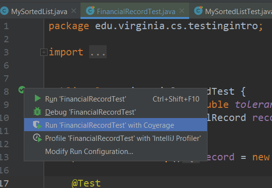
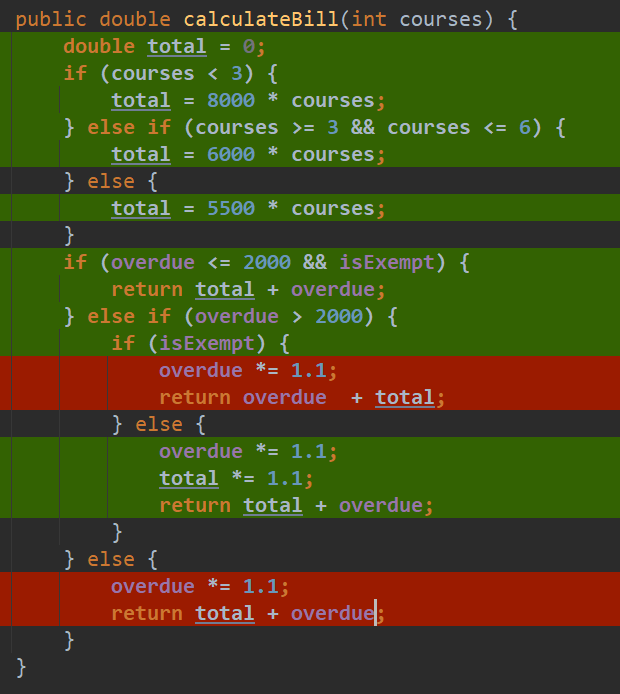
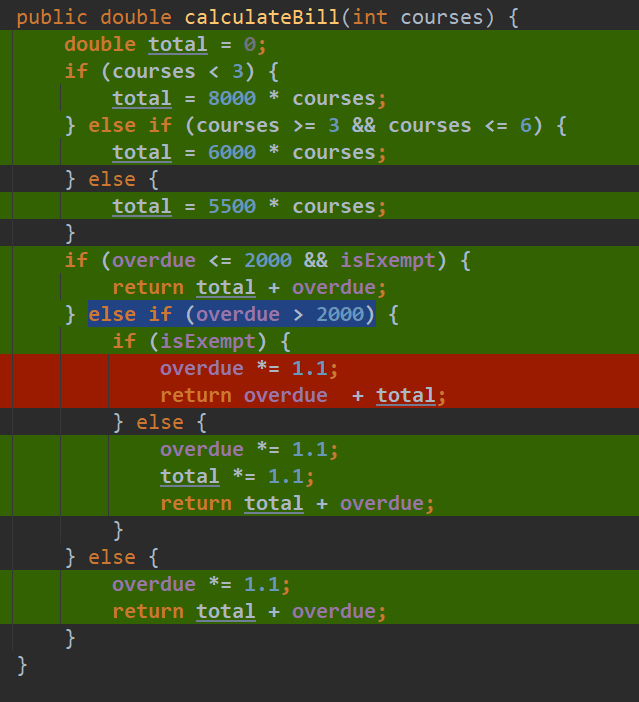
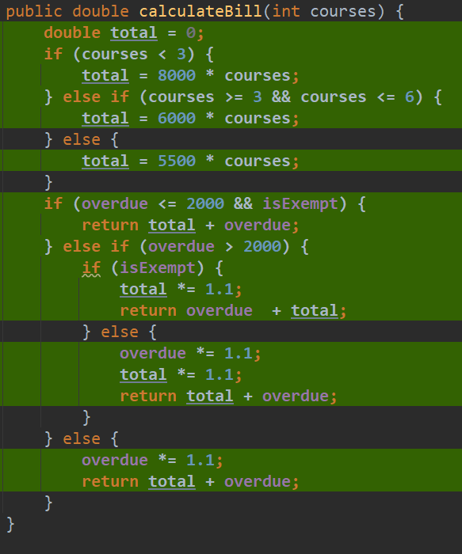

# White-Box Testing

In this module, we will look at **white-box testing** (sometimes called "glass-box" or "open-box" testing). We will compare it to black-box testing, and talk about how it can supplement our black-box testing in improving our confidence in code correctness.

---

* TOC
{:toc}

---

## The Story so Far

In the last module, we used Black-Box testing to select test cases for a function `calculateBill`.

The specification read:

Follow the specification steps IN ORDER
1. First, calculate total:
   * All courses cost the same, and cost per course is determined by the number of courses taken
   * $8000/ course if less than 3 course
   * $6000/ course if 3-6 course
   * $5500/course if greater than 6 courses  
2. Increase the value total by 10% if overdue is greater than 2000  
3. Increase the value of the field overdue amount by 10% if **exempt** is false (this is done AFTER step 2)
   * If **exempt** is true, this penalty is waived, and overdue does not change.  
4. Return the sum of total and overdue

In Black-Box testing, we select what test cases to write based on the specification. 

Our tests so far are:

| Test# | exp. return | exp. overdue | act. return | act. overdue | result |
|-------|-------------|--------------|-------------|--------------|--------|
| 1     | 20350       | 2750         | 20350       | 2750         | PASS   |
| 2     | 31500       | 1500         | 31500       | 1500         | PASS   |
| 3     | 51150       | 2750         | 51150       | 2750         | PASS   |

And good news, they're all passing now! However, in our haste to complete the test-writing from the last module, we *maybe* got a bit sloppy with our TDD practices. That is, we wrote some code that isn't actually checked by these tests.

Now that we have code that is written, we can use White-Box testing to ensure our **existing code** is reasonably tested.

# White-Box Testing

In **White-Box Testing** (sometimes called Glass-Box testing), we select cases while considering the existing **implementation** of the code. This is contrasted with **Black-Box Testing**, where we select test cases by considering the **interface** as specified for the method we are testing. As a note, because **White-Box Testing** relies on writing tests based on existing implementation, we actually cannot use White-Box testing as a starting point in Test-Driven Development. TDD is inherently **Black-Box**.

## Testing with Coverage

When testing existing code, we want to consider code **coverage**. That is, to what extent is the code tested?

### Statement Coverage

Statement coverage is a measure of what percentage of statements
have been covered by our tests.

Consider the following pseudocode:

```java
public void myFunc(int a, int b) {
   if (a > b && b > 0) {
      statement1;
      statement2;
   }
   while(b > 0) {
      statement3;
      b--;
   }
}
```

If we tested this function with `myFunc(3, 1)`, we could get
100% statement coverage.

100% statement coverage is a good minimum target for testing, as we don't want to rely on any lines of code we haven't tested at least once. However, consider all the situations this doesn't test.


### Branch Coverage

For example, what if `statement1` sets up an object that `statement3` relies on? This means that if `statement3` runs without `statement1` running, you could get a `NullPointerException`. Even though our previous test had 100%
statement coverage, it still didn't consider that possibility.

With **branch** coverage, we want to write tests such that we test the outcome of all conditional logic. That is:

* for every if-statement, we test with the condition `true` and `false`
* for every loop, we test *enters loop* as well as *skips loop*. If we're using a `do-while` loop, we want to test *one pass* and *multiple passes*.

So now, using our existing test, we need to add one more to get branch coverage.

* `myFunc(3, 1)` - tests `true` and `enters loop`
* `myFunc(-2, -1)` - tests `false` and `skips loop`

### Conditional Coverage

Similar to branch coverage, but our distinction is that in conditional coverage, for every boolean value, we want to evaluate the code if it's `true` or `false`. For example, in the `if` statement:

`if (a > b && b > 0)`

When aiming for complete conditional coverage, We don't just want to consider if the **whole** statement is true or false, we want at least one test for every possible combination of `true` or `false`. For this if-statement, we could do this with 4 tests:

* `myFunc(3, 1)` - `true` and `true`
* `myFunc(-2, -1)` - `false` and `false`
* `myFunc(-1, -2)` - `true` and `false`
* `myFunc(1, 3)` - `false` and `true`

Note that it may not always be possible to test every combination of `true` and `false`. For example, say you had an if statement in a "write a review system" that ensured your rating was on a 1-5 scale:

`if (1 <= rating && rating <= 5)`

In this case, 100% conditional coverage is **impossible**, because it's impossible for both clauses to be `false` at the same time: no number is both less than 1 and greater than 5.

### Path Coverage

Path coverage is a little trickier. Here, we are interested in what percentage of possible paths through our code we have taken. So in the above example, that could be:

* enters `if`, enters *while* loop
* skips `if`, enters *while* loop
* enters `if`, skips *while* loop
* skips both the `if` and the `while` loop

Our two previous test cover the first and last cases, but not the second and third case. As such, in this case, if we want full path coverage, we would need at least 4 tests. Additionally, if you want both 100% `path` and `conditional` coverage, the number of tests can expand exponentially.

Path coverage, however, can explode in complexity, especially if you have a lot of nested logic or loops.

## Back to our example

Back to the `calculateBill()` function, let's check the statement coverage of our tests on our solution. We can do this in IntelliJ by using "Run with Coverage" on our tests:



From there, we can see the coverage by opening the code
for our `calculateBill` function:



Note that I have changed my local settings in IntelliJ to highlight the lines in order to make the results more readable. By default, the coverage color only appears next to the line number on the left.

Here, we can see the lines our tests have executed. Green lines mean a line that has been executed by a **passing** test. Red lines mean the line has not been executed by a test. So we can see two pairs of lines that have not been executed by our tests:

* the lines after `if(isExempt)` inside of the `elif` block
* the last two lines of the function inside the `else` block

This means our solution from the black-box and TDD unit have untested code! Let's fix that.

### Test 4

We already have our existing tests:

| Test# | exp. return | exp. overdue | act. return | act. overdue | result |
|-------|-------------|--------------|-------------|--------------|--------|
| 1     | 20350       | 2750         | 20350       | 2750         | PASS   |
| 2     | 31500       | 1500         | 31500       | 1500         | PASS   |
| 3     | 51150       | 2750         | 51150       | 2750         | PASS   |

Now let's write test 4. For this, we are going to try to reach the last two lines of the function inside of the else block:

```java
    else {	
        overdue *= 1.1;
        return total + overdue;
    }
```

First, we need to ask "What inputs lets us reach this line?" Working backwards, it tells us that both of these if-statements must be false:

* `if (overdue <= 2000 && isExempt)`
* `else if (overdue > 2000)`

Starting with the second condition, we know `overdue` must be `<= 2000`. Otherwise we would enter the else-if. Then, by the first condition, since `overdue <= 2000` must be `true`, we can assume that `isExempt` must be `false` for us to enter the `else` statement at the end of the function.

So, our test input must have `overdue <= 2000`, and `isExempt = false`. The number of courses doesn't matter, so let's pick `5`. Thus, we get Test 4:

| Test# | courseCount | overdue | isExempt | exp. return | exp. overdue |
|-------|-------------|---------|----------|-------------|--------------|
| 4     | 5           | 1500    | false    | 31650       | 1650         |

We calculated the expected values by hand using the specification. We then write this test as a JUnit:

```java
    @Test 
    public void testCalculateBill_MidCourse_SmallOverdue_NoExempt() {
        record.setOverdue(1500);
        record.setExempt(false);
        assertEquals(31650, record.calculateBill(5), tolerance);
        assertEquals(1650, record.getOverdue(), tolerance);
	}
```

Now, we re-run all of our tests with coverage and: 



Our test is passing and we have successfully tested our targeted lines! Now, let's write a test to get the last two red lines.

### Test 5

To reach this line, we need the following conditions:

* `if (overdue <= 2000 && isExempt)` must be false
* `else if (overdue > 2000)` must be true
* `if (isExempt)` must be true.

So, we need to test with a large `overdue` value with exempt `true`. So we design test 5, calculating expected values by hand:

| Test# | courseCount | overdue | isExempt | exp. return | exp. overdue |
|-------|-------------|---------|----------|-------------|--------------|
| 5     | 5           | 2500    | true     | 35500       | 2500         |

Then write the test in JUnit:

```java
    @Test 
    public void testCalculateBill_MidCourse_SmallOverdue_NoExempt() {
        record.setOverdue(2500);
        record.setExempt(true);
        assertEquals(35500, record.calculateBill(5), tolerance);
        assertEquals(2500, record.getOverdue(), tolerance);
	}
```

And now we run our tests, and it fails!

```shell
expected: <35500.0> but was: <32750.0>
Expected :35500.0
Actual   :32750.0
```

We found a defect! As we look at our code and the specification, we notice that we made a mistake! In the condition where `overdue` is larger than `2000`, we should increase the value of `total` by 10%. However, because `isExempt` is true, the value of `overdue` should not increase! Yet our code reads:

```java
} else if (overdue > 2000) {
    if (isExempt) {
        overdue *= 1.1;
        return overdue  + total;
    }
```

We multiplied the wrong value by 1.1! We apply our fix:

```java
} else if (overdue > 2000) {
    if (isExempt) {
        total *= 1.1;
        return overdue  + total;
    }
```

And we run our tests, and now Test 5 passes! And now we have full statement coverage!



## Getting to 100% coverage

It may seem that getting to 100% path and conditional coverage is unrealistic; and in some cases, it can be mathematically impossible. However, part of the problem is that our functions may be more complicated than they need to be.

In fact, this function **is** too complicated, which hurts its testability. In our [Code Quality](https://sde-coursepack.github.io/modules/refactoring/Code-Quality/) unit, we will revisit this function and re-write it to simplify its testability.

## White-Box vs Black-Box

Understand that white-box and black-box do not tell us **how** we are testing. They are strategies that tell us what tests to write! The tests themselves are structurally the same. We simply used both techniques to select the inputs of our test.